# University ERP - System Architecture

## Table of Contents
1. [System Overview](#system-overview)
2. [Technology Stack](#technology-stack)
3. [Application Architecture](#application-architecture)
4. [Module Structure](#module-structure)
5. [DocType Organization](#doctype-organization)
6. [Database Schema](#database-schema)
7. [Integration Architecture](#integration-architecture)
8. [Student Portal Architecture](#student-portal-architecture)
9. [Security Architecture](#security-architecture)
10. [Deployment Architecture](#deployment-architecture)

---

## 1. System Overview

The University ERP is a comprehensive enterprise resource planning system built on the Frappe Framework, designed to manage all aspects of university operations.

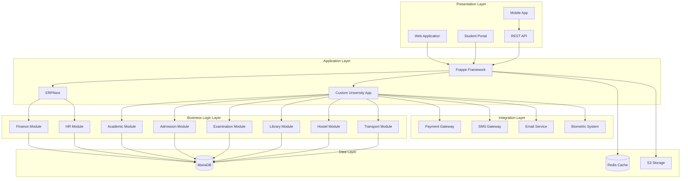

---

## 2. Technology Stack

### Backend
- **Framework**: Frappe Framework v15+
- **Language**: Python 3.11+
- **Database**: MariaDB 10.6+
- **Cache**: Redis 7.0+
- **Task Queue**: RQ (Redis Queue)
- **Web Server**: Nginx
- **Application Server**: Gunicorn

### Frontend
- **Framework**: Frappe UI (Vue.js based)
- **Student Portal**: React.js
- **Mobile**: React Native
- **UI Components**: Frappe UI Components
- **Charts**: Chart.js, Frappe Charts

### DevOps
- **Containerization**: Docker, Docker Compose
- **CI/CD**: GitHub Actions
- **Monitoring**: Prometheus + Grafana
- **Logging**: ELK Stack (Elasticsearch, Logstash, Kibana)
- **Backup**: Automated S3 backups

### Integrations
- **Payment**: Razorpay, PayU, Paytm
- **SMS**: Twilio, AWS SNS
- **Email**: AWS SES, SendGrid
- **Storage**: AWS S3, MinIO
- **Biometric**: Custom SDK integration

---

## 3. Application Architecture

### Frappe Apps Structure

```
frappe-bench/
├── apps/
│   ├── frappe/                 # Core Frappe Framework
│   ├── erpnext/                # ERPNext (Finance, HR, Inventory)
│   └── university_erp/         # Custom University ERP App
│       ├── university_erp/
│       │   ├── academic/       # Academic Module
│       │   ├── admission/      # Admission Module
│       │   ├── examination/    # Examination Module
│       │   ├── library/        # Library Module
│       │   ├── hostel/         # Hostel Module
│       │   ├── transport/      # Transport Module
│       │   ├── student_portal/ # Student Portal
│       │   ├── api/            # REST API Endpoints
│       │   └── hooks.py        # App Hooks
│       ├── university_erp_portal/  # Portal Frontend (React)
│       └── university_erp_mobile/  # Mobile App (React Native)
└── sites/
    └── university.local/
```

### App Dependencies

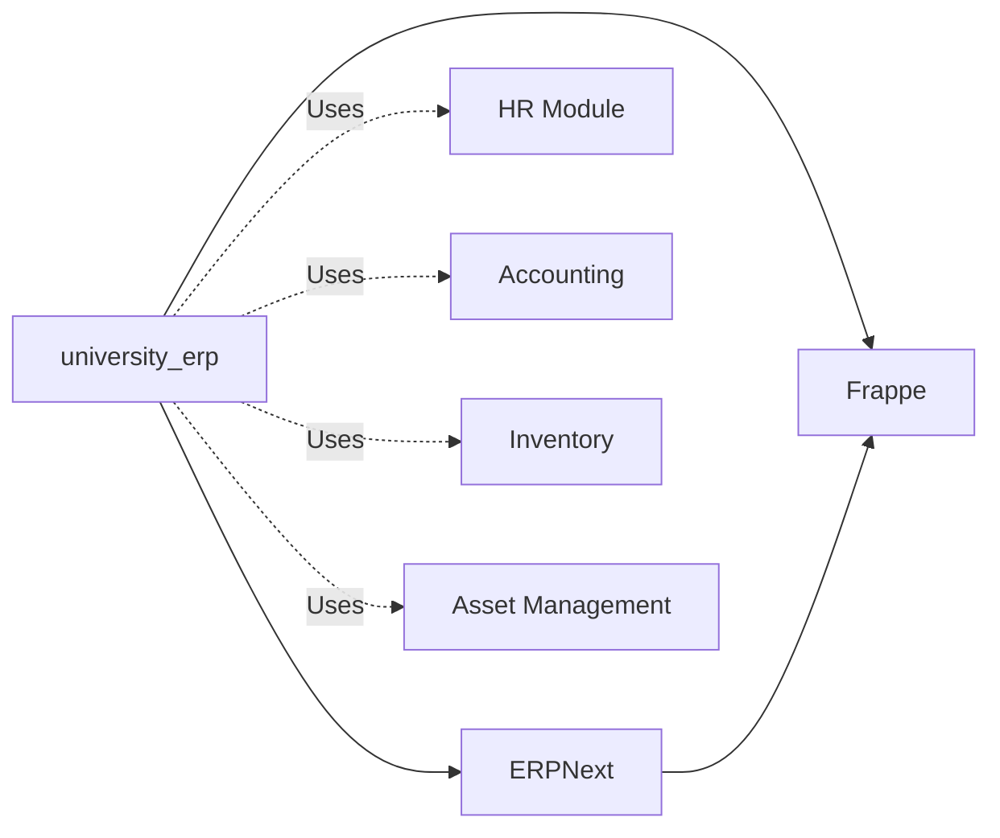

---

## 4. Module Structure

### Academic Module
**Purpose**: Manage academic programs, courses, batches, and schedules

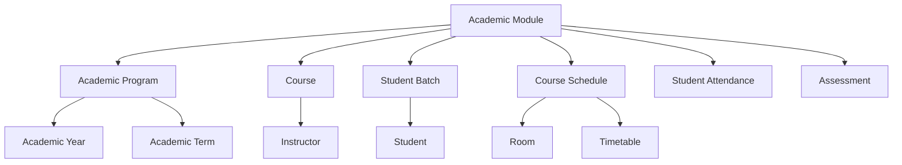

**Key DocTypes**:
- Academic Year
- Academic Term
- Academic Program
- Program Level (UG/PG/PhD)
- Course
- Course Schedule
- Student Batch
- Student Attendance
- Assessment Plan
- Assessment Result

### Admission Module
**Purpose**: Handle student applications, admissions, and enrollment

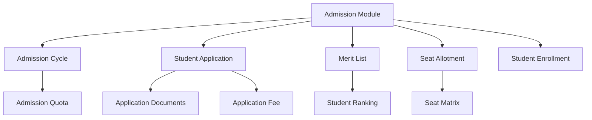

**Key DocTypes**:
- Admission Cycle
- Admission Quota
- Student Application
- Application Document
- Merit List
- Merit List Entry
- Seat Allotment
- Seat Matrix
- Student Enrollment
- Enrollment Document

### Examination Module
**Purpose**: Conduct exams, manage question banks, and process results

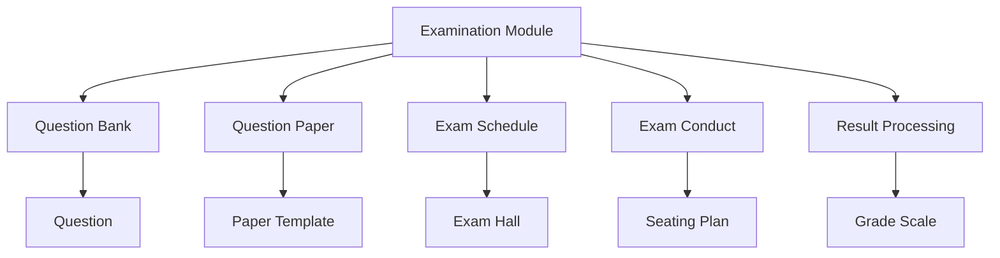

**Key DocTypes**:
- Question Bank
- Question
- Question Paper Template
- Question Paper
- Exam Schedule
- Exam Hall
- Seating Plan
- Student Exam Attempt
- Answer Sheet
- Exam Result
- Grade Scale

### Finance Module (ERPNext)
**Purpose**: Fee management, accounting, and financial reporting

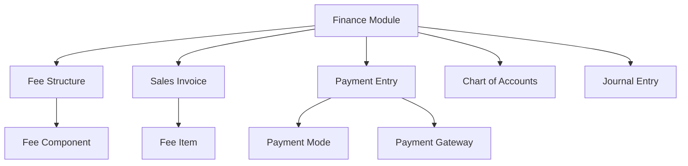

**Key DocTypes**:
- Fee Structure
- Fee Component
- Fee Schedule
- Sales Invoice (Student Fee)
- Payment Entry
- Payment Gateway Log
- Account
- Journal Entry
- Financial Reports

### HR Module (ERPNext)
**Purpose**: Staff management, payroll, and leave management

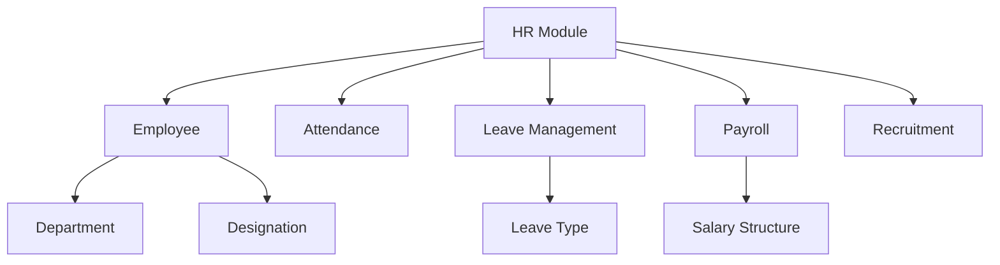

**Key DocTypes**:
- Employee
- Department
- Designation
- Attendance
- Leave Application
- Leave Type
- Salary Structure
- Salary Slip
- Job Opening
- Job Applicant

### Library Module
**Purpose**: Library resource management and circulation

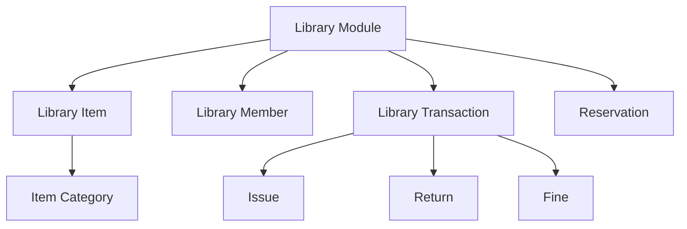

**Key DocTypes**:
- Library Item
- Library Category
- Library Member
- Library Transaction
- Library Reservation
- Library Fine
- Library Settings

### Hostel Module
**Purpose**: Hostel allocation and management

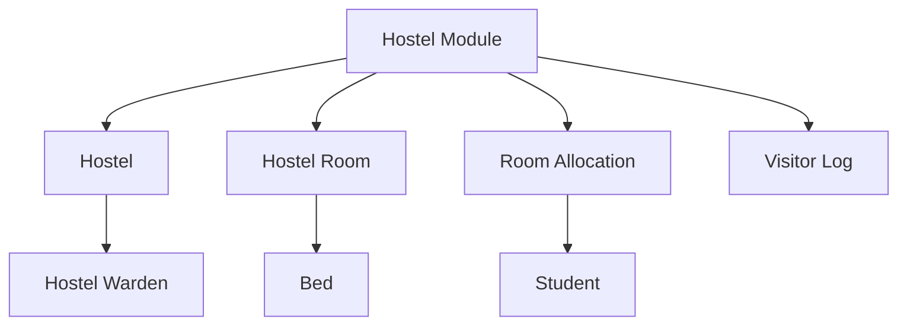

**Key DocTypes**:
- Hostel
- Hostel Warden
- Hostel Room
- Bed
- Room Allocation
- Hostel Visitor Log
- Mess Menu
- Hostel Fee

### Transport Module
**Purpose**: Transport route management and allocation

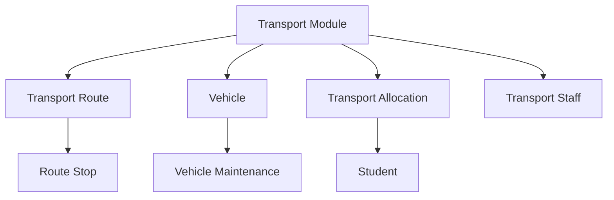

**Key DocTypes**:
- Transport Route
- Route Stop
- Vehicle
- Vehicle Maintenance
- Transport Allocation
- Transport Staff
- Transport Fee

---

## 5. DocType Organization

### Complete DocType Catalog (300+ DocTypes)

#### Core Academic (45 DocTypes)
```
academic/
├── master/
│   ├── Academic Year
│   ├── Academic Term
│   ├── Academic Program
│   ├── Program Level
│   ├── Course
│   ├── Course Category
│   ├── Course Unit
│   ├── Instructor
│   ├── Department
│   └── Faculty
├── student/
│   ├── Student
│   ├── Student Batch
│   ├── Student Group
│   ├── Student Category
│   ├── Guardian
│   └── Student Sibling
├── scheduling/
│   ├── Course Schedule
│   ├── Course Enrollment
│   ├── Timetable
│   ├── Room
│   ├── Room Allocation
│   └── Room Booking
└── assessment/
    ├── Assessment Plan
    ├── Assessment Group
    ├── Assessment Result
    ├── Assessment Criteria
    └── Grading Scale
```

#### Admission (25 DocTypes)
```
admission/
├── cycle/
│   ├── Admission Cycle
│   ├── Admission Quota
│   ├── Quota Seat
│   └── Admission Settings
├── application/
│   ├── Student Application
│   ├── Application Document
│   ├── Application Checklist
│   ├── Application Fee
│   └── Application Status
├── selection/
│   ├── Merit List
│   ├── Merit List Entry
│   ├── Selection Criteria
│   ├── Entrance Exam
│   └── Entrance Exam Result
└── enrollment/
    ├── Seat Allotment
    ├── Seat Matrix
    ├── Student Enrollment
    ├── Enrollment Document
    └── Enrollment Checklist
```

#### Examination (35 DocTypes)
```
examination/
├── question_bank/
│   ├── Question Bank
│   ├── Question
│   ├── Question Type
│   └── Question Difficulty
├── paper/
│   ├── Question Paper Template
│   ├── Question Paper
│   ├── Paper Section
│   └── Paper Blueprint
├── conduct/
│   ├── Exam Schedule
│   ├── Exam Hall
│   ├── Seating Plan
│   ├── Invigilator Assignment
│   ├── Student Exam Attempt
│   └── Answer Sheet
└── result/
    ├── Exam Result
    ├── Result Processing
    ├── Grade Scale
    ├── Grade Component
    ├── Transcript
    └── Marksheet
```

#### Student Portal (20 DocTypes)
```
student_portal/
├── dashboard/
│   ├── Student Dashboard
│   ├── Dashboard Widget
│   └── Announcement
├── academics/
│   ├── My Courses
│   ├── My Attendance
│   ├── My Assignments
│   └── My Grades
├── finance/
│   ├── My Fee Structure
│   ├── My Payments
│   └── Payment Request
└── services/
    ├── Leave Application
    ├── Bonafide Request
    ├── ID Card Request
    └── Grievance
```

#### Library (15 DocTypes)
```
library/
├── Library Item
├── Library Category
├── Library Member
├── Library Membership
├── Library Transaction
├── Library Reservation
├── Library Fine
├── Library Receipt
├── Library Shelf
├── Library Publisher
├── Library Author
└── Library Settings
```

#### Hostel (18 DocTypes)
```
hostel/
├── Hostel
├── Hostel Block
├── Hostel Floor
├── Hostel Room
├── Bed
├── Hostel Warden
├── Room Allocation
├── Hostel Application
├── Hostel Visitor Log
├── Visitor Pass
├── Mess Menu
├── Mess Attendance
├── Hostel Fee
└── Hostel Settings
```

#### Transport (12 DocTypes)
```
transport/
├── Transport Route
├── Route Stop
├── Vehicle
├── Vehicle Type
├── Vehicle Maintenance
├── Vehicle Log
├── Transport Allocation
├── Transport Application
├── Transport Staff
├── Transport Fee
└── Transport Settings
```

#### Finance Integration (22 DocTypes)
```
finance/
├── Fee Structure
├── Fee Component
├── Fee Schedule
├── Fee Category
├── Fee Discount
├── Scholarship
├── Fee Collection
├── Payment Gateway
├── Payment Gateway Log
├── Payment Receipt
├── Refund Request
├── Fee Waiver
└── Financial Report
```

#### Communication (18 DocTypes)
```
communication/
├── Notification Template
├── Email Template
├── SMS Template
├── Push Notification
├── Notification Log
├── Email Queue
├── SMS Log
├── Announcement
├── Circular
├── Newsletter
└── Communication Settings
```

#### HR Integration (25 DocTypes - from ERPNext)
```
hr/
├── Employee
├── Employee Grade
├── Department
├── Designation
├── Branch
├── Attendance
├── Leave Application
├── Leave Type
├── Leave Policy
├── Salary Structure
├── Salary Slip
├── Job Opening
├── Job Applicant
├── Interview
└── Appraisal
```

#### Inventory & Assets (20 DocTypes - from ERPNext)
```
inventory/
├── Item
├── Item Group
├── Warehouse
├── Stock Entry
├── Purchase Order
├── Purchase Receipt
├── Asset
├── Asset Category
├── Asset Maintenance
└── Asset Movement
```

#### Grievance & Feedback (12 DocTypes)
```
grievance/
├── Grievance
├── Grievance Category
├── Grievance Committee
├── Grievance Action
├── Feedback Form
├── Feedback Response
├── Survey
├── Survey Question
└── Survey Response
```

#### Analytics & MIS (15 DocTypes)
```
analytics/
├── Custom Dashboard
├── Dashboard Widget
├── KPI Definition
├── KPI Value
├── Scheduled Report
├── Report Template
├── Data Export
└── Analytics Settings
```

#### Accreditation (18 DocTypes)
```
accreditation/
├── Accreditation Cycle
├── NAAC Metric
├── NAAC Criterion
├── Course Outcome
├── Program Outcome
├── CO PO Mapping
├── Attainment Record
├── NIRF Data
├── SSR Document
└── Accreditation Settings
```

---

## 6. Database Schema

### Entity Relationship Diagram (High-Level)

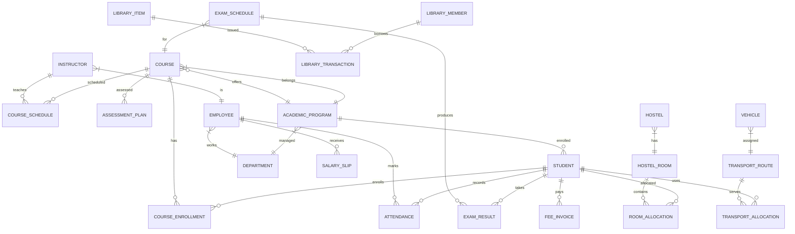

### Key Tables and Relationships

#### Student Context
```sql
-- Student Master
tabStudent (
    name VARCHAR(140) PRIMARY KEY,
    student_name VARCHAR(140),
    student_email_id VARCHAR(140),
    student_mobile_number VARCHAR(20),
    date_of_birth DATE,
    gender VARCHAR(20),
    blood_group VARCHAR(10),
    program VARCHAR(140) FOREIGN KEY,
    batch VARCHAR(140) FOREIGN KEY,
    current_term VARCHAR(140) FOREIGN KEY,
    status VARCHAR(20), -- Active, Suspended, Graduated
    admission_date DATE,
    INDEX idx_program (program),
    INDEX idx_batch (batch),
    INDEX idx_email (student_email_id)
)

-- Course Enrollment
tabCourse_Enrollment (
    name VARCHAR(140) PRIMARY KEY,
    student VARCHAR(140) FOREIGN KEY,
    course VARCHAR(140) FOREIGN KEY,
    academic_year VARCHAR(140) FOREIGN KEY,
    academic_term VARCHAR(140) FOREIGN KEY,
    enrollment_date DATE,
    status VARCHAR(20), -- Enrolled, Completed, Dropped
    INDEX idx_student (student),
    INDEX idx_course (course),
    INDEX idx_term (academic_term)
)

-- Attendance
tabStudent_Attendance (
    name VARCHAR(140) PRIMARY KEY,
    student VARCHAR(140) FOREIGN KEY,
    course_schedule VARCHAR(140) FOREIGN KEY,
    date DATE,
    status VARCHAR(20), -- Present, Absent, Late, Leave
    marked_by VARCHAR(140) FOREIGN KEY,
    INDEX idx_student_date (student, date),
    INDEX idx_schedule (course_schedule)
)
```

#### Academic Context
```sql
-- Academic Program
tabAcademic_Program (
    name VARCHAR(140) PRIMARY KEY,
    program_name VARCHAR(140),
    program_code VARCHAR(20),
    program_level VARCHAR(20), -- UG, PG, PhD
    department VARCHAR(140) FOREIGN KEY,
    duration INT, -- in years
    total_credits DECIMAL(10,2),
    is_published BOOLEAN,
    INDEX idx_department (department),
    INDEX idx_level (program_level)
)

-- Course
tabCourse (
    name VARCHAR(140) PRIMARY KEY,
    course_name VARCHAR(140),
    course_code VARCHAR(20) UNIQUE,
    department VARCHAR(140) FOREIGN KEY,
    credits DECIMAL(5,2),
    course_type VARCHAR(20), -- Theory, Practical, Project
    is_elective BOOLEAN,
    INDEX idx_code (course_code),
    INDEX idx_department (department)
)

-- Course Schedule
tabCourse_Schedule (
    name VARCHAR(140) PRIMARY KEY,
    course VARCHAR(140) FOREIGN KEY,
    academic_year VARCHAR(140) FOREIGN KEY,
    academic_term VARCHAR(140) FOREIGN KEY,
    instructor VARCHAR(140) FOREIGN KEY,
    room VARCHAR(140) FOREIGN KEY,
    day VARCHAR(20),
    from_time TIME,
    to_time TIME,
    student_batch VARCHAR(140) FOREIGN KEY,
    INDEX idx_course (course),
    INDEX idx_instructor (instructor),
    INDEX idx_batch (student_batch)
)
```

#### Examination Context
```sql
-- Question Bank
tabQuestion_Bank (
    name VARCHAR(140) PRIMARY KEY,
    title VARCHAR(200),
    course VARCHAR(140) FOREIGN KEY,
    question_type VARCHAR(50),
    difficulty_level VARCHAR(20),
    question_text TEXT,
    marks DECIMAL(5,2),
    bloom_level VARCHAR(50),
    course_outcome VARCHAR(140) FOREIGN KEY,
    INDEX idx_course (course),
    INDEX idx_type (question_type)
)

-- Exam Result
tabExam_Result (
    name VARCHAR(140) PRIMARY KEY,
    student VARCHAR(140) FOREIGN KEY,
    exam_schedule VARCHAR(140) FOREIGN KEY,
    total_marks DECIMAL(10,2),
    obtained_marks DECIMAL(10,2),
    percentage DECIMAL(5,2),
    grade VARCHAR(5),
    status VARCHAR(20), -- Pass, Fail, Absent
    result_date DATE,
    INDEX idx_student (student),
    INDEX idx_exam (exam_schedule)
)
```

---

## 7. Integration Architecture

### External System Integration

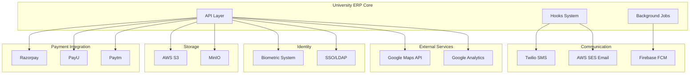

### Integration Patterns

#### 1. Payment Gateway Integration

```python
# File: university_erp/api/payment.py

class PaymentGatewayService:
    """
    Unified payment gateway service supporting multiple providers
    """

    @staticmethod
    def create_order(amount, currency, student, fee_invoice):
        """Create payment order with configured gateway"""
        gateway = frappe.db.get_single_value("University Settings", "payment_gateway")

        if gateway == "Razorpay":
            return RazorpayAdapter.create_order(amount, currency, student, fee_invoice)
        elif gateway == "PayU":
            return PayUAdapter.create_order(amount, currency, student, fee_invoice)
        elif gateway == "Paytm":
            return PaytmAdapter.create_order(amount, currency, student, fee_invoice)

    @staticmethod
    def verify_payment(payment_id, order_id, signature):
        """Verify payment signature"""
        gateway = frappe.db.get_single_value("University Settings", "payment_gateway")

        if gateway == "Razorpay":
            return RazorpayAdapter.verify_signature(payment_id, order_id, signature)
        # ... other gateways

    @staticmethod
    def process_webhook(payload, headers):
        """Process webhook from payment gateway"""
        # Identify gateway from headers
        # Route to appropriate adapter
        pass
```

#### 2. Communication Integration

```python
# File: university_erp/api/communication.py

class NotificationService:
    """
    Multi-channel notification service
    """

    @staticmethod
    def send_notification(recipient, message, channel="auto"):
        """
        Send notification via appropriate channel

        Channels: email, sms, push, all, auto
        """
        if channel == "auto":
            # Determine best channel based on user preferences
            channels = NotificationService._get_user_channels(recipient)
        elif channel == "all":
            channels = ["email", "sms", "push"]
        else:
            channels = [channel]

        results = {}
        for ch in channels:
            if ch == "email":
                results['email'] = EmailService.send(recipient, message)
            elif ch == "sms":
                results['sms'] = SMSService.send(recipient, message)
            elif ch == "push":
                results['push'] = PushNotificationService.send(recipient, message)

        return results

class EmailService:
    """AWS SES / SendGrid integration"""

    @staticmethod
    def send(recipient, message):
        provider = frappe.db.get_single_value("Email Settings", "provider")

        if provider == "AWS SES":
            # Use boto3 for SES
            import boto3
            client = boto3.client('ses', region_name='us-east-1')
            # Send email
        elif provider == "SendGrid":
            # Use SendGrid API
            pass

class SMSService:
    """Twilio / AWS SNS integration"""

    @staticmethod
    def send(phone, message):
        provider = frappe.db.get_single_value("SMS Settings", "provider")

        if provider == "Twilio":
            from twilio.rest import Client
            client = Client(account_sid, auth_token)
            # Send SMS
        elif provider == "AWS SNS":
            import boto3
            sns = boto3.client('sns')
            # Send SMS
```

#### 3. Storage Integration

```python
# File: university_erp/api/storage.py

class StorageService:
    """
    File storage service supporting S3 and MinIO
    """

    @staticmethod
    def upload_file(file_path, folder="uploads"):
        """Upload file to configured storage"""
        storage = frappe.db.get_single_value("System Settings", "file_storage")

        if storage == "S3":
            return S3Storage.upload(file_path, folder)
        elif storage == "MinIO":
            return MinIOStorage.upload(file_path, folder)
        else:
            # Local storage
            return LocalStorage.upload(file_path, folder)

    @staticmethod
    def get_signed_url(file_url, expiry=3600):
        """Generate signed URL for private file"""
        storage = frappe.db.get_single_value("System Settings", "file_storage")

        if storage == "S3":
            return S3Storage.get_signed_url(file_url, expiry)
        elif storage == "MinIO":
            return MinIOStorage.get_signed_url(file_url, expiry)
```

#### 4. Biometric Integration

```python
# File: university_erp/api/biometric.py

class BiometricService:
    """
    Biometric attendance integration
    """

    @staticmethod
    def register_fingerprint(student, template_data):
        """Register student fingerprint"""
        # Call biometric SDK
        device = BiometricDevice()
        result = device.register(
            user_id=student,
            template=template_data
        )

        if result.success:
            # Store reference in database
            frappe.get_doc({
                "doctype": "Biometric Registration",
                "student": student,
                "template_id": result.template_id,
                "registration_date": frappe.utils.now()
            }).insert()

        return result

    @staticmethod
    def sync_attendance():
        """
        Sync attendance from biometric devices
        Background job running every 15 minutes
        """
        devices = frappe.get_all("Biometric Device", filters={"enabled": 1})

        for device in devices:
            logs = BiometricDevice.fetch_logs(device.name)

            for log in logs:
                # Create attendance record
                attendance = frappe.get_doc({
                    "doctype": "Student Attendance",
                    "student": log.user_id,
                    "date": log.timestamp.date(),
                    "time": log.timestamp.time(),
                    "status": "Present",
                    "marked_by": "Biometric System"
                })
                attendance.insert(ignore_permissions=True)
```

---

## 8. Student Portal Architecture

### Portal Application Stack

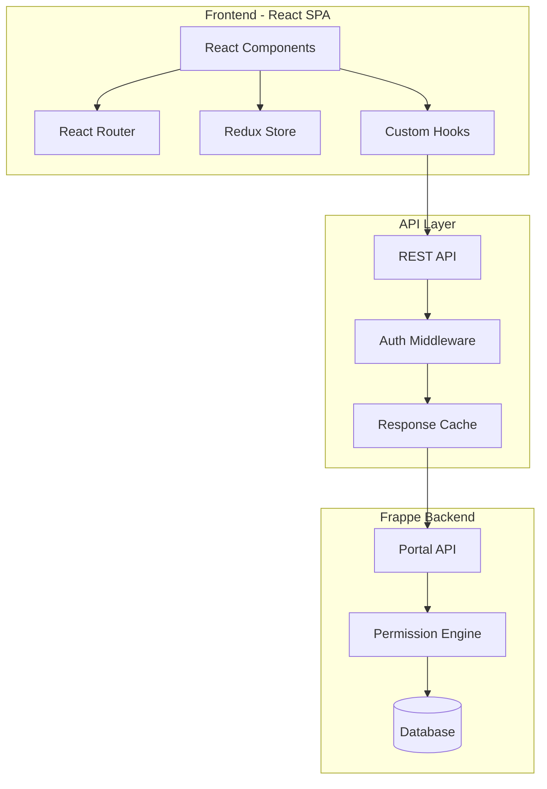

### Portal Directory Structure

```
university_erp_portal/
├── src/
│   ├── components/
│   │   ├── common/
│   │   │   ├── Header.jsx
│   │   │   ├── Sidebar.jsx
│   │   │   ├── Footer.jsx
│   │   │   └── Loader.jsx
│   │   ├── dashboard/
│   │   │   ├── Dashboard.jsx
│   │   │   ├── WidgetCard.jsx
│   │   │   └── QuickActions.jsx
│   │   ├── academics/
│   │   │   ├── MyCourses.jsx
│   │   │   ├── CourseDetail.jsx
│   │   │   ├── Attendance.jsx
│   │   │   └── Timetable.jsx
│   │   ├── examination/
│   │   │   ├── ExamSchedule.jsx
│   │   │   ├── Results.jsx
│   │   │   ├── OnlineExam.jsx
│   │   │   └── Transcript.jsx
│   │   ├── finance/
│   │   │   ├── FeeStructure.jsx
│   │   │   ├── PaymentHistory.jsx
│   │   │   └── MakePayment.jsx
│   │   └── services/
│   │       ├── LeaveApplication.jsx
│   │       ├── BonafideRequest.jsx
│   │       └── Grievance.jsx
│   ├── hooks/
│   │   ├── useAuth.js
│   │   ├── useAPI.js
│   │   ├── usePagination.js
│   │   └── useNotification.js
│   ├── services/
│   │   ├── api.js
│   │   ├── auth.js
│   │   └── storage.js
│   ├── store/
│   │   ├── index.js
│   │   ├── slices/
│   │   │   ├── authSlice.js
│   │   │   ├── studentSlice.js
│   │   │   └── courseSlice.js
│   │   └── middleware/
│   ├── utils/
│   │   ├── constants.js
│   │   ├── helpers.js
│   │   └── validators.js
│   ├── App.jsx
│   └── index.jsx
├── public/
│   ├── index.html
│   ├── manifest.json
│   └── service-worker.js
└── package.json
```

### Student Portal Data Flow

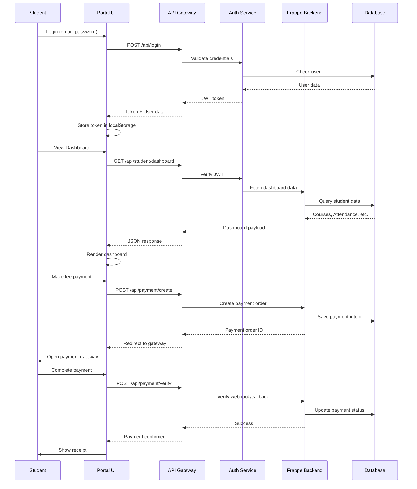

### Portal API Endpoints

```python
# File: university_erp/api/student_portal.py

@frappe.whitelist()
def get_dashboard(student):
    """
    Get student dashboard data
    Returns: courses, attendance, upcoming exams, pending fees
    """
    if not has_portal_access(student):
        frappe.throw("Access Denied")

    return {
        "profile": get_student_profile(student),
        "courses": get_enrolled_courses(student),
        "attendance": get_attendance_summary(student),
        "exams": get_upcoming_exams(student),
        "fees": get_pending_fees(student),
        "announcements": get_announcements(student)
    }

@frappe.whitelist()
def get_enrolled_courses(student):
    """Get list of enrolled courses with progress"""
    courses = frappe.db.sql("""
        SELECT
            ce.name,
            ce.course,
            c.course_name,
            c.course_code,
            c.credits,
            ce.academic_term,
            i.instructor_name,
            COUNT(DISTINCT cs.name) as total_classes,
            COUNT(DISTINCT CASE WHEN sa.status = 'Present' THEN sa.name END) as attended_classes,
            ROUND(COUNT(DISTINCT CASE WHEN sa.status = 'Present' THEN sa.name END) * 100.0 /
                  COUNT(DISTINCT cs.name), 2) as attendance_percentage
        FROM
            `tabCourse Enrollment` ce
        JOIN
            `tabCourse` c ON ce.course = c.name
        LEFT JOIN
            `tabCourse Schedule` cs ON cs.course = ce.course
            AND cs.academic_term = ce.academic_term
        LEFT JOIN
            `tabInstructor` i ON cs.instructor = i.name
        LEFT JOIN
            `tabStudent Attendance` sa ON sa.student = ce.student
            AND sa.course_schedule = cs.name
        WHERE
            ce.student = %s
            AND ce.status = 'Enrolled'
        GROUP BY
            ce.name
    """, (student,), as_dict=True)

    return courses

@frappe.whitelist()
def submit_assignment(assignment, student, file_url, comments=None):
    """Submit assignment"""
    # Check deadline
    assignment_doc = frappe.get_doc("Assignment", assignment)
    if frappe.utils.now_datetime() > assignment_doc.due_date:
        frappe.throw("Assignment submission deadline has passed")

    # Create submission
    submission = frappe.get_doc({
        "doctype": "Assignment Submission",
        "assignment": assignment,
        "student": student,
        "submission_date": frappe.utils.now(),
        "file_url": file_url,
        "comments": comments,
        "status": "Submitted"
    })
    submission.insert()

    # Notify instructor
    notify_assignment_submission(assignment, student)

    return submission.name

@frappe.whitelist()
def apply_for_leave(student, from_date, to_date, reason, leave_type):
    """Apply for leave"""
    leave_app = frappe.get_doc({
        "doctype": "Student Leave Application",
        "student": student,
        "from_date": from_date,
        "to_date": to_date,
        "reason": reason,
        "leave_type": leave_type,
        "status": "Pending",
        "application_date": frappe.utils.today()
    })
    leave_app.insert()

    # Notify class teacher
    notify_leave_application(leave_app)

    return leave_app.name

@frappe.whitelist()
def make_fee_payment(fee_invoice, amount, payment_method):
    """Initiate fee payment"""
    # Validate invoice
    invoice = frappe.get_doc("Sales Invoice", fee_invoice)
    if invoice.status == "Paid":
        frappe.throw("Invoice already paid")

    # Create payment order with gateway
    order = PaymentGatewayService.create_order(
        amount=amount,
        currency="INR",
        student=invoice.student,
        fee_invoice=fee_invoice
    )

    # Log payment attempt
    frappe.get_doc({
        "doctype": "Payment Gateway Log",
        "payment_order_id": order['id'],
        "amount": amount,
        "status": "Initiated",
        "reference_doctype": "Sales Invoice",
        "reference_name": fee_invoice
    }).insert()

    return order
```

### Portal Authentication Flow

```javascript
// File: university_erp_portal/src/services/auth.js

import api from './api';

class AuthService {
  async login(email, password) {
    try {
      const response = await api.post('/api/method/login', {
        usr: email,
        pwd: password
      });

      if (response.data.message) {
        // Store token
        localStorage.setItem('token', response.data.message.token);
        localStorage.setItem('user', JSON.stringify(response.data.message.user));

        // Set default auth header
        api.defaults.headers.common['Authorization'] =
          `Bearer ${response.data.message.token}`;

        return response.data.message;
      }
    } catch (error) {
      throw new Error(error.response?.data?.message || 'Login failed');
    }
  }

  async logout() {
    try {
      await api.post('/api/method/logout');
    } finally {
      localStorage.removeItem('token');
      localStorage.removeItem('user');
      delete api.defaults.headers.common['Authorization'];
    }
  }

  getCurrentUser() {
    const userStr = localStorage.getItem('user');
    return userStr ? JSON.parse(userStr) : null;
  }

  getToken() {
    return localStorage.getItem('token');
  }

  isAuthenticated() {
    return !!this.getToken();
  }
}

export default new AuthService();
```

---

## 9. Security Architecture

### Security Layers

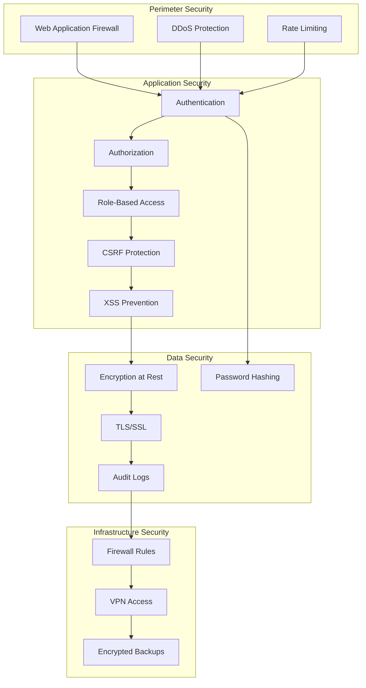

### Role-Based Access Control (RBAC)

```python
# File: university_erp/config/roles.py

ROLE_PERMISSIONS = {
    "Student": {
        "Student": ["read"],  # Can read own profile
        "Course Enrollment": ["read"],
        "Student Attendance": ["read"],
        "Exam Result": ["read"],
        "Fee Invoice": ["read"],
        "Payment Entry": ["read", "create"],  # Can make payments
        "Student Leave Application": ["read", "create"],
        "Assignment Submission": ["read", "create"],
        "Grievance": ["read", "create"],
        "Feedback Response": ["read", "create"]
    },

    "Faculty": {
        "Student": ["read"],
        "Course": ["read", "write"],
        "Course Schedule": ["read", "write"],
        "Student Attendance": ["read", "write", "create"],
        "Assessment Plan": ["read", "write", "create"],
        "Assessment Result": ["read", "write", "create"],
        "Assignment": ["read", "write", "create"],
        "Exam Schedule": ["read"]
    },

    "HOD": {
        # Inherits Faculty permissions
        "Academic Program": ["read", "write"],
        "Course": ["read", "write", "create", "delete"],
        "Instructor": ["read", "write"],
        "Timetable": ["read", "write", "create"]
    },

    "Exam Controller": {
        "Exam Schedule": ["read", "write", "create"],
        "Question Bank": ["read", "write", "create"],
        "Question Paper": ["read", "write", "create"],
        "Exam Result": ["read", "write", "create"],
        "Grade Scale": ["read", "write"],
        "Transcript": ["read", "create"]
    },

    "Accounts Manager": {
        "Fee Structure": ["read", "write", "create"],
        "Fee Schedule": ["read", "write", "create"],
        "Sales Invoice": ["read", "write", "create"],
        "Payment Entry": ["read", "write", "create"],
        "Payment Gateway Log": ["read"],
        "Account": ["read", "write"],
        "Journal Entry": ["read", "write", "create"]
    },

    "Admission Officer": {
        "Admission Cycle": ["read", "write", "create"],
        "Student Application": ["read", "write"],
        "Merit List": ["read", "write", "create"],
        "Seat Allotment": ["read", "write", "create"],
        "Student Enrollment": ["read", "write", "create"]
    },

    "Registrar": {
        # Full access to academic operations
        "Student": ["read", "write", "create"],
        "Academic Program": ["read", "write", "create"],
        "Course": ["read", "write", "create"],
        "Academic Year": ["read", "write", "create"],
        "Academic Term": ["read", "write", "create"]
    },

    "System Administrator": {
        # Full access to everything
        "*": ["read", "write", "create", "delete", "submit", "cancel"]
    }
}
```

### Data Encryption

```python
# File: university_erp/utils/encryption.py

import frappe
from cryptography.fernet import Fernet
import hashlib

class EncryptionService:
    """
    Handle sensitive data encryption
    """

    @staticmethod
    def get_encryption_key():
        """Get encryption key from site config"""
        return frappe.conf.get("encryption_key").encode()

    @staticmethod
    def encrypt(data):
        """Encrypt sensitive data"""
        key = EncryptionService.get_encryption_key()
        f = Fernet(key)
        encrypted = f.encrypt(data.encode())
        return encrypted.decode()

    @staticmethod
    def decrypt(encrypted_data):
        """Decrypt sensitive data"""
        key = EncryptionService.get_encryption_key()
        f = Fernet(key)
        decrypted = f.decrypt(encrypted_data.encode())
        return decrypted.decode()

    @staticmethod
    def hash_password(password):
        """Hash password using SHA-256"""
        return hashlib.sha256(password.encode()).hexdigest()

    @staticmethod
    def verify_password(password, hashed):
        """Verify password against hash"""
        return EncryptionService.hash_password(password) == hashed

# Sensitive fields to encrypt
ENCRYPTED_FIELDS = {
    "Student": ["aadhar_number", "bank_account_number"],
    "Employee": ["aadhar_number", "pan_number", "bank_account_number"],
    "Guardian": ["aadhar_number"]
}
```

### Audit Logging

```python
# File: university_erp/hooks.py

doc_events = {
    "*": {
        "on_update": "university_erp.utils.audit.log_update",
        "on_submit": "university_erp.utils.audit.log_submit",
        "on_cancel": "university_erp.utils.audit.log_cancel",
        "on_trash": "university_erp.utils.audit.log_delete"
    }
}

# File: university_erp/utils/audit.py

def log_update(doc, method):
    """Log document updates"""
    if should_audit(doc.doctype):
        frappe.get_doc({
            "doctype": "Audit Log",
            "reference_doctype": doc.doctype,
            "reference_name": doc.name,
            "action": "Update",
            "user": frappe.session.user,
            "timestamp": frappe.utils.now(),
            "ip_address": frappe.local.request_ip,
            "changes": get_document_changes(doc)
        }).insert(ignore_permissions=True)

def should_audit(doctype):
    """Check if doctype should be audited"""
    AUDIT_DOCTYPES = [
        "Student", "Employee", "Fee Invoice", "Payment Entry",
        "Exam Result", "Student Application", "Admission Cycle"
    ]
    return doctype in AUDIT_DOCTYPES
```

---

## 10. Deployment Architecture

### Production Infrastructure

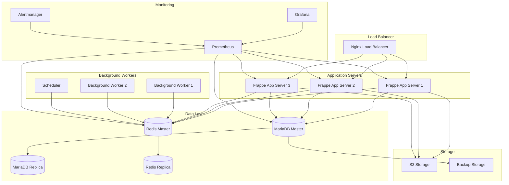

### Docker Compose Setup

```yaml
# File: docker-compose.prod.yml

version: '3.8'

services:
  # Nginx Load Balancer
  nginx:
    image: nginx:latest
    ports:
      - "80:80"
      - "443:443"
    volumes:
      - ./nginx/nginx.conf:/etc/nginx/nginx.conf
      - ./nginx/ssl:/etc/nginx/ssl
      - static_files:/var/www/html
    depends_on:
      - frappe-app-1
      - frappe-app-2
    networks:
      - frappe-network

  # Frappe Application Servers
  frappe-app-1:
    image: university_erp:latest
    environment:
      - SITE_NAME=university.local
      - DB_HOST=mariadb-master
      - REDIS_CACHE=redis-master:6379
      - REDIS_QUEUE=redis-master:6379
    volumes:
      - sites:/home/frappe/frappe-bench/sites
      - logs:/home/frappe/frappe-bench/logs
    depends_on:
      - mariadb-master
      - redis-master
    networks:
      - frappe-network

  frappe-app-2:
    image: university_erp:latest
    environment:
      - SITE_NAME=university.local
      - DB_HOST=mariadb-master
      - REDIS_CACHE=redis-master:6379
      - REDIS_QUEUE=redis-master:6379
    volumes:
      - sites:/home/frappe/frappe-bench/sites
      - logs:/home/frappe/frappe-bench/logs
    depends_on:
      - mariadb-master
      - redis-master
    networks:
      - frappe-network

  # Background Workers
  worker-default:
    image: university_erp:latest
    command: bench worker --queue default
    environment:
      - SITE_NAME=university.local
      - DB_HOST=mariadb-master
      - REDIS_QUEUE=redis-master:6379
    volumes:
      - sites:/home/frappe/frappe-bench/sites
    depends_on:
      - mariadb-master
      - redis-master
    networks:
      - frappe-network

  worker-long:
    image: university_erp:latest
    command: bench worker --queue long
    environment:
      - SITE_NAME=university.local
      - DB_HOST=mariadb-master
      - REDIS_QUEUE=redis-master:6379
    volumes:
      - sites:/home/frappe/frappe-bench/sites
    depends_on:
      - mariadb-master
      - redis-master
    networks:
      - frappe-network

  scheduler:
    image: university_erp:latest
    command: bench schedule
    environment:
      - SITE_NAME=university.local
      - DB_HOST=mariadb-master
      - REDIS_QUEUE=redis-master:6379
    volumes:
      - sites:/home/frappe/frappe-bench/sites
    depends_on:
      - mariadb-master
      - redis-master
    networks:
      - frappe-network

  # Database - Master
  mariadb-master:
    image: mariadb:10.6
    environment:
      - MYSQL_ROOT_PASSWORD=${DB_ROOT_PASSWORD}
      - MYSQL_DATABASE=university_erp
      - MYSQL_USER=frappe
      - MYSQL_PASSWORD=${DB_PASSWORD}
    volumes:
      - mariadb_data:/var/lib/mysql
      - ./mariadb/master.cnf:/etc/mysql/conf.d/master.cnf
    networks:
      - frappe-network

  # Database - Replica
  mariadb-replica:
    image: mariadb:10.6
    environment:
      - MYSQL_ROOT_PASSWORD=${DB_ROOT_PASSWORD}
      - MYSQL_MASTER_HOST=mariadb-master
    volumes:
      - mariadb_replica_data:/var/lib/mysql
      - ./mariadb/replica.cnf:/etc/mysql/conf.d/replica.cnf
    depends_on:
      - mariadb-master
    networks:
      - frappe-network

  # Redis - Master
  redis-master:
    image: redis:7-alpine
    command: redis-server --appendonly yes
    volumes:
      - redis_data:/data
    networks:
      - frappe-network

  # Redis - Replica
  redis-replica:
    image: redis:7-alpine
    command: redis-server --slaveof redis-master 6379
    depends_on:
      - redis-master
    networks:
      - frappe-network

  # Monitoring
  prometheus:
    image: prom/prometheus:latest
    volumes:
      - ./prometheus/prometheus.yml:/etc/prometheus/prometheus.yml
      - prometheus_data:/prometheus
    ports:
      - "9090:9090"
    networks:
      - frappe-network

  grafana:
    image: grafana/grafana:latest
    environment:
      - GF_SECURITY_ADMIN_PASSWORD=${GRAFANA_PASSWORD}
    volumes:
      - grafana_data:/var/lib/grafana
      - ./grafana/dashboards:/etc/grafana/provisioning/dashboards
    ports:
      - "3000:3000"
    depends_on:
      - prometheus
    networks:
      - frappe-network

volumes:
  sites:
  logs:
  mariadb_data:
  mariadb_replica_data:
  redis_data:
  static_files:
  prometheus_data:
  grafana_data:

networks:
  frappe-network:
    driver: bridge
```

### High Availability Setup

```bash
# File: scripts/deploy_ha.sh

#!/bin/bash

# High Availability Deployment Script

set -e

echo "Deploying University ERP in HA mode..."

# 1. Build application image
docker build -t university_erp:latest .

# 2. Deploy database cluster
docker-compose -f docker-compose.db.yml up -d
sleep 30

# 3. Setup database replication
docker exec mariadb-master mysql -uroot -p${DB_ROOT_PASSWORD} \
  -e "GRANT REPLICATION SLAVE ON *.* TO 'replica'@'%' IDENTIFIED BY '${REPLICA_PASSWORD}'"

docker exec mariadb-replica mysql -uroot -p${DB_ROOT_PASSWORD} \
  -e "CHANGE MASTER TO MASTER_HOST='mariadb-master', MASTER_USER='replica', MASTER_PASSWORD='${REPLICA_PASSWORD}'"

docker exec mariadb-replica mysql -uroot -p${DB_ROOT_PASSWORD} \
  -e "START SLAVE"

# 4. Deploy Redis cluster
docker-compose -f docker-compose.redis.yml up -d
sleep 10

# 5. Deploy application servers
docker-compose -f docker-compose.app.yml up -d --scale frappe-app=3
sleep 20

# 6. Deploy background workers
docker-compose -f docker-compose.worker.yml up -d

# 7. Deploy monitoring
docker-compose -f docker-compose.monitoring.yml up -d

# 8. Setup backup cron
cat > /etc/cron.d/frappe-backup << EOF
0 2 * * * root /opt/scripts/backup.sh
EOF

echo "Deployment complete!"
echo "Access application at: https://university.example.com"
echo "Access Grafana at: http://localhost:3000"
```

---

## Summary

This architecture document provides:

1. **Complete System Overview** - High-level architecture with all layers
2. **Technology Stack** - Comprehensive list of technologies used
3. **Module Organization** - All 8+ modules with their purpose
4. **DocType Catalog** - 300+ DocTypes organized by module
5. **Database Schema** - ER diagrams and table structures
6. **Integration Patterns** - Payment, Communication, Storage, Biometric
7. **Student Portal** - Complete React architecture and API endpoints
8. **Security Architecture** - RBAC, encryption, audit logging
9. **Deployment Architecture** - HA setup with Docker Compose

All diagrams use Mermaid syntax for easy rendering in markdown viewers.
