# University ERP - Workflows and Process Diagrams

## Table of Contents
1. [Student Admission Workflow](#1-student-admission-workflow)
2. [Student Registration & Enrollment Workflow](#2-student-registration--enrollment-workflow)
3. [Course Enrollment Workflow](#3-course-enrollment-workflow)
4. [Fee Payment Workflow](#4-fee-payment-workflow)
5. [Examination Workflow](#5-examination-workflow)
6. [Result Processing Workflow](#6-result-processing-workflow)
7. [Leave Application Workflow](#7-leave-application-workflow)
8. [Grievance Redressal Workflow](#8-grievance-redressal-workflow)
9. [Library Book Issue/Return Workflow](#9-library-book-issuereturn-workflow)
10. [Hostel Allocation Workflow](#10-hostel-allocation-workflow)
11. [Transport Allocation Workflow](#11-transport-allocation-workflow)
12. [Attendance Marking Workflow](#12-attendance-marking-workflow)
13. [Assignment Submission Workflow](#13-assignment-submission-workflow)
14. [Document Request Workflow](#14-document-request-workflow)
15. [Faculty Recruitment Workflow](#15-faculty-recruitment-workflow)

---

## 1. Student Admission Workflow

### Process Flow Diagram

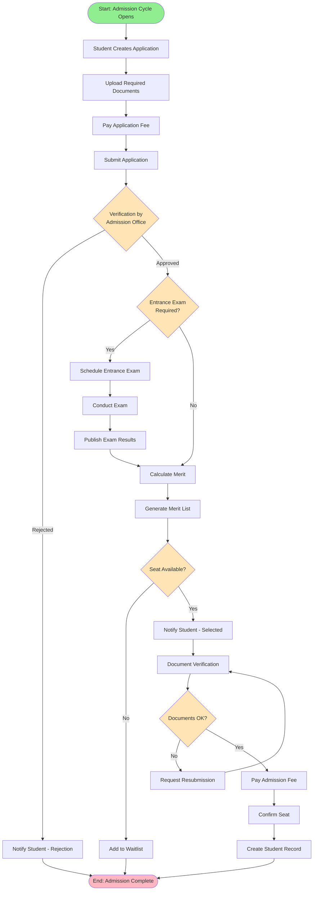

### Workflow States

| State | Description | Allowed Transitions | Responsible Role |
|-------|-------------|---------------------|------------------|
| Draft | Application created but not submitted | Submit | Student |
| Submitted | Application submitted for review | Approve, Reject | Admission Officer |
| Under Review | Documents being verified | Approve, Request Resubmission | Admission Officer |
| Entrance Scheduled | Exam scheduled for candidate | Mark Attended | Exam Controller |
| Merit List Generated | Candidate in merit list | Allocate Seat, Waitlist | Admission Officer |
| Seat Allocated | Seat allocated to candidate | Confirm, Reject | Student |
| Document Verified | All documents verified | Proceed to Enrollment | Admission Officer |
| Fee Paid | Admission fee paid | Complete Enrollment | Accounts |
| Enrolled | Student enrolled successfully | - | Registrar |
| Rejected | Application rejected | - | Admission Officer |
| Waitlisted | Candidate in waitlist | Allocate Seat | Admission Officer |

### Notification Triggers

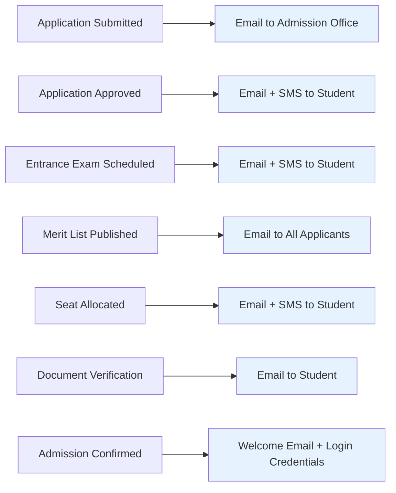

---

## 2. Student Registration & Enrollment Workflow

### Process Flow Diagram

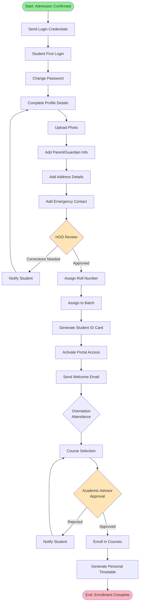

### Data Required at Each Stage

| Stage | Data Collection | Validation Rules |
|-------|----------------|------------------|
| Profile Completion | Name, DOB, Gender, Blood Group, Aadhar | All mandatory fields |
| Photo Upload | Passport size photo | Max 500KB, JPG/PNG |
| Parent Info | Father/Mother/Guardian name, occupation, phone, email | At least one parent mandatory |
| Address | Current & Permanent address, pincode | Valid pincode required |
| Emergency Contact | Name, relationship, phone | Valid phone number |
| Course Selection | Preferred courses list | Min credits, prerequisites |

---

## 3. Course Enrollment Workflow

### Process Flow Diagram

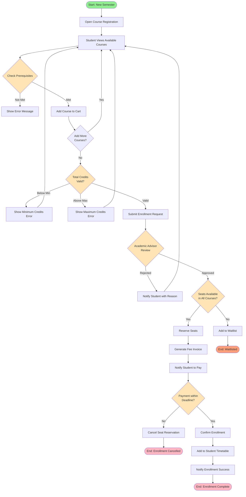

### Business Rules

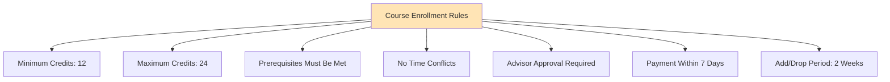

---

## 4. Fee Payment Workflow

### Process Flow Diagram

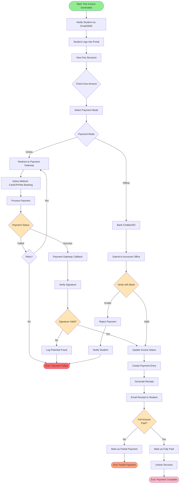

### Payment Gateway Integration Flow

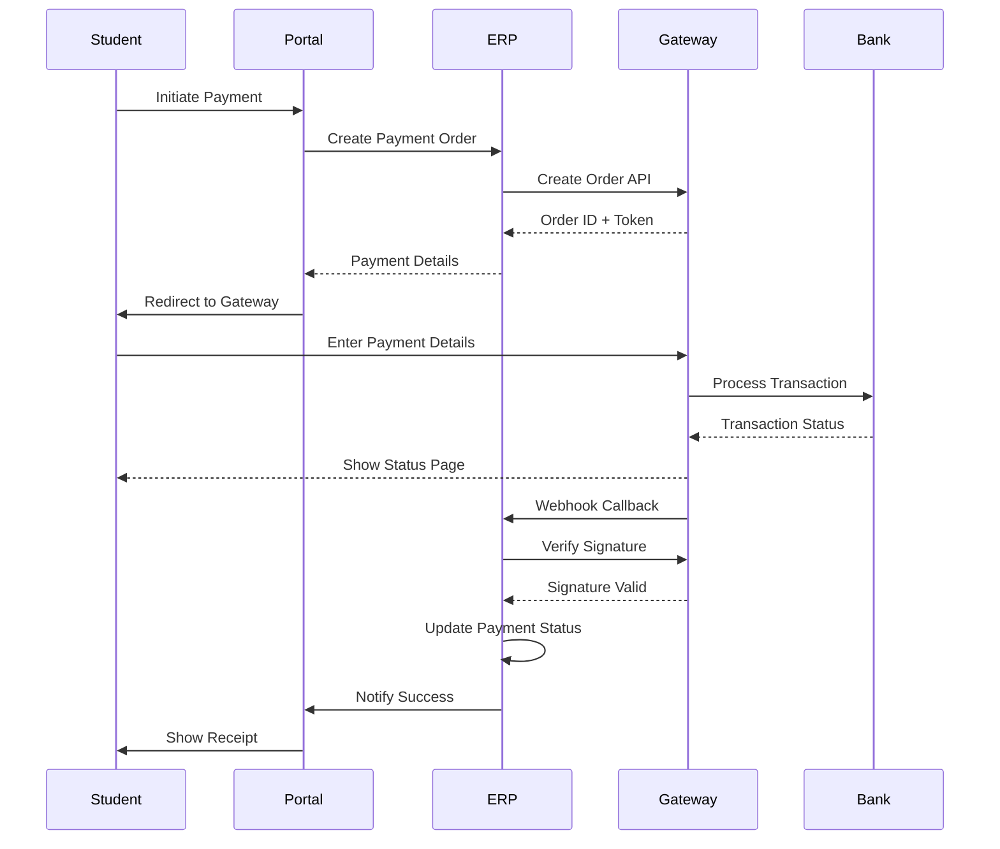

### Fee Components

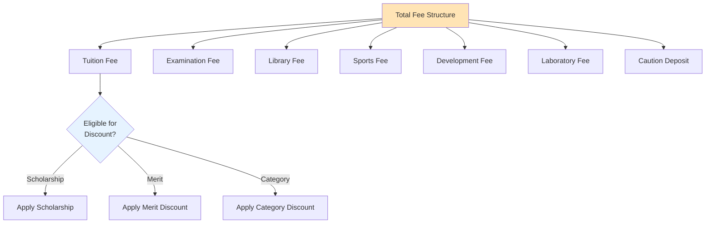

---

## 5. Examination Workflow

### Process Flow Diagram

```mermaid
flowchart TD
    START([Start: Term End Approaching]) --> CREATE_SCHEDULE[Exam Controller Creates Exam Schedule]
    CREATE_SCHEDULE --> SELECT_COURSES[Select Courses for Examination]
    SELECT_COURSES --> SET_DATES[Set Exam Dates & Timings]
    SET_DATES --> ALLOC_HALLS[Allocate Exam Halls]

    ALLOC_HALLS --> GEN_SEATING[Generate Seating Plan]
    GEN_SEATING --> ASSIGN_INVIG[Assign Invigilators]
    ASSIGN_INVIG --> PUBLISH_SCHEDULE[Publish Exam Schedule]

    PUBLISH_SCHEDULE --> NOTIFY_STUDENTS[Notify Students]
    NOTIFY_STUDENTS --> PREP_QPAPER[Prepare Question Papers]

    PREP_QPAPER --> PAPER_MODE{Paper Type}
    PAPER_MODE -->|Online| CREATE_ONLINE[Create Online Exam]
    PAPER_MODE -->|Offline| PRINT_PAPER[Print Question Papers]

    CREATE_ONLINE --> ASSIGN_QUESTIONS[Assign Questions from Bank]
    ASSIGN_QUESTIONS --> SET_DURATION[Set Duration & Rules]
    SET_DURATION --> PUBLISH_ONLINE[Publish Online Exam]

    PRINT_PAPER --> SEAL[Seal in Envelopes]
    SEAL --> STORE[Store in Strong Room]

    PUBLISH_ONLINE --> WAIT_EXAM[Wait for Exam Date]
    STORE --> WAIT_EXAM

    WAIT_EXAM --> EXAM_DAY[Exam Day]

    EXAM_DAY --> MODE_CHECK{Exam Mode}
    MODE_CHECK -->|Online| ACTIVATE[Activate Online Exam]
    MODE_CHECK -->|Offline| DISTRIBUTE[Distribute Papers]

    ACTIVATE --> STUDENT_LOGIN[Students Login]
    STUDENT_LOGIN --> VERIFY_ID[Verify Student Identity]
    VERIFY_ID --> START_EXAM[Start Exam Timer]

    DISTRIBUTE --> VERIFY_SEAL[Verify Seal]
    VERIFY_SEAL --> HAND_PAPER[Hand Papers to Students]
    HAND_PAPER --> START_EXAM

    START_EXAM --> CONDUCT[Conduct Examination]
    CONDUCT --> MONITOR[Monitor for Malpractice]

    MONITOR --> MALPRACTICE{Malpractice<br/>Detected?}
    MALPRACTICE -->|Yes| REPORT_MALP[Report Malpractice]
    REPORT_MALP --> DISCIPLINARY[Disciplinary Action]
    DISCIPLINARY --> CONDUCT

    MALPRACTICE -->|No| CONTINUE[Continue Exam]
    CONTINUE --> TIME_UP{Time Up?}

    TIME_UP -->|No| CONDUCT
    TIME_UP -->|Yes| COLLECT[Collect Answer Sheets]

    COLLECT --> ONLINE_CHECK{Online Exam?}
    ONLINE_CHECK -->|Yes| AUTO_SAVE[Auto-Save Responses]
    ONLINE_CHECK -->|No| BUNDLE[Bundle Answer Sheets]

    AUTO_SAVE --> STORE_RESP[Store in Database]
    BUNDLE --> HAND_EVAL[Hand to Evaluators]

    STORE_RESP --> END([End: Exam Conducted])
    HAND_EVAL --> END

    style START fill:#90EE90
    style END fill:#FFB6C1
    style PAPER_MODE fill:#FFE4B5
    style MODE_CHECK fill:#FFE4B5
    style MALPRACTICE fill:#FFE4B5
    style TIME_UP fill:#FFE4B5
    style ONLINE_CHECK fill:#FFE4B5
```

### Exam Monitoring (Online Exams)

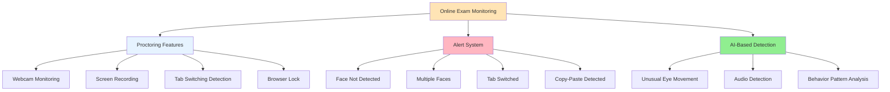

---

## 6. Result Processing Workflow

### Process Flow Diagram

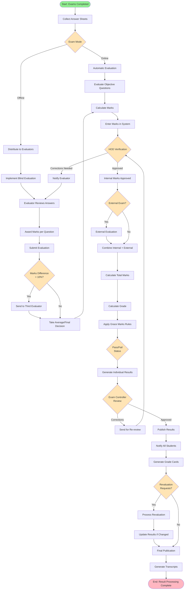

### Grade Calculation Logic

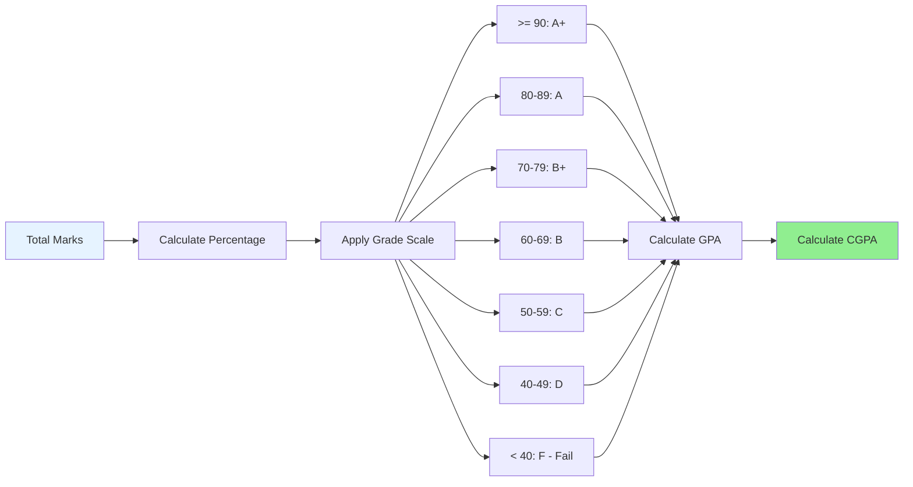

---

## 7. Leave Application Workflow

### Process Flow Diagram

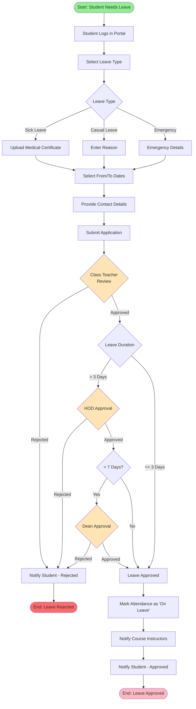

### Leave Types & Approval Hierarchy

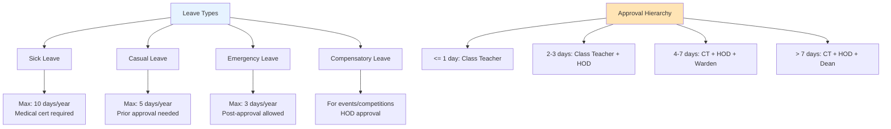

---

## 8. Grievance Redressal Workflow

### Process Flow Diagram

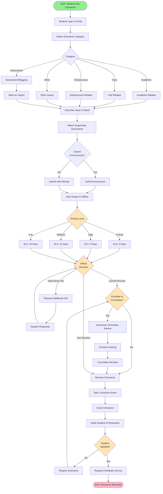

### SLA Monitoring

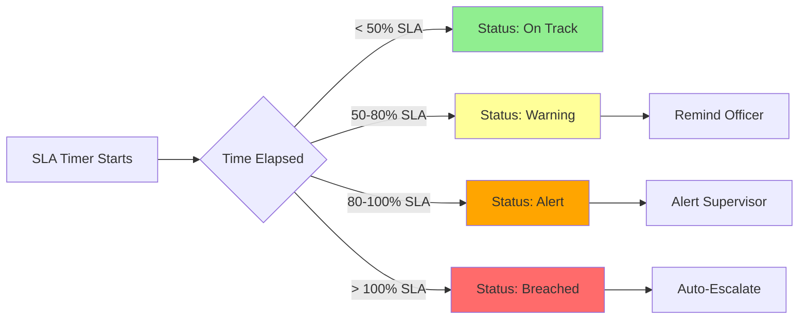

---

## 9. Library Book Issue/Return Workflow

### Process Flow Diagram

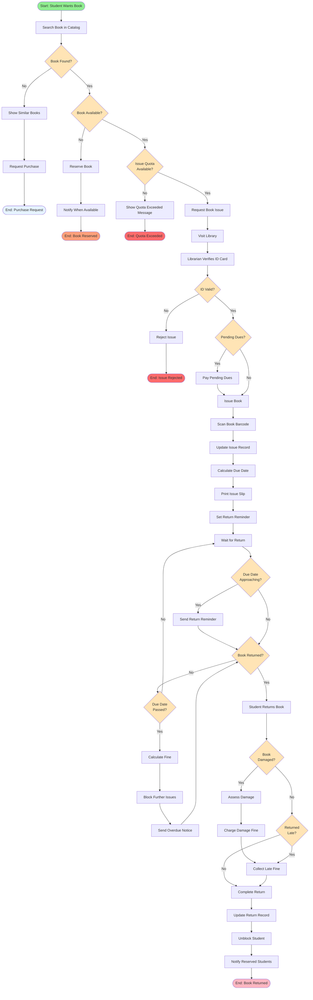

### Library Rules & Fine Structure

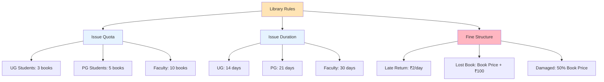

---

## 10. Hostel Allocation Workflow

### Process Flow Diagram

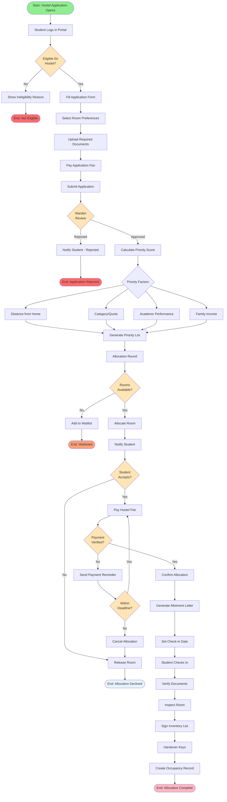

### Priority Calculation

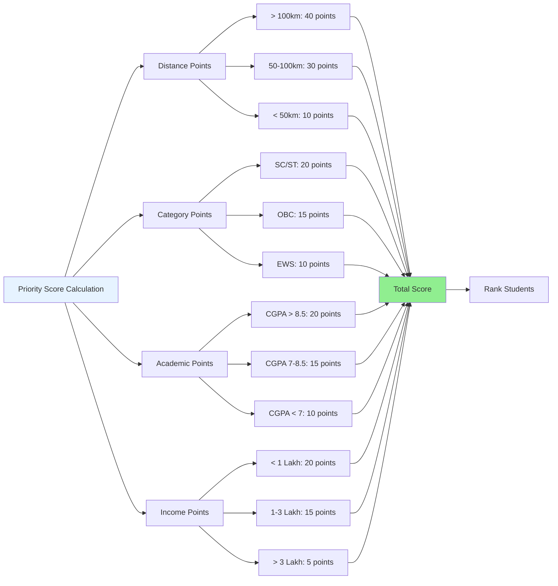

---

## 11. Transport Allocation Workflow

### Process Flow Diagram

```mermaid
flowchart TD
    START([Start: Transport Registration Opens]) --> LOGIN[Student Logs in Portal]
    LOGIN --> VIEW_ROUTES[View Available Routes]
    VIEW_ROUTES --> SELECT[Select Route]
    SELECT --> CHECK_STOPS{Pickup Stop<br/>Available?}

    CHECK_STOPS -->|No| REQ_STOP[Request New Stop]
    REQ_STOP --> TRANSPORT_OFF{Transport Officer<br/>Reviews}
    TRANSPORT_OFF -->|Rejected| NOTIFY_STOP_REJ[Notify Student]
    NOTIFY_STOP_REJ --> VIEW_ROUTES
    TRANSPORT_OFF -->|Approved| ADD_STOP[Add Stop to Route]
    ADD_STOP --> FILL_APP

    CHECK_STOPS -->|Yes| FILL_APP[Fill Application]
    FILL_APP --> UPLOAD[Upload Address Proof]
    UPLOAD --> SUBMIT_APP[Submit Application]

    SUBMIT_APP --> CHECK_SEATS{Seats<br/>Available?}
    CHECK_SEATS -->|No| WAITLIST[Add to Waitlist]
    WAITLIST --> END_WAIT([End: Waitlisted])

    CHECK_SEATS -->|Yes| CALC_FEE[Calculate Transport Fee]
    CALC_FEE --> NOTIFY_FEE[Notify Student]

    NOTIFY_FEE --> PAY_FEE[Pay Transport Fee]
    PAY_FEE --> VERIFY{Payment<br/>Verified?}

    VERIFY -->|No| REMINDER[Send Reminder]
    REMINDER --> DEADLINE{Within<br/>Deadline?}
    DEADLINE -->|No| CANCEL[Cancel Application]
    CANCEL --> END_CANCEL([End: Application Cancelled])
    DEADLINE -->|Yes| PAY_FEE

    VERIFY -->|Yes| ALLOC[Allocate Seat]
    ALLOC --> UPDATE[Update Vehicle Roster]
    UPDATE --> GEN_PASS[Generate Bus Pass]
    GEN_PASS --> NOTIFY_SUCCESS[Notify Student]
    NOTIFY_SUCCESS --> COLLECT[Collect Bus Pass from Office]
    COLLECT --> ACTIVE[Activate Transport Service]
    ACTIVE --> END([End: Transport Allocated])

    style START fill:#90EE90
    style END fill:#FFB6C1
    style END_WAIT fill:#FFA07A
    style END_CANCEL fill:#FF6B6B
    style CHECK_STOPS fill:#FFE4B5
    style TRANSPORT_OFF fill:#FFE4B5
    style CHECK_SEATS fill:#FFE4B5
    style VERIFY fill:#FFE4B5
    style DEADLINE fill:#FFE4B5
```

### Route Optimization

```mermaid
graph TD
    OPTIMIZE[Route Optimization]

    OPTIMIZE --> FACTORS[Optimization Factors]
    FACTORS --> TIME[Minimize Travel Time]
    FACTORS --> DIST[Minimize Distance]
    FACTORS --> UTIL[Maximize Vehicle Utilization]
    FACTORS --> DEMAND[Balance Demand]

    OPTIMIZE --> SCHEDULE[Schedule Optimization]
    SCHEDULE --> MORNING[Morning Routes]
    SCHEDULE --> EVENING[Evening Routes]
    SCHEDULE --> TIMING[Timing based on Timetable]

    OPTIMIZE --> CAPACITY[Capacity Management]
    CAPACITY --> VEHICLE[Vehicle Capacity]
    CAPACITY --> STUDENT[Student Demand]
    CAPACITY --> PEAK[Peak Hour Management]

    style OPTIMIZE fill:#E6F3FF
```

---

## 12. Attendance Marking Workflow

### Process Flow Diagram

```mermaid
flowchart TD
    START([Start: Class Begins]) --> METHOD{Attendance<br/>Method}

    METHOD -->|Manual| MANUAL[Manual Marking]
    METHOD -->|Biometric| BIOMETRIC[Biometric System]
    METHOD -->|App-Based| APP[Mobile App]
    METHOD -->|QR Code| QR[QR Code Scan]

    MANUAL --> FACULTY_LOGIN[Faculty Logs in]
    FACULTY_LOGIN --> SELECT_CLASS[Select Course Schedule]
    SELECT_CLASS --> LOAD_STUDENTS[Load Student List]
    LOAD_STUDENTS --> MARK[Mark Attendance]

    BIOMETRIC --> SCAN[Student Scans Fingerprint]
    SCAN --> VERIFY_BIO{Biometric<br/>Verified?}
    VERIFY_BIO -->|No| ERROR[Show Error]
    ERROR --> RETRY{Retry?}
    RETRY -->|Yes| SCAN
    RETRY -->|No| MANUAL_FALLBACK[Mark Manually]
    MANUAL_FALLBACK --> MARK

    VERIFY_BIO -->|Yes| LOCATION{Within Campus<br/>Location?}
    LOCATION -->|No| DENY[Deny Attendance]
    DENY --> ALERT_ADMIN[Alert Administrator]
    LOCATION -->|Yes| AUTO_MARK[Auto Mark Present]

    APP --> STUDENT_OPEN[Student Opens App]
    STUDENT_OPEN --> VERIFY_LOC{Location<br/>Verified?}
    VERIFY_LOC -->|No| DENY
    VERIFY_LOC -->|Yes| VERIFY_TIME{Within Time<br/>Window?}
    VERIFY_TIME -->|No| MARK_LATE[Mark Late]
    VERIFY_TIME -->|Yes| SELF_MARK[Self Mark Present]

    QR --> GENERATE_QR[Faculty Generates Dynamic QR]
    GENERATE_QR --> DISPLAY[Display QR Code]
    DISPLAY --> STUDENT_SCAN[Students Scan QR]
    STUDENT_SCAN --> QR_VERIFY{QR Valid &<br/>Not Expired?}
    QR_VERIFY -->|No| DENY
    QR_VERIFY -->|Yes| SELF_MARK

    MARK --> STATUS{Attendance<br/>Status}
    STATUS -->|Present| PRESENT
    STATUS -->|Absent| ABSENT
    STATUS -->|Late| LATE
    STATUS -->|Leave| ON_LEAVE

    AUTO_MARK --> PRESENT
    SELF_MARK --> PRESENT
    MARK_LATE --> LATE

    PRESENT --> RECORD[Record Attendance]
    ABSENT --> RECORD
    LATE --> RECORD
    ON_LEAVE --> RECORD

    RECORD --> SYNC[Sync to Database]
    SYNC --> CALC_PERCENT[Calculate Attendance %]
    CALC_PERCENT --> CHECK_LOW{Attendance<br/>< 75%?}

    CHECK_LOW -->|Yes| ALERT[Alert Student & Parent]
    CHECK_LOW -->|No| UPDATE

    ALERT --> UPDATE[Update Dashboard]
    UPDATE --> NOTIFY_STUDENT[Notify Student]
    NOTIFY_STUDENT --> END([End: Attendance Recorded])

    ALERT_ADMIN --> END

    style START fill:#90EE90
    style END fill:#FFB6C1
    style METHOD fill:#FFE4B5
    style VERIFY_BIO fill:#FFE4B5
    style LOCATION fill:#FFE4B5
    style VERIFY_LOC fill:#FFE4B5
    style VERIFY_TIME fill:#FFE4B5
    style QR_VERIFY fill:#FFE4B5
    style STATUS fill:#FFE4B5
    style CHECK_LOW fill:#FFE4B5
```

### Attendance Methods Comparison

```mermaid
graph TD
    METHODS[Attendance Methods]

    METHODS --> M1[Manual Marking]
    M1 --> M1_PRO[Pros: Simple, Flexible]
    M1 --> M1_CON[Cons: Time-consuming, Proxy risk]

    METHODS --> M2[Biometric]
    M2 --> M2_PRO[Pros: Secure, Automated]
    M2 --> M2_CON[Cons: Hardware cost, Queues]

    METHODS --> M3[Mobile App]
    M3 --> M3_PRO[Pros: Quick, Location-based]
    M3 --> M3_CON[Cons: GPS spoofing risk]

    METHODS --> M4[QR Code]
    M4 --> M4_PRO[Pros: Fast, Dynamic]
    M4 --> M4_CON[Cons: Screenshot sharing risk]

    style METHODS fill:#E6F3FF
```

---

## 13. Assignment Submission Workflow

### Process Flow Diagram

```mermaid
flowchart TD
    START([Start: Assignment Created]) --> FACULTY[Faculty Creates Assignment]
    FACULTY --> SET_DETAILS[Set Title, Description, Marks]
    SET_DETAILS --> SET_DEADLINE[Set Submission Deadline]
    SET_DEADLINE --> ATTACH[Attach Reference Files]
    ATTACH --> PUBLISH[Publish Assignment]

    PUBLISH --> NOTIFY[Notify Students]
    NOTIFY --> STUDENT_VIEW[Student Views Assignment]
    STUDENT_VIEW --> DOWNLOAD[Download Reference Materials]
    DOWNLOAD --> WORK[Student Works on Assignment]

    WORK --> PREPARE[Prepare Submission File]
    PREPARE --> UPLOAD[Upload File]
    UPLOAD --> CHECK_SIZE{File Size<br/>Valid?}

    CHECK_SIZE -->|No| SIZE_ERROR[Show Size Error]
    SIZE_ERROR --> UPLOAD

    CHECK_SIZE -->|Yes| CHECK_FORMAT{File Format<br/>Allowed?}
    CHECK_FORMAT -->|No| FORMAT_ERROR[Show Format Error]
    FORMAT_ERROR --> UPLOAD

    CHECK_FORMAT -->|Yes| CHECK_DEADLINE{Before<br/>Deadline?}
    CHECK_DEADLINE -->|No| LATE{Allow Late<br/>Submission?}

    LATE -->|No| REJECT[Reject Submission]
    REJECT --> END_REJ([End: Submission Rejected])

    LATE -->|Yes| PENALTY[Apply Late Penalty]
    PENALTY --> SUBMIT

    CHECK_DEADLINE -->|Yes| SUBMIT[Submit Assignment]
    SUBMIT --> PLAGIARISM[Run Plagiarism Check]

    PLAGIARISM --> PLAG_SCORE{Plagiarism<br/>> Threshold?}
    PLAG_SCORE -->|Yes| FLAG[Flag Submission]
    FLAG --> NOTIFY_FAC[Notify Faculty]
    NOTIFY_FAC --> MANUAL_REV

    PLAG_SCORE -->|No| CONFIRM[Confirm Submission]
    CONFIRM --> RECEIPT[Generate Receipt]
    RECEIPT --> NOTIFY_STUDENT[Notify Student]
    NOTIFY_STUDENT --> QUEUE[Add to Evaluation Queue]

    QUEUE --> MANUAL_REV[Faculty Reviews Submission]
    MANUAL_REV --> EVALUATE[Evaluate & Award Marks]
    EVALUATE --> FEEDBACK[Provide Feedback]
    FEEDBACK --> PLAG_ACTION{Plagiarism<br/>Flagged?}

    PLAG_ACTION -->|Yes| DISCIPLINARY[Disciplinary Action]
    DISCIPLINARY --> ZERO_MARKS[Award Zero Marks]
    ZERO_MARKS --> PUBLISH_GRADE

    PLAG_ACTION -->|No| PUBLISH_GRADE[Publish Grade]
    PUBLISH_GRADE --> NOTIFY_RESULT[Notify Student]
    NOTIFY_RESULT --> VIEW_RESULT{Student Views<br/>Result}

    VIEW_RESULT --> SATISFIED{Satisfied with<br/>Evaluation?}
    SATISFIED -->|No| REEVAL_REQ[Request Re-evaluation]
    REEVAL_REQ --> HOD_REV{HOD Reviews<br/>Request}
    HOD_REV -->|Approved| MANUAL_REV
    HOD_REV -->|Rejected| FINAL

    SATISFIED -->|Yes| FINAL[Finalize Marks]
    FINAL --> UPDATE_RECORD[Update Academic Record]
    UPDATE_RECORD --> END([End: Assignment Complete])

    style START fill:#90EE90
    style END fill:#FFB6C1
    style END_REJ fill:#FF6B6B
    style CHECK_SIZE fill:#FFE4B5
    style CHECK_FORMAT fill:#FFE4B5
    style CHECK_DEADLINE fill:#FFE4B5
    style LATE fill:#FFE4B5
    style PLAG_SCORE fill:#FFE4B5
    style PLAG_ACTION fill:#FFE4B5
    style VIEW_RESULT fill:#FFE4B5
    style SATISFIED fill:#FFE4B5
    style HOD_REV fill:#FFE4B5
```

### Plagiarism Detection

```mermaid
flowchart LR
    SUBMIT[Submitted Assignment]

    SUBMIT --> EXTRACT[Extract Text Content]
    EXTRACT --> COMPARE[Compare with Sources]

    COMPARE --> DB[Internal Database]
    COMPARE --> WEB[Web Search]
    COMPARE --> PREV[Previous Submissions]

    DB --> SCORE[Calculate Similarity Score]
    WEB --> SCORE
    PREV --> SCORE

    SCORE --> THRESHOLD{Score > 30%?}
    THRESHOLD -->|No| PASS[Mark as Original]
    THRESHOLD -->|Yes| FLAG[Flag for Review]

    FLAG --> REPORT[Generate Detailed Report]
    REPORT --> FACULTY[Send to Faculty]

    style SUBMIT fill:#E6F3FF
    style PASS fill:#90EE90
    style FLAG fill:#FFB6C1
```

---

## 14. Document Request Workflow

### Process Flow Diagram

```mermaid
flowchart TD
    START([Start: Student Needs Document]) --> LOGIN[Student Logs in Portal]
    LOGIN --> SELECT[Select Document Type]
    SELECT --> TYPES{Document Type}

    TYPES -->|Bonafide| BONAFIDE[Bonafide Certificate]
    TYPES -->|TC| TC[Transfer Certificate]
    TYPES -->|Transcript| TRANSCRIPT[Academic Transcript]
    TYPES -->|ID Card| ID_CARD[ID Card Duplicate]
    TYPES -->|NOC| NOC[No Objection Certificate]

    BONAFIDE --> PURPOSE[Specify Purpose]
    TC --> TC_REASON[Specify Reason]
    TRANSCRIPT --> DELIVERY[Select Delivery Address]
    ID_CARD --> POLICE[Upload Police FIR]
    NOC --> NOC_PURPOSE[Specify Purpose]

    PURPOSE --> FILL
    TC_REASON --> FILL
    DELIVERY --> FILL
    POLICE --> FILL
    NOC_PURPOSE --> FILL

    FILL[Fill Request Form] --> PAY{Fee<br/>Required?}
    PAY -->|Yes| PAY_FEE[Pay Processing Fee]
    PAY -->|No| SUBMIT

    PAY_FEE --> SUBMIT[Submit Request]
    SUBMIT --> REGISTRAR{Registrar<br/>Review}

    REGISTRAR -->|Rejected| NOTIFY_REJ[Notify Student - Rejected]
    NOTIFY_REJ --> END_REJ([End: Request Rejected])

    REGISTRAR -->|Approved| CHECK{Document Type<br/>Check}

    CHECK -->|Auto-Generate| GENERATE[Auto-Generate Document]
    CHECK -->|Manual| PREPARE[Manually Prepare Document]

    GENERATE --> SIGN[Digital Signature]
    PREPARE --> PRINT[Print Document]
    PRINT --> MANUAL_SIGN[Physical Signature & Seal]

    SIGN --> READY
    MANUAL_SIGN --> READY[Document Ready]

    READY --> MODE{Delivery Mode}
    MODE -->|Collect| NOTIFY_COLLECT[Notify to Collect]
    MODE -->|Post| COURIER[Send via Courier]
    MODE -->|Email| EMAIL[Send via Email]

    NOTIFY_COLLECT --> COLLECT_OFFICE[Student Collects from Office]
    COLLECT_OFFICE --> VERIFY_ID[Verify Identity]
    VERIFY_ID --> HANDOVER[Handover Document]

    COURIER --> TRACK[Provide Tracking Number]
    TRACK --> DELIVERED

    EMAIL --> SEND_EMAIL[Send Email with PDF]
    SEND_EMAIL --> DELIVERED

    HANDOVER --> DELIVERED[Document Delivered]
    DELIVERED --> UPDATE[Update Request Status]
    UPDATE --> NOTIFY_SUCCESS[Notify Student - Completed]
    NOTIFY_SUCCESS --> END([End: Request Complete])

    style START fill:#90EE90
    style END fill:#FFB6C1
    style END_REJ fill:#FF6B6B
    style TYPES fill:#FFE4B5
    style PAY fill:#FFE4B5
    style REGISTRAR fill:#FFE4B5
    style CHECK fill:#FFE4B5
    style MODE fill:#FFE4B5
```

### Document Types & Processing Time

```mermaid
graph TD
    DOCS[Document Types]

    DOCS --> D1[Bonafide Certificate]
    D1 --> T1[Processing: 2 days<br/>Fee: ₹50]

    DOCS --> D2[Transfer Certificate]
    D2 --> T2[Processing: 7 days<br/>Fee: ₹200]

    DOCS --> D3[Academic Transcript]
    D3 --> T3[Processing: 5 days<br/>Fee: ₹500]

    DOCS --> D4[Provisional Certificate]
    D4 --> T4[Processing: 3 days<br/>Fee: ₹100]

    DOCS --> D5[Degree Certificate]
    D5 --> T5[Processing: 30 days<br/>Fee: ₹1000]

    style DOCS fill:#E6F3FF
```

---

## 15. Faculty Recruitment Workflow

### Process Flow Diagram

```mermaid
flowchart TD
    START([Start: Recruitment Need Identified]) --> HOD[HOD Creates Job Requisition]
    HOD --> JUSTIFICATION[Provide Justification]
    JUSTIFICATION --> POSITION[Define Position Details]
    POSITION --> BUDGET{Budget<br/>Available?}

    BUDGET -->|No| REQ_BUDGET[Request Budget Approval]
    REQ_BUDGET --> ADMIN{Admin<br/>Approval}
    ADMIN -->|Rejected| END_REJ([End: Budget Not Approved])
    ADMIN -->|Approved| ALLOC_BUDGET[Allocate Budget]
    ALLOC_BUDGET --> POST

    BUDGET -->|Yes| POST[Post Job Opening]
    POST --> ADVERTISE[Advertise on Portals]
    ADVERTISE --> COLLECT_APP[Collect Applications]

    COLLECT_APP --> DEADLINE{Application<br/>Deadline Reached?}
    DEADLINE -->|No| COLLECT_APP
    DEADLINE -->|Yes| SCREEN[Initial Screening]

    SCREEN --> SHORTLIST[Shortlist Candidates]
    SHORTLIST --> NOTIFY_SHORT[Notify Shortlisted Candidates]
    NOTIFY_SHORT --> SCHEDULE_DEMO[Schedule Demo Lecture]

    SCHEDULE_DEMO --> CONDUCT_DEMO[Conduct Demo Lecture]
    CONDUCT_DEMO --> EVAL_DEMO[Evaluate Demo]
    EVAL_DEMO --> DEMO_PASS{Demo<br/>Satisfactory?}

    DEMO_PASS -->|No| REJECT1[Reject Candidate]
    REJECT1 --> MORE_CAND{More<br/>Candidates?}
    MORE_CAND -->|Yes| CONDUCT_DEMO
    MORE_CAND -->|No| RE_ADVERTISE[Re-advertise Position]
    RE_ADVERTISE --> ADVERTISE

    DEMO_PASS -->|Yes| SCHEDULE_INTERVIEW[Schedule Interview]
    SCHEDULE_INTERVIEW --> PANEL[Form Interview Panel]
    PANEL --> CONDUCT_INT[Conduct Interview]

    CONDUCT_INT --> TECHNICAL[Technical Round]
    TECHNICAL --> HR[HR Round]
    HR --> PANEL_DISCUSSION[Panel Discussion]
    PANEL_DISCUSSION --> DECISION{Selection<br/>Decision}

    DECISION -->|Rejected| REJECT2[Reject Candidate]
    REJECT2 --> MORE_CAND

    DECISION -->|Selected| SEND_OFFER[Send Offer Letter]
    SEND_OFFER --> NEGOTIATE{Candidate<br/>Accepts?}

    NEGOTIATE -->|No| COUNTER{Counter<br/>Offer?}
    COUNTER -->|Yes| ADMIN_APPR{Admin<br/>Approves?}
    ADMIN_APPR -->|Yes| REVISE[Revise Offer]
    REVISE --> SEND_OFFER
    ADMIN_APPR -->|No| REJECT3[Reject Counter]
    REJECT3 --> MORE_CAND

    COUNTER -->|No| MORE_CAND

    NEGOTIATE -->|Yes| ACCEPT_OFFER[Offer Accepted]
    ACCEPT_OFFER --> DOC_VERIFY[Document Verification]
    DOC_VERIFY --> BG_CHECK[Background Check]
    BG_CHECK --> BG_OK{Background<br/>Clear?}

    BG_OK -->|No| REJECT4[Withdraw Offer]
    REJECT4 --> MORE_CAND

    BG_OK -->|Yes| JOINING[Set Joining Date]
    JOINING --> ONBOARD[Onboarding Process]
    ONBOARD --> CREATE_EMP[Create Employee Record]
    CREATE_EMP --> ORIENTATION[Conduct Orientation]
    ORIENTATION --> ASSIGN[Assign Courses & Timetable]
    ASSIGN --> PROBATION[Start Probation Period]
    PROBATION --> END([End: Recruitment Complete])

    style START fill:#90EE90
    style END fill:#FFB6C1
    style END_REJ fill:#FF6B6B
    style BUDGET fill:#FFE4B5
    style ADMIN fill:#FFE4B5
    style DEADLINE fill:#FFE4B5
    style DEMO_PASS fill:#FFE4B5
    style MORE_CAND fill:#FFE4B5
    style DECISION fill:#FFE4B5
    style NEGOTIATE fill:#FFE4B5
    style COUNTER fill:#FFE4B5
    style ADMIN_APPR fill:#FFE4B5
    style BG_OK fill:#FFE4B5
```

### Interview Evaluation Criteria

```mermaid
graph TD
    EVAL[Evaluation Criteria]

    EVAL --> TECH[Technical Knowledge - 30%]
    TECH --> T1[Subject Expertise]
    TECH --> T2[Research Publications]
    TECH --> T3[Industry Experience]

    EVAL --> TEACH[Teaching Skills - 30%]
    TEACH --> TE1[Demo Lecture Quality]
    TEACH --> TE2[Communication Skills]
    TEACH --> TE3[Student Engagement]

    EVAL --> RESEARCH[Research Aptitude - 20%]
    RESEARCH --> R1[Publications Count]
    RESEARCH --> R2[Research Proposals]
    RESEARCH --> R3[Patents/Awards]

    EVAL --> PERSON[Personality - 20%]
    PERSON --> P1[Leadership Qualities]
    PERSON --> P2[Team Player]
    PERSON --> P3[Cultural Fit]

    style EVAL fill:#E6F3FF
```

---

## Summary

This workflow documentation provides:

1. **15 Comprehensive Workflows** covering all major university operations
2. **Detailed Process Flow Diagrams** with decision points and alternate paths
3. **State Transitions** with responsible roles at each stage
4. **Business Rules** and validation logic
5. **Notification Triggers** and communication flows
6. **Integration Points** with external systems
7. **Exception Handling** and error scenarios

All diagrams use Mermaid syntax and can be rendered in any Mermaid-compatible viewer or documentation platform.
