# University ERP - Sequence Diagrams

## Table of Contents
1. [Student Login & Authentication](#1-student-login--authentication)
2. [Student Admission Flow](#2-student-admission-flow)
3. [Course Enrollment](#3-course-enrollment)
4. [Fee Payment Processing](#4-fee-payment-processing)
5. [Online Examination](#5-online-examination)
6. [Result Publication](#6-result-publication)
7. [Attendance Marking (Biometric)](#7-attendance-marking-biometric)
8. [Library Book Issue](#8-library-book-issue)
9. [Hostel Room Allocation](#9-hostel-room-allocation)
10. [Assignment Submission & Evaluation](#10-assignment-submission--evaluation)
11. [Grievance Handling](#11-grievance-handling)
12. [Document Request Processing](#12-document-request-processing)
13. [Notification System](#13-notification-system)
14. [API Integration - Payment Gateway](#14-api-integration---payment-gateway)
15. [Background Job Processing](#15-background-job-processing)

---

## 1. Student Login & Authentication

### Sequence Diagram

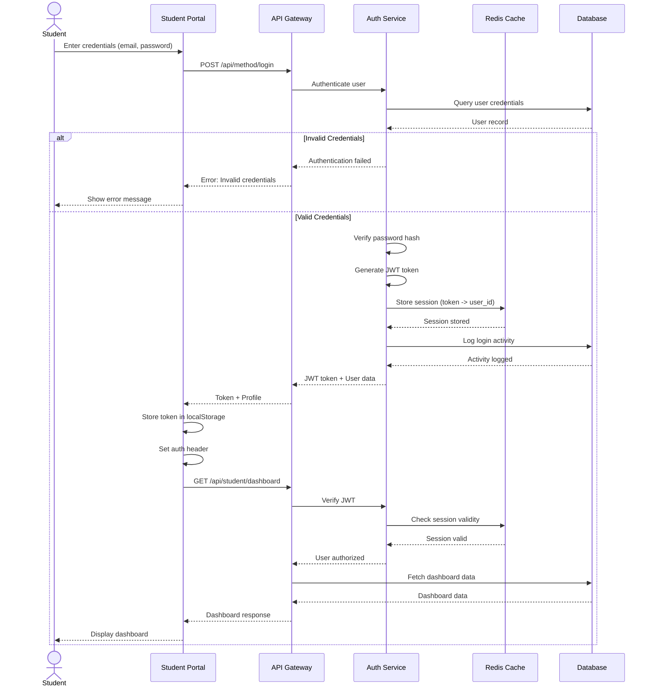

### Token Refresh Flow

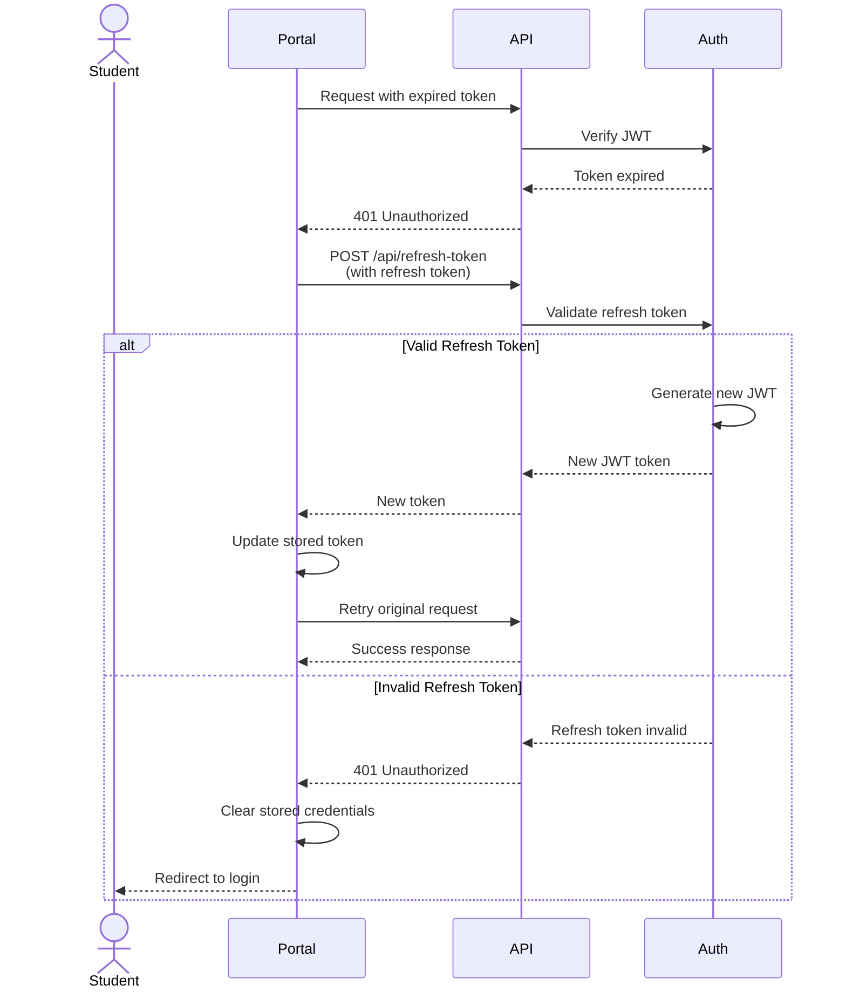

---

## 2. Student Admission Flow

### Sequence Diagram

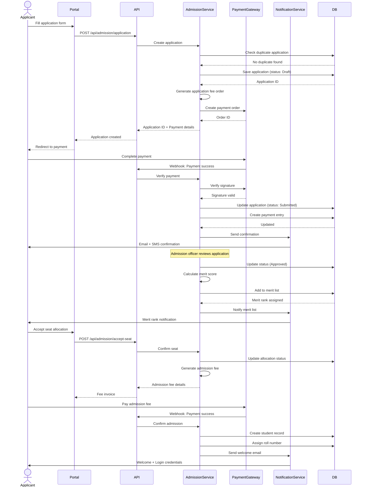

---

## 3. Course Enrollment

### Sequence Diagram

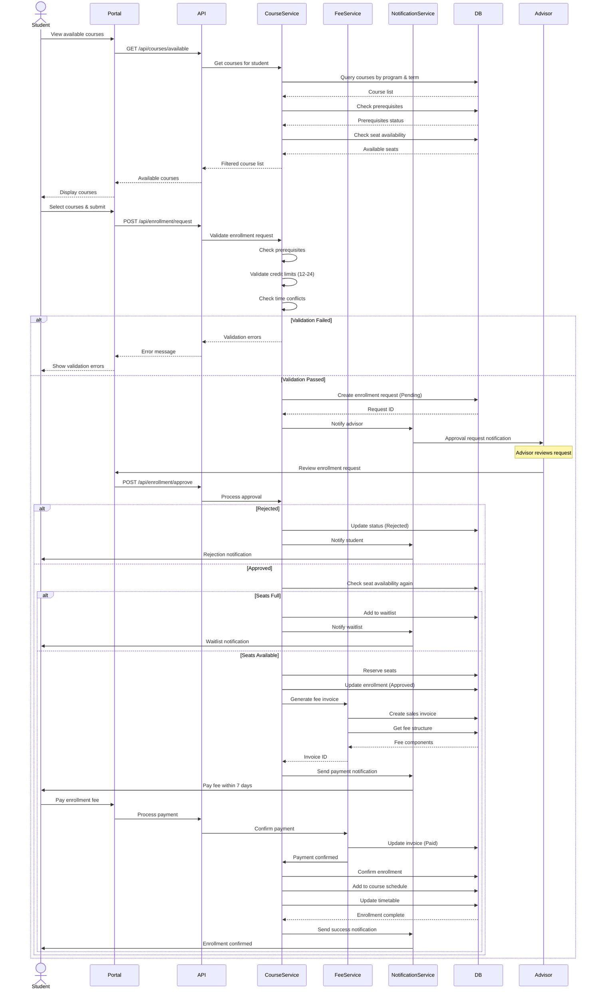

---

## 4. Fee Payment Processing

### Sequence Diagram

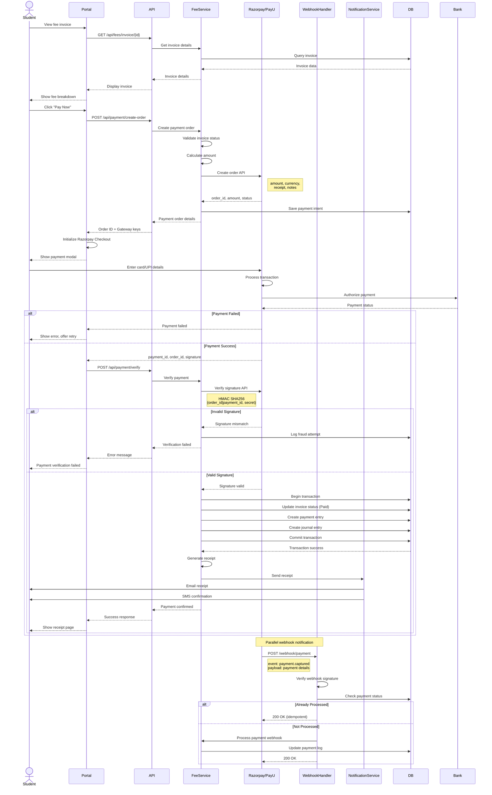

---

## 5. Online Examination

### Sequence Diagram

```mermaid
sequenceDiagram
    actor Student
    participant Portal
    participant API
    participant ExamService
    participant ProctoringService
    participant DB
    participant NotificationService

    Note over Student,DB: Before Exam Day

    ExamService->>DB: Get exam schedule
    ExamService->>DB: Generate question papers from bank
    ExamService->>NotificationService: Send exam reminders
    NotificationService->>Student: Exam notification (24h before)

    Note over Student,DB: Exam Day

    Student->>Portal: Login to portal
    Portal->>API: GET /api/exams/upcoming
    API->>ExamService: Get student exams
    ExamService->>DB: Query exam schedule
    DB-->>ExamService: Exam details
    ExamService-->>API: Exam list
    API-->>Portal: Upcoming exams
    Portal-->>Student: Show exam card

    Student->>Portal: Click "Start Exam"
    Portal->>API: POST /api/exam/start
    API->>ExamService: Validate exam start

    ExamService->>DB: Check exam timing
    ExamService->>DB: Check student eligibility
    ExamService->>DB: Check previous attempts

    alt Not Yet Started
        ExamService-->>API: Exam not started
        API-->>Portal: Show countdown timer
    else Already Submitted
        ExamService-->>API: Already attempted
        API-->>Portal: Cannot re-attempt
    else Eligible to Start
        ExamService->>DB: Create exam attempt record
        ExamService->>DB: Load question paper
        DB-->>ExamService: Questions

        ExamService->>ExamService: Shuffle questions (if enabled)
        ExamService-->>API: Exam data + Timer
        API-->>Portal: Question paper

        Portal->>Portal: Enable full-screen mode
        Portal->>Portal: Disable right-click, copy-paste
        Portal->>Portal: Start exam timer

        Portal->>ProctoringService: Initialize proctoring
        ProctoringService->>ProctoringService: Request camera access
        Student-->>ProctoringService: Grant camera permission
        ProctoringService->>ProctoringService: Start video capture
        ProctoringService->>ProctoringService: Start screen recording

        Portal-->>Student: Show first question

        loop Every 2 minutes
            ProctoringService->>ProctoringService: Capture webcam snapshot
            ProctoringService->>ProctoringService: Detect faces

            alt No Face Detected
                ProctoringService->>API: POST /api/exam/alert
                API->>ExamService: Log proctoring alert
                ExamService->>DB: Save alert (No face)
                ProctoringService-->>Portal: Show warning
                Portal-->>Student: "Face not detected!"
            else Multiple Faces
                ProctoringService->>API: POST /api/exam/alert
                API->>ExamService: Log alert
                ExamService->>DB: Save alert (Multiple faces)
                ProctoringService-->>Portal: Show warning
                Portal-->>Student: "Multiple people detected!"
            end
        end

        loop During Exam
            Student->>Portal: Select answer
            Portal->>Portal: Save answer locally
            Portal->>API: POST /api/exam/save-answer (auto-save)
            API->>ExamService: Save answer
            ExamService->>DB: Update answer sheet
            DB-->>ExamService: Saved
            ExamService-->>API: Success
            API-->>Portal: Answer saved indicator

            alt Tab Switch Detected
                Portal->>Portal: Detect visibility change
                Portal->>API: POST /api/exam/alert
                API->>ExamService: Log violation
                ExamService->>DB: Save alert (Tab switched)
                ExamService->>ExamService: Increment violation count

                alt Violations > 3
                    ExamService->>ExamService: Auto-submit exam
                    ExamService->>NotificationService: Notify invigilator
                    NotificationService->>Invigilator: Malpractice alert
                    ExamService-->>API: Exam terminated
                    API-->>Portal: Exam ended
                    Portal-->>Student: "Exam terminated due to violations"
                else Violations <= 3
                    ExamService-->>API: Warning
                    API-->>Portal: Show warning
                    Portal-->>Student: "Warning: Tab switching detected"
                end
            end

            Student->>Portal: Navigate questions
            Portal-->>Student: Show question
        end

        alt Time Up
            Portal->>Portal: Timer expires
            Portal->>API: POST /api/exam/submit (auto-submit)
            API->>ExamService: Force submit
        else Student Submits
            Student->>Portal: Click "Submit Exam"
            Portal->>Portal: Confirm submission
            Student->>Portal: Confirm
            Portal->>API: POST /api/exam/submit
            API->>ExamService: Submit exam
        end

        ExamService->>DB: Mark exam as submitted
        ExamService->>DB: Calculate marks (objective questions)
        DB-->>ExamService: Marks calculated

        ExamService->>ProctoringService: Stop proctoring
        ProctoringService->>ProctoringService: Upload recordings
        ProctoringService->>DB: Save proctoring data

        ExamService->>NotificationService: Send submission confirmation
        NotificationService->>Student: Email confirmation

        ExamService-->>API: Submission successful
        API-->>Portal: Exam submitted
        Portal-->>Student: "Exam submitted successfully"
    end
```

---

## 6. Result Publication

### Sequence Diagram

```mermaid
sequenceDiagram
    actor Faculty
    actor Student
    participant Portal
    participant API
    participant ExamService
    participant NotificationService
    participant DB

    Note over Faculty,DB: Evaluation Phase

    Faculty->>Portal: Login to faculty portal
    Portal->>API: GET /api/exams/pending-evaluation
    API->>ExamService: Get answer sheets
    ExamService->>DB: Query pending evaluations
    DB-->>ExamService: Answer sheet list
    ExamService-->>API: Answer sheets
    API-->>Portal: Display for evaluation
    Portal-->>Faculty: Show answer sheets

    loop For each answer sheet
        Faculty->>Portal: Open answer sheet
        Portal->>API: GET /api/exam/answer-sheet/{id}
        API->>ExamService: Get answer details
        ExamService->>DB: Query answer sheet + student responses
        DB-->>ExamService: Answer details
        ExamService-->>API: Answer sheet data
        API-->>Portal: Display answers
        Portal-->>Faculty: Show responses

        Faculty->>Faculty: Review answers
        Faculty->>Portal: Award marks per question
        Portal->>API: POST /api/exam/evaluate
        API->>ExamService: Save marks

        ExamService->>DB: Update answer sheet marks
        ExamService->>DB: Calculate total marks
        DB-->>ExamService: Marks saved
        ExamService-->>API: Evaluation saved
        API-->>Portal: Success
        Portal-->>Faculty: Next answer sheet
    end

    Faculty->>Portal: Submit all evaluations
    Portal->>API: POST /api/exam/submit-evaluation
    API->>ExamService: Mark evaluation complete

    Note over ExamService,DB: HOD Verification

    ExamService->>NotificationService: Notify HOD
    NotificationService->>HOD: Evaluation complete

    HOD->>Portal: Review evaluations
    Portal->>API: GET /api/exam/verify
    API->>ExamService: Get evaluation summary
    ExamService->>DB: Query evaluated exams
    DB-->>ExamService: Evaluation data
    ExamService-->>API: Summary with statistics
    API-->>Portal: Evaluation summary
    Portal-->>HOD: Display statistics

    HOD->>Portal: Approve evaluations
    Portal->>API: POST /api/exam/approve-evaluation
    API->>ExamService: Verify and approve

    ExamService->>DB: Update evaluation status (Verified)
    DB-->>ExamService: Status updated

    Note over ExamService,DB: Result Processing

    ExamService->>ExamService: Calculate grades
    ExamService->>DB: Get grade scale
    DB-->>ExamService: Grade boundaries

    ExamService->>ExamService: Apply grade rules
    loop For each student
        ExamService->>ExamService: Calculate percentage
        ExamService->>ExamService: Determine grade
        ExamService->>ExamService: Check pass/fail
        ExamService->>DB: Create exam result
        DB-->>ExamService: Result created
    end

    ExamService->>NotificationService: Notify exam controller
    NotificationService->>ExamController: Results ready for review

    ExamController->>Portal: Review results
    Portal->>API: GET /api/exam/results/review
    API->>ExamService: Get result summary
    ExamService->>DB: Query result statistics
    DB-->>ExamService: Pass/Fail stats
    ExamService-->>API: Result summary
    API-->>Portal: Display statistics
    Portal-->>ExamController: Show result analysis

    ExamController->>Portal: Publish results
    Portal->>API: POST /api/exam/publish-results
    API->>ExamService: Publish results

    ExamService->>DB: Update result status (Published)
    ExamService->>DB: Generate result documents
    DB-->>ExamService: Documents generated

    ExamService->>NotificationService: Notify all students

    par Parallel Notifications
        NotificationService->>Student: Email notification
        NotificationService->>Student: SMS notification
        NotificationService->>Student: Push notification
    end

    Student->>Portal: Login to view result
    Portal->>API: GET /api/exam/my-results
    API->>ExamService: Get student results
    ExamService->>DB: Query student exam results
    DB-->>ExamService: Result data
    ExamService-->>API: Results
    API-->>Portal: Display results
    Portal-->>Student: Show result card

    Student->>Portal: Download result PDF
    Portal->>API: GET /api/exam/result-pdf
    API->>ExamService: Generate PDF
    ExamService->>ExamService: Create PDF document
    ExamService-->>API: PDF file
    API-->>Portal: PDF download
    Portal-->>Student: Result PDF downloaded

    opt Revaluation Request
        Student->>Portal: Request revaluation
        Portal->>API: POST /api/exam/revaluation-request
        API->>ExamService: Create revaluation request

        ExamService->>DB: Check revaluation eligibility
        alt Not Eligible
            ExamService-->>API: Not eligible
            API-->>Portal: Error message
        else Eligible
            ExamService->>DB: Create revaluation request
            ExamService->>ExamService: Calculate revaluation fee
            ExamService-->>API: Revaluation created + Fee
            API-->>Portal: Request created
            Portal-->>Student: Pay revaluation fee

            Note over ExamController: Revaluation process

            ExamController->>Portal: Assign to different evaluator
            Portal->>API: POST /api/exam/revaluate
            Note over Faculty: Different faculty evaluates again
            Faculty->>API: Submit revaluation marks
            API->>ExamService: Update marks

            ExamService->>DB: Compare original vs revaluation marks
            alt Marks Increased
                ExamService->>DB: Update result with new marks
                ExamService->>NotificationService: Notify student
                NotificationService->>Student: Marks updated
            else No Change
                ExamService->>NotificationService: Notify no change
                NotificationService->>Student: Marks unchanged
            end
        end
    end
```

---

## 7. Attendance Marking (Biometric)

### Sequence Diagram

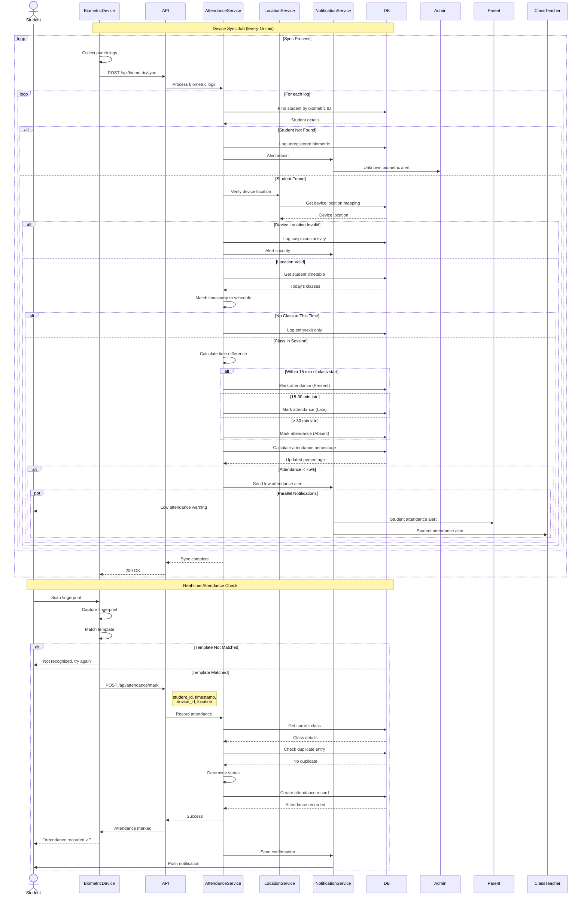

---

## 8. Library Book Issue

### Sequence Diagram

```mermaid
sequenceDiagram
    actor Student
    participant Portal
    participant API
    participant LibraryService
    participant NotificationService
    participant DB

    Student->>Portal: Search for book
    Portal->>API: GET /api/library/search?q=book_title
    API->>LibraryService: Search books
    LibraryService->>DB: Full-text search
    DB-->>LibraryService: Matching books
    LibraryService-->>API: Book list
    API-->>Portal: Search results
    Portal-->>Student: Display books

    Student->>Portal: Click "Request Book"
    Portal->>API: POST /api/library/reserve
    API->>LibraryService: Create reservation

    LibraryService->>DB: Check book availability
    DB-->>LibraryService: Available copies

    alt No Copies Available
        LibraryService->>DB: Add to reservation queue
        LibraryService->>NotificationService: Notify when available
        NotificationService->>Student: "Added to queue"
    else Copies Available
        LibraryService->>DB: Check student quota
        DB-->>LibraryService: Current issues

        alt Quota Exceeded
            LibraryService-->>API: Quota exceeded error
            API-->>Portal: Error message
            Portal-->>Student: "Cannot issue: Quota full"
        else Quota Available
            LibraryService->>DB: Check pending dues
            DB-->>LibraryService: Dues amount

            alt Has Pending Dues
                LibraryService-->>API: Pending dues error
                API-->>Portal: Dues information
                Portal-->>Student: "Clear dues first: ₹X"
            else No Dues
                LibraryService->>DB: Create reservation
                DB-->>LibraryService: Reservation ID

                LibraryService->>NotificationService: Send notification
                NotificationService->>Student: "Book reserved. Visit library"

                LibraryService-->>API: Reservation created
                API-->>Portal: Success
                Portal-->>Student: Show reservation details
            end
        end
    end

    Note over Student,DB: Student visits library

    Student->>Librarian: Present ID card
    Librarian->>Portal: Login to library system
    Portal->>API: GET /api/library/reservations
    API->>LibraryService: Get pending reservations
    LibraryService->>DB: Query reservations
    DB-->>LibraryService: Reservation list
    LibraryService-->>API: Reservations
    API-->>Portal: Display list
    Portal-->>Librarian: Show student reservation

    Librarian->>Portal: Verify ID card
    Portal->>API: POST /api/library/verify-student
    API->>LibraryService: Verify identity
    LibraryService->>DB: Check student status
    DB-->>LibraryService: Active student

    Librarian->>Librarian: Fetch book from shelf
    Librarian->>Portal: Scan book barcode
    Portal->>API: POST /api/library/issue
    Note right of API: student_id, book_id

    API->>LibraryService: Issue book
    LibraryService->>DB: Check book availability again
    DB-->>LibraryService: Available

    LibraryService->>DB: Create library transaction
    LibraryService->>DB: Update book status (Issued)
    LibraryService->>DB: Calculate due date
    Note right of LibraryService: Due date = Today + 14 days (UG)<br/>or 21 days (PG)
    DB-->>LibraryService: Transaction created

    LibraryService->>NotificationService: Schedule return reminder
    NotificationService->>NotificationService: Schedule job for (due_date - 2 days)

    LibraryService-->>API: Book issued
    API-->>Portal: Transaction details
    Portal-->>Librarian: Print issue slip

    Librarian->>Librarian: Hand book + slip to student
    Portal->>NotificationService: Send confirmation
    NotificationService->>Student: Email + SMS confirmation

    Note over NotificationService,Student: Return reminder (2 days before due)

    NotificationService->>Student: "Return book by {due_date}"

    Note over Student,DB: Student returns book (Overdue scenario)

    Student->>Librarian: Return book (late)
    Librarian->>Portal: Scan book barcode
    Portal->>API: POST /api/library/return
    API->>LibraryService: Process return

    LibraryService->>DB: Get transaction details
    DB-->>LibraryService: Issue date, due date

    LibraryService->>LibraryService: Check book condition
    alt Book Damaged
        LibraryService->>LibraryService: Calculate damage fine
        Note right of LibraryService: Damage fine = 50% of book price
    end

    LibraryService->>LibraryService: Calculate late fine
    Note right of LibraryService: Late fine = days_overdue × ₹2

    LibraryService->>DB: Create fine entry
    LibraryService->>DB: Update transaction (Returned)
    LibraryService->>DB: Update book status (Available)
    DB-->>LibraryService: Return processed

    LibraryService-->>API: Fine amount: ₹X
    API-->>Portal: Display fine
    Portal-->>Librarian: Show fine amount

    Librarian->>Student: "Fine: ₹X"
    Student->>Librarian: Pay fine
    Librarian->>Portal: Collect fine payment
    Portal->>API: POST /api/library/pay-fine
    API->>LibraryService: Record payment

    LibraryService->>DB: Create payment entry
    LibraryService->>DB: Clear fine
    LibraryService->>DB: Unblock student account
    DB-->>LibraryService: Fine cleared

    LibraryService->>NotificationService: Notify reserved students
    NotificationService->>DB: Get reservation queue
    DB-->>NotificationService: Next student in queue
    NotificationService->>NextStudent: "Book available now"

    LibraryService-->>API: Return complete
    API-->>Portal: Success
    Portal-->>Librarian: Print receipt
    Librarian->>Student: Hand receipt
```

---

## 9. Hostel Room Allocation

### Sequence Diagram

```mermaid
sequenceDiagram
    actor Student
    participant Portal
    participant API
    participant HostelService
    participant FeeService
    participant NotificationService
    participant DB

    Student->>Portal: Login and navigate to hostel
    Portal->>API: GET /api/hostel/check-eligibility
    API->>HostelService: Check eligibility
    HostelService->>DB: Get student details
    DB-->>HostelService: Student data
    HostelService->>HostelService: Check eligibility criteria
    Note right of HostelService: Year >= 2, Distance > 50km,<br/>No disciplinary action

    alt Not Eligible
        HostelService-->>API: Not eligible
        API-->>Portal: Ineligibility reason
        Portal-->>Student: "Not eligible: {reason}"
    else Eligible
        HostelService-->>API: Eligible
        API-->>Portal: Eligibility confirmed
        Portal-->>Student: "You are eligible"

        Student->>Portal: Fill application form
        Portal->>Student: Select room preferences
        Note left of Student: AC/Non-AC, Single/Shared,<br/>Floor preference

        Student->>Portal: Upload documents
        Note left of Student: Address proof, Income cert,<br/>Category cert (if applicable)

        Student->>Portal: Submit application
        Portal->>API: POST /api/hostel/apply
        API->>HostelService: Create application

        HostelService->>HostelService: Calculate priority score
        Note right of HostelService: Distance: 40 pts<br/>Category: 20 pts<br/>Academic: 20 pts<br/>Income: 20 pts

        HostelService->>DB: Save application with score
        DB-->>HostelService: Application ID

        HostelService->>FeeService: Calculate application fee
        FeeService-->>HostelService: Fee amount (₹500)

        HostelService-->>API: Application created + Fee
        API-->>Portal: Pay application fee
        Portal-->>Student: Redirect to payment

        Student->>Portal: Pay application fee
        Portal->>API: Process payment
        API->>FeeService: Record payment
        FeeService->>DB: Create payment entry
        FeeService-->>API: Payment confirmed

        API->>HostelService: Payment confirmed
        HostelService->>DB: Update application (Submitted)
        HostelService->>NotificationService: Notify warden
        NotificationService->>Warden: New application

        Note over Warden,DB: Warden reviews application

        Warden->>Portal: Login and review application
        Portal->>API: GET /api/hostel/applications/pending
        API->>HostelService: Get pending applications
        HostelService->>DB: Query applications
        DB-->>HostelService: Application list
        HostelService-->>API: Applications
        API-->>Portal: Display applications
        Portal-->>Warden: Show applications

        Warden->>Portal: Approve/Reject application
        Portal->>API: POST /api/hostel/review
        API->>HostelService: Process review

        alt Rejected
            HostelService->>DB: Update status (Rejected)
            HostelService->>NotificationService: Notify student
            NotificationService->>Student: Application rejected
        else Approved
            HostelService->>DB: Update status (Approved)
            HostelService->>DB: Add to priority list
            DB-->>HostelService: Updated

            HostelService->>NotificationService: Notify student
            NotificationService->>Student: Application approved

            Note over HostelService,DB: Allocation Round

            HostelService->>DB: Get all approved applications
            HostelService->>HostelService: Sort by priority score
            HostelService->>DB: Get available rooms

            loop For each student in order
                HostelService->>HostelService: Match preferences with availability

                alt Room Available
                    HostelService->>DB: Allocate room
                    HostelService->>DB: Mark room occupied
                    HostelService->>NotificationService: Notify student
                    NotificationService->>Student: Room allocated
                else No Room Available
                    HostelService->>DB: Add to waitlist
                    HostelService->>NotificationService: Notify waitlist
                    NotificationService->>Student: Added to waitlist
                end
            end

            Student->>Portal: View allocation
            Portal->>API: GET /api/hostel/allocation
            API->>HostelService: Get allocation details
            HostelService->>DB: Query allocation
            DB-->>HostelService: Room details
            HostelService-->>API: Allocation info
            API-->>Portal: Display allocation
            Portal-->>Student: Show room details

            Student->>Portal: Accept allocation
            Portal->>API: POST /api/hostel/accept
            API->>HostelService: Confirm acceptance

            HostelService->>FeeService: Generate hostel fee
            FeeService->>DB: Get fee structure
            DB-->>FeeService: Fee components
            FeeService->>DB: Create fee invoice
            DB-->>FeeService: Invoice created

            HostelService->>NotificationService: Send fee notification
            NotificationService->>Student: Pay hostel fee within 7 days

            Student->>Portal: Pay hostel fee
            Portal->>API: Process payment
            API->>FeeService: Record payment
            FeeService->>DB: Update invoice (Paid)
            FeeService-->>API: Payment confirmed

            API->>HostelService: Payment confirmed
            HostelService->>DB: Update allocation (Confirmed)
            HostelService->>HostelService: Generate allotment letter
            HostelService->>HostelService: Set check-in date

            HostelService->>NotificationService: Send allotment letter
            NotificationService->>Student: Email allotment letter

            HostelService-->>API: Allocation confirmed
            API-->>Portal: Success
            Portal-->>Student: "Allocation confirmed"

            Note over Student,DB: Check-in Day

            Student->>Warden: Visit hostel on check-in date
            Warden->>Portal: Process check-in
            Portal->>API: POST /api/hostel/checkin
            API->>HostelService: Check-in student

            HostelService->>HostelService: Verify documents
            HostelService->>HostelService: Inspect room condition
            HostelService->>HostelService: Create inventory checklist

            Warden->>Student: Sign inventory list
            Student->>Warden: Signed

            HostelService->>DB: Create occupancy record
            HostelService->>DB: Activate hostel services
            DB-->>HostelService: Check-in complete

            Warden->>Student: Handover room keys

            HostelService-->>API: Check-in successful
            API-->>Portal: Success
            Portal-->>Warden: Check-in recorded

            HostelService->>NotificationService: Send welcome message
            NotificationService->>Student: Welcome to hostel
        end
    end
```

---

## 10. Assignment Submission & Evaluation

### Sequence Diagram

```mermaid
sequenceDiagram
    actor Faculty
    actor Student
    participant Portal
    participant API
    participant AssignmentService
    participant PlagiarismService
    participant StorageService
    participant NotificationService
    participant DB

    Note over Faculty,DB: Faculty creates assignment

    Faculty->>Portal: Create new assignment
    Portal->>API: POST /api/assignment/create
    API->>AssignmentService: Create assignment

    AssignmentService->>DB: Save assignment details
    Note right of DB: title, description, max_marks,<br/>due_date, allowed_formats

    AssignmentService->>NotificationService: Notify enrolled students
    NotificationService->>DB: Get enrolled students
    DB-->>NotificationService: Student list

    par Notify All Students
        NotificationService->>Student: Email notification
        NotificationService->>Student: Push notification
    end

    Note over Student,DB: Student works on assignment

    Student->>Portal: View assignment
    Portal->>API: GET /api/assignment/{id}
    API->>AssignmentService: Get assignment details
    AssignmentService->>DB: Query assignment
    DB-->>AssignmentService: Assignment data
    AssignmentService-->>API: Assignment details
    API-->>Portal: Display assignment
    Portal-->>Student: Show assignment & download materials

    Student->>Student: Work on assignment
    Student->>Portal: Upload submission file
    Portal->>Portal: Validate file size (<10MB)
    Portal->>Portal: Validate file format (.pdf, .docx, .zip)

    alt Invalid File
        Portal-->>Student: Show error message
    else Valid File
        Portal->>API: POST /api/assignment/submit
        Note right of API: multipart/form-data

        API->>AssignmentService: Process submission

        AssignmentService->>AssignmentService: Check deadline

        alt Past Deadline
            AssignmentService->>AssignmentService: Check late submission policy

            alt Late Not Allowed
                AssignmentService-->>API: Deadline passed
                API-->>Portal: Error message
                Portal-->>Student: "Cannot submit: Deadline passed"
            else Late Allowed with Penalty
                AssignmentService->>AssignmentService: Calculate penalty
                Note right of AssignmentService: Penalty = 10% per day late
                AssignmentService->>AssignmentService: Apply penalty
            end
        end

        AssignmentService->>StorageService: Upload file to S3
        StorageService->>StorageService: Generate unique filename
        StorageService->>StorageService: Upload to S3 bucket
        StorageService-->>AssignmentService: File URL

        AssignmentService->>DB: Create submission record
        Note right of DB: student, assignment, file_url,<br/>submission_time, status: Submitted

        AssignmentService->>PlagiarismService: Check plagiarism
        PlagiarismService->>PlagiarismService: Extract text content
        PlagiarismService->>DB: Compare with previous submissions
        PlagiarismService->>PlagiarismService: Search web for matches
        PlagiarismService->>PlagiarismService: Calculate similarity score

        alt High Plagiarism (>30%)
            PlagiarismService->>DB: Flag submission
            PlagiarismService->>DB: Save detailed report
            PlagiarismService->>NotificationService: Alert faculty
            NotificationService->>Faculty: Plagiarism detected alert
        end

        PlagiarismService-->>AssignmentService: Plagiarism score

        AssignmentService->>DB: Save plagiarism score
        AssignmentService->>NotificationService: Confirm to student
        NotificationService->>Student: Email confirmation + Receipt

        AssignmentService->>NotificationService: Notify faculty
        NotificationService->>Faculty: New submission notification

        AssignmentService-->>API: Submission successful
        API-->>Portal: Success + Receipt
        Portal-->>Student: "Submitted successfully"
    end

    Note over Faculty,DB: Faculty evaluates assignment

    Faculty->>Portal: View pending evaluations
    Portal->>API: GET /api/assignment/pending
    API->>AssignmentService: Get submissions
    AssignmentService->>DB: Query unevaluated submissions
    DB-->>AssignmentService: Submission list
    AssignmentService-->>API: Submissions
    API-->>Portal: Display list
    Portal-->>Faculty: Show submissions

    Faculty->>Portal: Open submission
    Portal->>API: GET /api/assignment/submission/{id}
    API->>AssignmentService: Get submission details
    AssignmentService->>DB: Query submission + plagiarism report
    DB-->>AssignmentService: Submission data
    AssignmentService->>StorageService: Get signed URL
    StorageService-->>AssignmentService: Temporary download URL
    AssignmentService-->>API: Submission details + File URL
    API-->>Portal: Display submission
    Portal-->>Faculty: Show file + plagiarism report

    alt Plagiarism Flagged
        Portal-->>Faculty: Highlight plagiarism warning
        Faculty->>Faculty: Review plagiarism report

        alt Confirmed Plagiarism
            Faculty->>Portal: Report academic misconduct
            Portal->>API: POST /api/misconduct/report
            API->>AssignmentService: Create misconduct case
            AssignmentService->>DB: Save misconduct record
            AssignmentService->>DB: Award zero marks
            AssignmentService->>NotificationService: Notify HOD & student
            NotificationService->>HOD: Misconduct alert
            NotificationService->>Student: Academic misconduct notice
        else False Positive
            Faculty->>Portal: Mark as false positive
            Portal->>API: Clear plagiarism flag
        end
    end

    Faculty->>Faculty: Evaluate assignment
    Faculty->>Portal: Enter marks & feedback
    Portal->>API: POST /api/assignment/evaluate
    API->>AssignmentService: Save evaluation

    AssignmentService->>DB: Update submission with marks
    AssignmentService->>DB: Update status (Evaluated)
    DB-->>AssignmentService: Evaluation saved

    AssignmentService->>NotificationService: Notify student
    NotificationService->>Student: Email: Marks published

    AssignmentService-->>API: Evaluation complete
    API-->>Portal: Success
    Portal-->>Faculty: Evaluation saved

    Note over Student,DB: Student views result

    Student->>Portal: View assignment result
    Portal->>API: GET /api/assignment/result/{id}
    API->>AssignmentService: Get result
    AssignmentService->>DB: Query evaluation
    DB-->>AssignmentService: Marks + Feedback
    AssignmentService-->>API: Result details
    API-->>Portal: Display result
    Portal-->>Student: Show marks & feedback

    opt Student requests re-evaluation
        Student->>Portal: Request re-evaluation
        Portal->>Portal: Enter re-evaluation reason
        Portal->>API: POST /api/assignment/reeval-request
        API->>AssignmentService: Create re-eval request

        AssignmentService->>DB: Check re-eval eligibility
        Note right of DB: Max 1 re-eval per assignment

        alt Not Eligible
            AssignmentService-->>API: Not eligible
            API-->>Portal: Error message
        else Eligible
            AssignmentService->>DB: Create re-eval request
            AssignmentService->>NotificationService: Notify HOD
            NotificationService->>HOD: Re-evaluation request

            HOD->>Portal: Review request
            Portal->>API: POST /api/assignment/reeval-decision
            API->>AssignmentService: Process decision

            alt Approved
                AssignmentService->>DB: Assign to different faculty
                AssignmentService->>NotificationService: Notify faculty
                NotificationService->>OtherFaculty: Re-evaluation assigned

                Note over OtherFaculty: Faculty re-evaluates

                OtherFaculty->>API: POST /api/assignment/reeval-submit
                API->>AssignmentService: Update marks

                AssignmentService->>DB: Update marks
                AssignmentService->>NotificationService: Notify student
                NotificationService->>Student: Re-evaluation complete
            else Rejected
                AssignmentService->>NotificationService: Notify student
                NotificationService->>Student: Request rejected
            end
        end
    end
```

---

## 11. Grievance Handling

### Sequence Diagram

```mermaid
sequenceDiagram
    actor Student
    participant Portal
    participant API
    participant GrievanceService
    participant WorkflowEngine
    participant NotificationService
    participant DB

    Student->>Portal: File grievance
    Portal->>Portal: Select category
    Note left of Portal: Academic, Fees, Infrastructure,<br/>Harassment, Other

    Portal->>Portal: Select if anonymous
    Student->>Portal: Describe issue & attach docs
    Portal->>API: POST /api/grievance/create
    API->>GrievanceService: Create grievance

    GrievanceService->>GrievanceService: Determine priority
    Note right of GrievanceService: Critical: 2 day SLA<br/>High: 5 days<br/>Medium: 10 days<br/>Low: 15 days

    GrievanceService->>WorkflowEngine: Initialize workflow
    WorkflowEngine->>DB: Create grievance record
    WorkflowEngine->>WorkflowEngine: Auto-assign to officer
    Note right of WorkflowEngine: Based on category

    WorkflowEngine->>DB: Save initial state
    WorkflowEngine->>WorkflowEngine: Start SLA timer

    GrievanceService->>NotificationService: Notify officer
    NotificationService->>Officer: New grievance assigned

    alt Anonymous
        GrievanceService-->>API: Grievance ID (no name)
    else Identified
        GrievanceService->>NotificationService: Send confirmation
        NotificationService->>Student: Email confirmation
        GrievanceService-->>API: Grievance details
    end

    API-->>Portal: Grievance created
    Portal-->>Student: "Grievance submitted: #{id}"

    Note over Officer,DB: Officer reviews grievance

    loop SLA Monitoring
        WorkflowEngine->>WorkflowEngine: Check elapsed time

        alt 50-80% SLA elapsed
            WorkflowEngine->>NotificationService: Send reminder
            NotificationService->>Officer: Reminder notification
        else > 80% SLA elapsed
            WorkflowEngine->>NotificationService: Send alert
            NotificationService->>Officer: Urgent alert
            NotificationService->>Supervisor: SLA alert
        else SLA Breached
            WorkflowEngine->>WorkflowEngine: Auto-escalate
            WorkflowEngine->>DB: Update assigned to supervisor
            WorkflowEngine->>NotificationService: Escalation alert
            NotificationService->>Supervisor: Grievance escalated
        end
    end

    Officer->>Portal: Login and view grievances
    Portal->>API: GET /api/grievance/assigned
    API->>GrievanceService: Get assigned grievances
    GrievanceService->>DB: Query grievances
    DB-->>GrievanceService: Grievance list
    GrievanceService-->>API: Grievances with SLA status
    API-->>Portal: Display list
    Portal-->>Officer: Show grievances

    Officer->>Portal: Open grievance
    Portal->>API: GET /api/grievance/{id}
    API->>GrievanceService: Get details
    GrievanceService->>DB: Query grievance + attachments
    DB-->>GrievanceService: Full details
    GrievanceService-->>API: Grievance data
    API-->>Portal: Display grievance
    Portal-->>Officer: Show details

    alt Need More Information
        Officer->>Portal: Request additional info
        Portal->>API: POST /api/grievance/request-info
        API->>GrievanceService: Add info request

        GrievanceService->>DB: Update status (Info Requested)
        GrievanceService->>WorkflowEngine: Pause SLA timer

        alt Not Anonymous
            GrievanceService->>NotificationService: Notify student
            NotificationService->>Student: Info requested

            Student->>Portal: Provide additional info
            Portal->>API: POST /api/grievance/provide-info
            API->>GrievanceService: Add info

            GrievanceService->>DB: Add comment/attachment
            GrievanceService->>WorkflowEngine: Resume SLA timer
            GrievanceService->>NotificationService: Notify officer
            NotificationService->>Officer: Info provided
        else Anonymous
            Note over GrievanceService: Cannot request info from anonymous
        end
    end

    alt Cannot Resolve
        Officer->>Portal: Escalate to committee
        Portal->>API: POST /api/grievance/escalate
        API->>GrievanceService: Escalate grievance

        GrievanceService->>DB: Update status (Escalated)
        GrievanceService->>DB: Get committee members
        DB-->>GrievanceService: Committee list

        GrievanceService->>NotificationService: Notify committee
        par Notify All Members
            NotificationService->>CommitteeMember1: Grievance escalated
            NotificationService->>CommitteeMember2: Grievance escalated
            NotificationService->>CommitteeMember3: Grievance escalated
        end

        Note over Committee: Committee reviews & decides

        Committee->>Portal: Schedule hearing
        Portal->>API: POST /api/grievance/schedule-hearing
        API->>GrievanceService: Schedule hearing

        GrievanceService->>DB: Create hearing record
        GrievanceService->>NotificationService: Notify participants

        alt Not Anonymous
            NotificationService->>Student: Hearing scheduled
        end
        NotificationService->>Officer: Hearing scheduled

        Note over Committee: Conduct hearing

        Committee->>Portal: Record hearing minutes
        Portal->>API: POST /api/grievance/hearing-minutes
        API->>GrievanceService: Save minutes

        Committee->>Portal: Submit decision
        Portal->>API: POST /api/grievance/committee-decision
        API->>GrievanceService: Record decision

        GrievanceService->>DB: Update with decision
        GrievanceService->>WorkflowEngine: Trigger resolution workflow
    end

    alt Can Resolve
        Officer->>Portal: Enter resolution
        Portal->>API: POST /api/grievance/resolve
        API->>GrievanceService: Process resolution

        GrievanceService->>GrievanceService: Document resolution
        GrievanceService->>DB: Update status (Resolved)
        GrievanceService->>WorkflowEngine: Stop SLA timer
        WorkflowEngine-->>GrievanceService: Timer stopped

        GrievanceService->>GrievanceService: Record resolution time

        alt Not Anonymous
            GrievanceService->>NotificationService: Notify student
            NotificationService->>Student: Grievance resolved

            Student->>Portal: View resolution
            Portal->>API: GET /api/grievance/{id}/resolution
            API->>GrievanceService: Get resolution
            GrievanceService->>DB: Query resolution details
            DB-->>GrievanceService: Resolution data
            GrievanceService-->>API: Resolution
            API-->>Portal: Display resolution
            Portal-->>Student: Show resolution details

            Student->>Portal: Provide feedback
            Portal->>Portal: Rate satisfaction (1-5)
            Portal->>Portal: Add comments
            Portal->>API: POST /api/grievance/feedback
            API->>GrievanceService: Save feedback

            GrievanceService->>DB: Update with feedback

            alt Unsatisfied (Rating < 3)
                GrievanceService->>DB: Reopen grievance
                GrievanceService->>WorkflowEngine: Escalate
                WorkflowEngine->>WorkflowEngine: Assign to higher authority
                WorkflowEngine->>NotificationService: Notify supervisor
                NotificationService->>Supervisor: Reopened grievance
            else Satisfied
                GrievanceService->>DB: Update status (Closed)
                GrievanceService->>NotificationService: Send thank you
                NotificationService->>Student: Thank you message

                GrievanceService-->>API: Grievance closed
                API-->>Portal: Status updated
                Portal-->>Student: "Grievance closed"
            end
        else Anonymous
            GrievanceService->>DB: Update status (Resolved)
            Note over GrievanceService: No feedback possible for anonymous
        end
    end

    Note over GrievanceService,DB: Analytics & Reporting

    GrievanceService->>DB: Update category statistics
    GrievanceService->>DB: Update resolution time metrics
    GrievanceService->>DB: Update satisfaction scores
```

---

## 12. Document Request Processing

### Sequence Diagram

```mermaid
sequenceDiagram
    actor Student
    participant Portal
    participant API
    participant DocumentService
    participant TemplateEngine
    participant DigitalSignature
    participant CourierService
    participant NotificationService
    participant DB

    Student->>Portal: Request document
    Portal->>Portal: Select document type
    Note left of Portal: Bonafide, TC, Transcript,<br/>ID Card, NOC, etc.

    Portal->>Portal: Fill request form
    Student->>Portal: Enter purpose & details
    Portal->>API: POST /api/document/request
    API->>DocumentService: Create request

    DocumentService->>DB: Get document configuration
    DB-->>DocumentService: Config (fee, processing_time, required_fields)

    DocumentService->>DocumentService: Validate request
    DocumentService->>DB: Check student eligibility
    DB-->>DocumentService: Eligible

    alt Fee Required
        DocumentService->>DB: Create fee invoice
        DocumentService-->>API: Request created + Fee
        API-->>Portal: Pay processing fee
        Portal-->>Student: Payment page

        Student->>Portal: Pay fee
        Portal->>API: Process payment
        API->>DocumentService: Payment confirmed
    else No Fee
        DocumentService-->>API: Request created
    end

    DocumentService->>DB: Save request (status: Pending)
    DocumentService->>NotificationService: Notify registrar
    NotificationService->>Registrar: New document request

    API-->>Portal: Request submitted
    Portal-->>Student: "Request submitted: #{id}"

    Note over Registrar,DB: Registrar reviews request

    Registrar->>Portal: Login and view requests
    Portal->>API: GET /api/document/pending
    API->>DocumentService: Get pending requests
    DocumentService->>DB: Query pending documents
    DB-->>DocumentService: Request list
    DocumentService-->>API: Requests
    API-->>Portal: Display list
    Portal-->>Registrar: Show pending requests

    Registrar->>Portal: Review request
    Portal->>API: GET /api/document/{id}
    API->>DocumentService: Get request details
    DocumentService->>DB: Query request + student data
    DB-->>DocumentService: Full details
    DocumentService-->>API: Request data
    API-->>Portal: Display request
    Portal-->>Registrar: Show details

    Registrar->>Portal: Approve/Reject
    Portal->>API: POST /api/document/review
    API->>DocumentService: Process review

    alt Rejected
        DocumentService->>DB: Update status (Rejected)
        DocumentService->>NotificationService: Notify student
        NotificationService->>Student: Request rejected
        DocumentService-->>API: Rejected
    else Approved
        DocumentService->>DB: Update status (Approved)
        DocumentService->>DocumentService: Determine processing method

        alt Auto-Generate (Bonafide, NOC)
            DocumentService->>DB: Get student data
            DB-->>DocumentService: Student details

            DocumentService->>TemplateEngine: Generate document
            TemplateEngine->>TemplateEngine: Load template
            TemplateEngine->>TemplateEngine: Populate data
            Note right of TemplateEngine: Name, Roll No, Program,<br/>Purpose, Date, etc.

            TemplateEngine->>TemplateEngine: Generate PDF
            TemplateEngine-->>DocumentService: PDF document

            DocumentService->>DigitalSignature: Sign document
            DigitalSignature->>DigitalSignature: Apply digital signature
            DigitalSignature->>DigitalSignature: Add verification QR code
            DigitalSignature-->>DocumentService: Signed PDF

            DocumentService->>DocumentService: Store document
            DocumentService->>DB: Save document URL
        else Manual Prepare (TC, Degree)
            DocumentService->>NotificationService: Notify document cell
            NotificationService->>DocumentCell: Prepare document

            DocumentCell->>Portal: Mark as prepared
            Portal->>API: POST /api/document/prepared
            API->>DocumentService: Document prepared

            DocumentService->>DocumentService: Print document
            DocumentService->>DocumentService: Physical signature & seal
            DocumentService->>DB: Update status (Ready)
        end

        DocumentService->>DB: Update status (Ready)
        DocumentService->>NotificationService: Notify student
        NotificationService->>Student: Document ready

        DocumentService-->>API: Processing complete
        API-->>Portal: Status updated
        Portal-->>Registrar: Document ready

        Note over Student,DB: Delivery Phase

        Student->>Portal: View document status
        Portal->>API: GET /api/document/{id}/status
        API->>DocumentService: Get status
        DocumentService->>DB: Query document
        DB-->>DocumentService: Status: Ready
        DocumentService-->>API: Document ready
        API-->>Portal: Display status
        Portal-->>Student: "Document ready"

        Student->>Portal: Select delivery mode
        Portal->>Portal: Choose: Collect/Post/Email
        Portal->>API: POST /api/document/delivery-mode
        API->>DocumentService: Set delivery mode

        alt Collect from Office
            DocumentService->>DB: Update delivery mode
            DocumentService->>NotificationService: Send collection notice
            NotificationService->>Student: Collect from registrar office

            Student->>Registrar: Visit office with ID
            Registrar->>Portal: Verify student identity
            Portal->>API: POST /api/document/handover
            API->>DocumentService: Record handover

            DocumentService->>DB: Update status (Delivered)
            DocumentService->>DB: Log handover details
            Registrar->>Student: Handover document
            Student->>Registrar: Sign receipt

            DocumentService-->>API: Handover recorded
        else Send by Post
            DocumentService->>DB: Get delivery address
            DB-->>DocumentService: Student address

            DocumentService->>CourierService: Create shipment
            CourierService->>CourierService: Generate AWB number
            CourierService->>CourierService: Schedule pickup
            CourierService-->>DocumentService: Tracking number

            DocumentService->>DB: Save tracking number
            DocumentService->>NotificationService: Send tracking info
            NotificationService->>Student: Tracking number: {awb}

            CourierService->>CourierService: Out for delivery
            CourierService->>API: POST /webhook/delivery-status
            API->>DocumentService: Update delivery status

            loop Track Delivery
                DocumentService->>CourierService: Get shipment status
                CourierService-->>DocumentService: Current status
                DocumentService->>DB: Update delivery status
            end

            CourierService->>Student: Deliver document
            Student->>CourierService: Sign POD
            CourierService->>API: POST /webhook/delivered
            API->>DocumentService: Delivery confirmed

            DocumentService->>DB: Update status (Delivered)
            DocumentService->>NotificationService: Confirm delivery
            NotificationService->>Student: Document delivered
        else Send by Email
            DocumentService->>DB: Get document URL
            DB-->>DocumentService: Signed PDF URL

            DocumentService->>NotificationService: Email document
            NotificationService->>NotificationService: Attach PDF
            NotificationService->>NotificationService: Add verification link
            NotificationService->>Student: Email with document

            DocumentService->>DB: Update status (Delivered)
            DocumentService->>NotificationService: Confirm delivery
            NotificationService->>Student: Document sent to email
        end

        DocumentService->>DB: Close request
        DocumentService-->>API: Delivery complete
        API-->>Portal: Status updated
        Portal-->>Student: "Document delivered"
    end

    Note over Student,DB: Verification

    opt Third Party Verification
        ThirdParty->>Portal: Verify document
        Portal->>Portal: Enter document ID or scan QR
        Portal->>API: GET /api/document/verify/{id}
        API->>DocumentService: Verify document

        DocumentService->>DB: Query document
        DB-->>DocumentService: Document details

        alt Document Exists
            DocumentService->>DocumentService: Verify digital signature
            DocumentService-->>API: Verification result
            API-->>Portal: Document verified
            Portal-->>ThirdParty: Show verification details
        else Document Not Found
            DocumentService-->>API: Not found
            API-->>Portal: Invalid document
            Portal-->>ThirdParty: "Document not verified"
        end
    end
```

---

## 13. Notification System

### Sequence Diagram

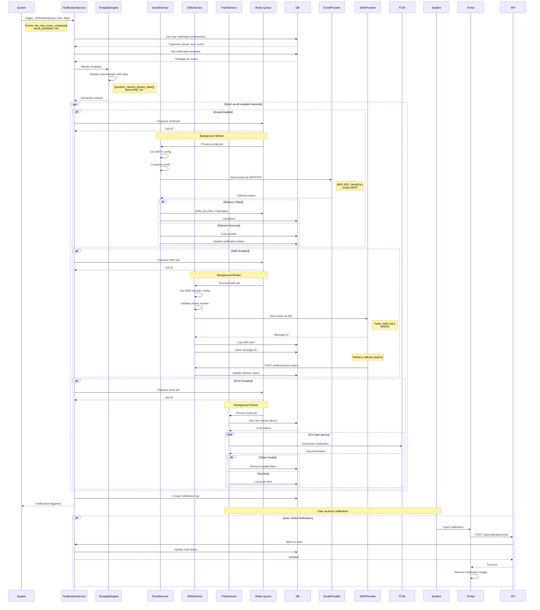

### Notification Templates

```mermaid
graph TD
    TEMPLATES[Notification Templates]

    TEMPLATES --> ACADEMIC[Academic Events]
    ACADEMIC --> COURSE_ENROLLED[Course Enrollment Success]
    ACADEMIC --> ATTENDANCE_LOW[Low Attendance Alert]
    ACADEMIC --> CLASS_CANCEL[Class Cancellation]

    TEMPLATES --> EXAM[Examination Events]
    EXAM --> EXAM_SCHEDULED[Exam Schedule Published]
    EXAM --> EXAM_REMINDER[Exam Reminder 24h]
    EXAM --> RESULT_PUBLISHED[Result Published]

    TEMPLATES --> FEE[Fee Events]
    FEE --> FEE_GENERATED[Fee Invoice Generated]
    FEE --> FEE_DUE[Payment Due Reminder]
    FEE --> FEE_OVERDUE[Payment Overdue Alert]
    FEE --> PAYMENT_SUCCESS[Payment Confirmation]

    TEMPLATES --> LIBRARY[Library Events]
    LIBRARY --> BOOK_ISSUED[Book Issue Confirmation]
    LIBRARY --> BOOK_DUE[Return Reminder]
    LIBRARY --> BOOK_OVERDUE[Overdue Notice]

    style TEMPLATES fill:#E6F3FF
```

---

## 14. API Integration - Payment Gateway

### Sequence Diagram

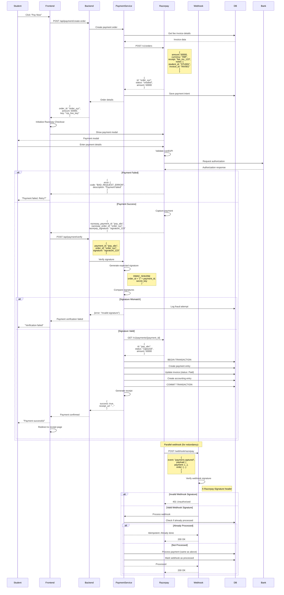

---

## 15. Background Job Processing

### Sequence Diagram

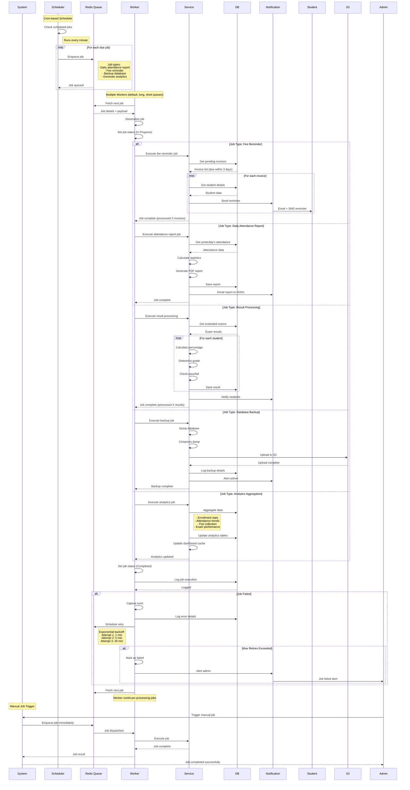

### Job Types & Schedules

```mermaid
graph TD
    JOBS[Background Jobs]

    JOBS --> DAILY[Daily Jobs]
    DAILY --> ATT_REPORT[Attendance Report - 11 PM]
    DAILY --> FEE_REMINDER[Fee Reminder - 9 AM]
    DAILY --> BACKUP[Database Backup - 2 AM]
    DAILY --> ANALYTICS[Analytics Aggregation - 3 AM]

    JOBS --> HOURLY[Hourly Jobs]
    HOURLY --> BIOMETRIC[Biometric Sync - Every 15 min]
    HOURLY --> NOTIF[Notification Queue - Every 5 min]
    HOURLY --> CACHE[Cache Cleanup - Every 1 hour]

    JOBS --> WEEKLY[Weekly Jobs]
    WEEKLY --> ATTENDANCE_ALERT[Low Attendance Alerts - Monday 10 AM]
    WEEKLY --> COURSE_PROGRESS[Course Progress Report - Friday 5 PM]
    WEEKLY --> LIBRARY_OVERDUE[Library Overdue - Sunday 9 AM]

    JOBS --> MONTHLY[Monthly Jobs]
    MONTHLY --> SALARY[Salary Processing - 1st of month]
    MONTHLY --> FEE_STRUCTURE[Fee Structure Generation - 25th]
    MONTHLY --> COMPLIANCE[Compliance Reports - Last day]

    style JOBS fill:#E6F3FF
```

---

## Summary

This document provides comprehensive sequence diagrams for:

1. **Authentication & Authorization** - Login, token refresh
2. **Admission Process** - Application to enrollment
3. **Course Enrollment** - Selection, approval, confirmation
4. **Payment Processing** - Gateway integration, verification
5. **Online Examination** - Conduct, proctoring, submission
6. **Result Publication** - Evaluation, verification, publication
7. **Biometric Attendance** - Real-time marking, sync
8. **Library Management** - Issue, return, fine collection
9. **Hostel Allocation** - Application, priority-based allocation
10. **Assignment Handling** - Submission, plagiarism, evaluation
11. **Grievance Management** - Filing, escalation, resolution
12. **Document Processing** - Request, approval, delivery
13. **Notification System** - Multi-channel delivery
14. **Payment Gateway Integration** - Razorpay API flow
15. **Background Jobs** - Scheduled and async processing

All diagrams use Mermaid syntax and show detailed interactions between system components, including error handling, parallel processing, and webhook callbacks.
