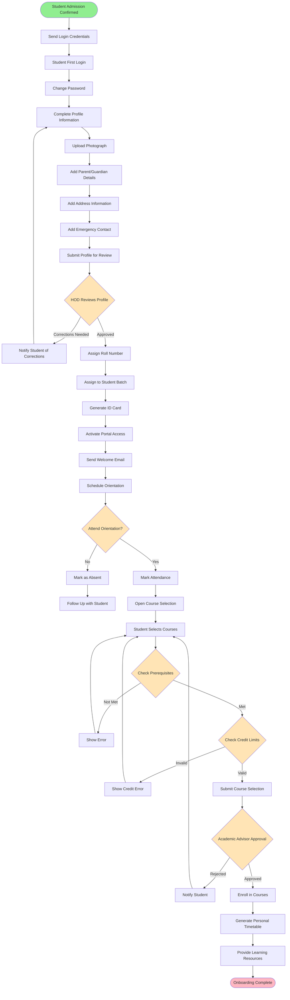
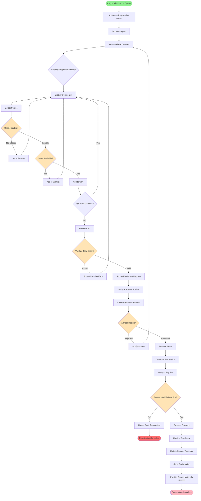
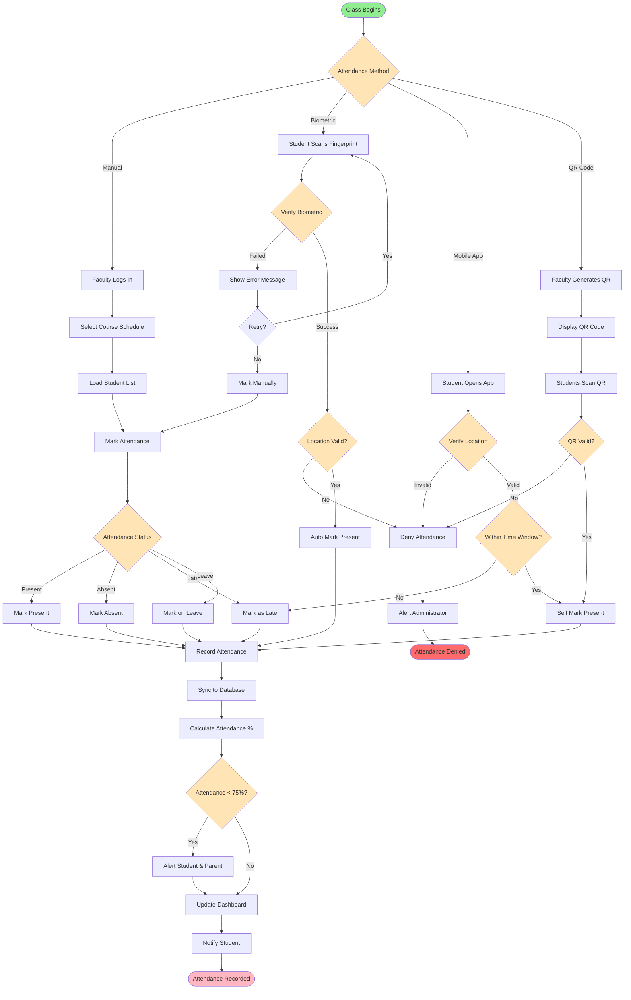
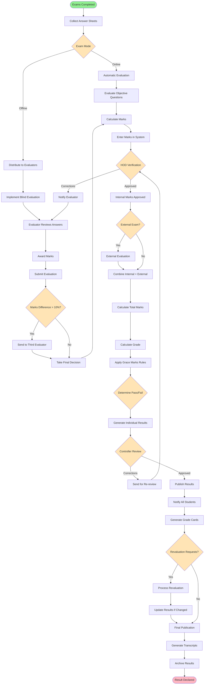
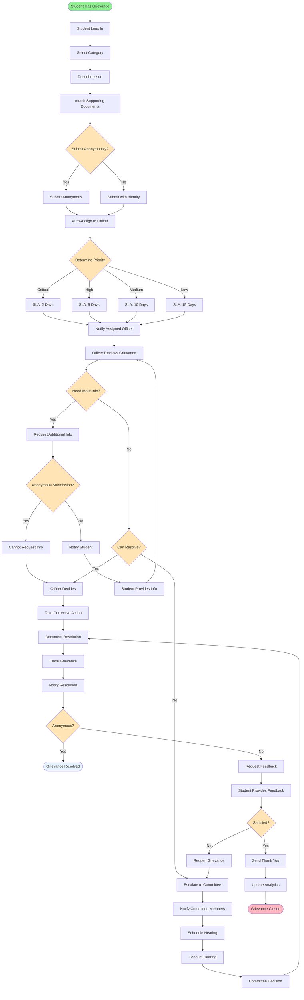

```mermaid
flowchart TD
    Start([Examination Planning]) --> CreateSchedule[Create Exam Schedule]
    CreateSchedule --> SelectCourses[Select Courses]
    SelectCourses --> SetDates[Set Exam Dates]
    SetDates --> AllocHalls[Allocate Exam Halls]
    AllocHalls --> GenSeating[Generate Seating Arrangement]
    GenSeating --> AssignInvig[Assign Invigilators]

    AssignInvig --> PrepQuestions[Prepare Question Papers]
    PrepQuestions --> ExamType{Exam Type}

    ExamType -->|Online| CreateOnline[Create Online Exam]
    ExamType -->|Offline| PrintPapers[Print Question Papers]

    CreateOnline --> SelectQuestions[Select Questions from Bank]
    SelectQuestions --> ConfigExam[Configure Exam Settings]
    ConfigExam --> PublishOnline[Publish Online Exam]

    PrintPapers --> SealPapers[Seal in Envelopes]
    SealPapers --> StoreSecure[Store in Strong Room]

    PublishOnline --> PublishSchedule[Publish Exam Schedule]
    StoreSecure --> PublishSchedule

    PublishSchedule --> NotifyAll[Notify All Stakeholders]
    NotifyAll --> WaitExam[Wait for Exam Day]

    WaitExam --> ExamDay[Exam Day Arrives]
    ExamDay --> ModeCheck{Exam Mode}

    ModeCheck -->|Online| ActivateOnline[Activate Online Exam]
    ModeCheck -->|Offline| DistributePapers[Distribute Papers to Halls]

    ActivateOnline --> StudentLogin[Students Login]
    StudentLogin --> VerifyIdentity[Verify Student Identity]
    VerifyIdentity --> StartProctoring[Start Proctoring]
    StartProctoring --> StartTimer[Start Exam Timer]

    DistributePapers --> VerifySeal[Verify Seals]
    VerifySeal --> HandPapers[Hand Papers to Students]
    HandPapers --> StartTimer

    StartTimer --> ConductExam[Conduct Examination]
    ConductExam --> MonitorExam[Monitor for Malpractice]

    MonitorExam --> DetectIssue{Issue Detected?}
    DetectIssue -->|Yes| ReportIssue[Report Malpractice]
    ReportIssue --> TakeAction[Take Disciplinary Action]
    TakeAction --> ConductExam

    DetectIssue -->|No| CheckTime{Time Remaining?}
    CheckTime -->|Yes| ConductExam
    CheckTime -->|No| CollectAnswers[Collect Answer Sheets]

    CollectAnswers --> OnlineCheck{Online Exam?}
    OnlineCheck -->|Yes| AutoSave[Auto-Save Responses]
    OnlineCheck -->|No| BundleSheets[Bundle Answer Sheets]

    AutoSave --> StoreDB[Store in Database]
    BundleSheets --> HandEvaluators[Hand to Evaluators]

    StoreDB --> PrepEval[Prepare for Evaluation]
    HandEvaluators --> PrepEval

    PrepEval --> End([Examination Conducted])

    style Start fill:#90EE90
    style End fill:#FFB6C1
    style ExamType fill:#FFE4B5
    style ModeCheck fill:#FFE4B5
    style DetectIssue fill:#FFE4B5
    style CheckTime fill:#FFE4B5
    style OnlineCheck fill:#FFE4B5
```

```mermaid
flowchart TD
    Start([Fee Structure Defined]) --> CreateFeeStruct[Create Fee Structure]
    CreateFeeStruct --> DefineComponents[Define Fee Components]
    DefineComponents --> SetAmounts[Set Amounts]
    SetAmounts --> ApplyDiscounts{Apply Discounts?}

    ApplyDiscounts -->|Yes| CalcDiscount[Calculate Discounts]
    ApplyDiscounts -->|No| GenInvoices[Generate Fee Invoices]
    CalcDiscount --> GenInvoices

    GenInvoices --> AssignStudents[Assign to Students]
    AssignStudents --> SetDueDate[Set Due Dates]
    SetDueDate --> PublishFee[Publish Fee Structure]

    PublishFee --> NotifyStudents[Notify Students]
    NotifyStudents --> StudentView[Student Views Invoice]

    StudentView --> SelectMode{Select Payment Mode}
    SelectMode -->|Online| InitiateOnline[Initiate Online Payment]
    SelectMode -->|Offline| GenChallan[Generate Bank Challan]

    InitiateOnline --> SelectMethod[Select Payment Method]
    SelectMethod --> Gateway[Redirect to Gateway]
    Gateway --> EnterDetails[Enter Payment Details]
    EnterDetails --> ProcessTxn[Process Transaction]

    ProcessTxn --> TxnStatus{Transaction Status}
    TxnStatus -->|Failed| ShowError[Show Error]
    ShowError --> Retry{Retry Payment?}
    Retry -->|Yes| Gateway
    Retry -->|No| EndFail([Payment Failed])

    TxnStatus -->|Success| Callback[Gateway Callback]

    GenChallan --> PrintChallan[Print Challan]
    PrintChallan --> VisitBank[Visit Bank]
    VisitBank --> MakePayment[Make Payment]
    MakePayment --> BankReceipt[Get Bank Receipt]
    BankReceipt --> SubmitAccounts[Submit to Accounts]

    SubmitAccounts --> VerifyBank{Verify with Bank}
    VerifyBank -->|Invalid| RejectPayment[Reject Payment]
    RejectPayment --> NotifyInvalid[Notify Student]
    NotifyInvalid --> EndFail

    VerifyBank -->|Valid| UpdateInvoice[Update Invoice]

    Callback --> VerifySign{Verify Signature}
    VerifySign -->|Invalid| LogFraud[Log Fraud Attempt]
    LogFraud --> EndFail

    VerifySign -->|Valid| UpdateInvoice
    UpdateInvoice --> CreatePayEntry[Create Payment Entry]
    CreatePayEntry --> CreateJE[Create Journal Entry]
    CreateJE --> GenReceipt[Generate Receipt]
    GenReceipt --> EmailReceipt[Email Receipt]

    EmailReceipt --> CheckFull{Full Amount Paid?}
    CheckFull -->|No| MarkPartial[Mark as Partial Payment]
    MarkPartial --> EndPartial([Partial Payment])

    CheckFull -->|Yes| MarkPaid[Mark as Fully Paid]
    MarkPaid --> UnlockServices[Unlock Services]
    UnlockServices --> UpdateLedger[Update Accounting Ledger]
    UpdateLedger --> End([Payment Complete])

    style Start fill:#90EE90
    style End fill:#FFB6C1
    style EndFail fill:#FF6B6B
    style EndPartial fill:#FFA07A
    style ApplyDiscounts fill:#FFE4B5
    style SelectMode fill:#FFE4B5
    style TxnStatus fill:#FFE4B5
    style Retry fill:#FFE4B5
    style VerifyBank fill:#FFE4B5
    style VerifySign fill:#FFE4B5
    style CheckFull fill:#FFE4B5
```

```mermaid
flowchart TD
    Start([Student Needs Book]) --> SearchBook[Search Book Catalog]
    SearchBook --> BookFound{Book Found?}

    BookFound -->|No| SuggestBooks[Show Similar Books]
    SuggestBooks --> RequestPurchase{Request Purchase?}
    RequestPurchase -->|Yes| SubmitRequest[Submit Purchase Request]
    SubmitRequest --> EndRequest([Request Submitted])
    RequestPurchase -->|No| EndSearch([End Search])

    BookFound -->|Yes| CheckAvail{Check Availability}
    CheckAvail -->|Not Available| ReserveBook[Reserve Book]
    ReserveBook --> AddQueue[Add to Queue]
    AddQueue --> NotifyWait[Will Notify When Available]
    NotifyWait --> EndReserved([Book Reserved])

    CheckAvail -->|Available| CheckQuota{Check Issue Quota}
    CheckQuota -->|Exceeded| ShowQuotaMsg[Show Quota Exceeded]
    ShowQuotaMsg --> EndQuota([Cannot Issue])

    CheckQuota -->|Available| RequestIssue[Request Book Issue]
    RequestIssue --> VisitLibrary[Visit Library]
    VisitLibrary --> ShowID[Show ID Card to Librarian]

    ShowID --> VerifyID{Verify ID}
    VerifyID -->|Invalid| RejectIssue[Reject Issue Request]
    RejectIssue --> EndReject([Issue Rejected])

    VerifyID -->|Valid| CheckDues{Check Pending Dues}
    CheckDues -->|Has Dues| PayDues[Pay Pending Dues]
    PayDues --> ClearDues[Clear Dues]
    ClearDues --> ProceedIssue[Proceed to Issue]

    CheckDues -->|No Dues| ProceedIssue
    ProceedIssue --> FetchBook[Librarian Fetches Book]
    FetchBook --> ScanBarcode[Scan Book Barcode]
    ScanBarcode --> CreateTxn[Create Library Transaction]
    CreateTxn --> CalcDue[Calculate Due Date]
    CalcDue --> UpdateStatus[Update Book Status to Issued]
    UpdateStatus --> PrintSlip[Print Issue Slip]
    PrintSlip --> HandBook[Hand Book to Student]

    HandBook --> SendConfirm[Send Confirmation Email/SMS]
    SendConfirm --> SetReminder[Set Return Reminder]
    SetReminder --> WaitReturn[Wait for Return]

    WaitReturn --> DueNear{Due Date Near?}
    DueNear -->|Yes| SendReminder[Send Return Reminder]
    SendReminder --> CheckReturn{Book Returned?}

    DueNear -->|No| CheckReturn
    CheckReturn -->|No| DuePassed{Due Date Passed?}
    DuePassed -->|No| WaitReturn

    DuePassed -->|Yes| CalcFine[Calculate Late Fine]
    CalcFine --> BlockIssue[Block Further Issues]
    BlockIssue --> SendNotice[Send Overdue Notice]
    SendNotice --> WaitReturn

    CheckReturn -->|Yes| ReturnBook[Student Returns Book]
    ReturnBook --> InspectBook{Inspect Book Condition}

    InspectBook -->|Damaged| AssessDamage[Assess Damage]
    AssessDamage --> CalcDamageFine[Calculate Damage Fine]
    CalcDamageFine --> TotalFine[Add to Late Fine]
    TotalFine --> CollectFine[Collect Fine]

    InspectBook -->|Good Condition| CheckLate{Returned Late?}
    CheckLate -->|Yes| CollectFine
    CheckLate -->|No| CompleteReturn[Complete Return]

    CollectFine --> PayFine[Student Pays Fine]
    PayFine --> RecordPayment[Record Fine Payment]
    RecordPayment --> CompleteReturn

    CompleteReturn --> UpdateReturn[Update Transaction]
    UpdateReturn --> MarkAvailable[Mark Book as Available]
    MarkAvailable --> UnblockStudent[Unblock Student]
    UnblockStudent --> NotifyQueued[Notify Next in Queue]
    NotifyQueued --> End([Book Returned])

    style Start fill:#90EE90
    style End fill:#FFB6C1
    style EndRequest fill:#E6F3FF
    style EndSearch fill:#E6F3FF
    style EndReserved fill:#FFA07A
    style EndQuota fill:#FF6B6B
    style EndReject fill:#FF6B6B
    style BookFound fill:#FFE4B5
    style CheckAvail fill:#FFE4B5
    style CheckQuota fill:#FFE4B5
    style VerifyID fill:#FFE4B5
    style CheckDues fill:#FFE4B5
    style DueNear fill:#FFE4B5
    style CheckReturn fill:#FFE4B5
    style DuePassed fill:#FFE4B5
    style InspectBook fill:#FFE4B5
    style CheckLate fill:#FFE4B5
```

```mermaid
flowchart TD
    Start([Hostel Application Opens]) --> OpenReg[Open Registration]
    OpenReg --> StudentLogin[Student Logs In]
    StudentLogin --> CheckElig{Check Eligibility}

    CheckElig -->|Not Eligible| ShowReason[Show Ineligibility Reason]
    ShowReason --> EndInelig([Not Eligible])

    CheckElig -->|Eligible| FillApp[Fill Application Form]
    FillApp --> SelectPref[Select Room Preferences]
    SelectPref --> UploadDocs[Upload Required Documents]
    UploadDocs --> PayAppFee[Pay Application Fee]
    PayAppFee --> SubmitApp[Submit Application]

    SubmitApp --> WardenReview[Warden Reviews Application]
    WardenReview --> WardenDecision{Warden Decision}

    WardenDecision -->|Rejected| NotifyRej[Notify Student]
    NotifyRej --> EndRej([Application Rejected])

    WardenDecision -->|Approved| CalcPriority[Calculate Priority Score]
    CalcPriority --> AddList[Add to Priority List]
    AddList --> WaitAlloc[Wait for Allocation Round]

    WaitAlloc --> AllocRound[Allocation Round Begins]
    AllocRound --> SortList[Sort by Priority Score]
    SortList --> GetAvailRooms[Get Available Rooms]
    GetAvailRooms --> ProcessList[Process Applicants in Order]

    ProcessList --> NextApplicant{Next Applicant}
    NextApplicant -->|No More| EndAlloc([Allocation Complete])

    NextApplicant -->|Yes| MatchPref[Match Preferences]
    MatchPref --> RoomAvail{Room Available?}

    RoomAvail -->|No| AddWaitlist[Add to Waitlist]
    AddWaitlist --> NotifyWait[Notify Waitlist Status]
    NotifyWait --> ProcessList

    RoomAvail -->|Yes| AllocRoom[Allocate Room]
    AllocRoom --> MarkOccupied[Mark Room as Occupied]
    MarkOccupied --> NotifyAlloc[Notify Student]

    NotifyAlloc --> StudentAccept{Student Accepts?}
    StudentAccept -->|No| ReleaseRoom[Release Room]
    ReleaseRoom --> ProcessList

    StudentAccept -->|Yes| GenHostelFee[Generate Hostel Fee Invoice]
    GenHostelFee --> NotifyPay[Notify to Pay]

    NotifyPay --> WaitPay{Payment Within Deadline?}
    WaitPay -->|No| CancelAlloc[Cancel Allocation]
    CancelAlloc --> ReleaseRoom

    WaitPay -->|Yes| PayFee[Pay Hostel Fee]
    PayFee --> VerifyPay[Verify Payment]
    VerifyPay --> ConfirmAlloc[Confirm Allocation]
    ConfirmAlloc --> GenLetter[Generate Allotment Letter]
    GenLetter --> SetCheckin[Set Check-in Date]
    SetCheckin --> EmailLetter[Email Allotment Letter]

    EmailLetter --> CheckinDay[Check-in Day Arrives]
    CheckinDay --> VisitHostel[Student Visits Hostel]
    VisitHostel --> VerifyDocs[Verify Documents]
    VerifyDocs --> InspectRoom[Inspect Room]
    InspectRoom --> SignInventory[Sign Inventory Checklist]
    SignInventory --> CreateOccupancy[Create Occupancy Record]
    CreateOccupancy --> ActivateServices[Activate Hostel Services]
    ActivateServices --> HandoverKeys[Handover Room Keys]
    HandoverKeys --> SendWelcome[Send Welcome Message]
    SendWelcome --> End([Allocation Complete])

    style Start fill:#90EE90
    style End fill:#FFB6C1
    style EndAlloc fill:#E6F3FF
    style EndInelig fill:#FF6B6B
    style EndRej fill:#FF6B6B
    style CheckElig fill:#FFE4B5
    style WardenDecision fill:#FFE4B5
    style NextApplicant fill:#FFE4B5
    style RoomAvail fill:#FFE4B5
    style StudentAccept fill:#FFE4B5
    style WaitPay fill:#FFE4B5
```

```mermaid
flowchart TD
    Start([Student Needs Document]) --> Login[Student Logs In]
    Login --> SelectType[Select Document Type]
    SelectType --> FillForm[Fill Request Form]
    FillForm --> FeeRequired{Fee Required?}

    FeeRequired -->|Yes| PayFee[Pay Processing Fee]
    FeeRequired -->|No| SubmitReq[Submit Request]
    PayFee --> SubmitReq

    SubmitReq --> RegistrarReview[Registrar Reviews Request]
    RegistrarReview --> RegistrarDecision{Registrar Decision}

    RegistrarDecision -->|Rejected| NotifyRej[Notify Student]
    NotifyRej --> EndRej([Request Rejected])

    RegistrarDecision -->|Approved| DocType{Document Type}

    DocType -->|Auto-Generate| GetData[Get Student Data]
    DocType -->|Manual Prepare| NotifyCell[Notify Document Cell]

    GetData --> LoadTemplate[Load Template]
    LoadTemplate --> PopulateData[Populate Data]
    PopulateData --> GenPDF[Generate PDF]
    GenPDF --> DigitalSign[Apply Digital Signature]
    DigitalSign --> AddQR[Add Verification QR]
    AddQR --> StoreDoc[Store Document]
    StoreDoc --> MarkReady[Mark as Ready]

    NotifyCell --> PrepareDoc[Prepare Document]
    PrepareDoc --> PrintDoc[Print Document]
    PrintDoc --> PhysicalSign[Physical Signature & Seal]
    PhysicalSign --> MarkReady

    MarkReady --> NotifyReady[Notify Student]
    NotifyReady --> SelectDelivery{Select Delivery Mode}

    SelectDelivery -->|Collect| NotifyCollect[Notify to Collect]
    SelectDelivery -->|Post| CreateShipment[Create Courier Shipment]
    SelectDelivery -->|Email| PrepareEmail[Prepare Email]

    NotifyCollect --> StudentVisit[Student Visits Office]
    StudentVisit --> VerifyID[Verify Identity]
    VerifyID --> HandoverDoc[Handover Document]
    HandoverDoc --> SignReceipt[Sign Receipt]
    SignReceipt --> MarkDelivered[Mark as Delivered]

    CreateShipment --> GenAWB[Generate AWB Number]
    GenAWB --> SchedulePickup[Schedule Pickup]
    SchedulePickup --> TrackShipment[Track Shipment]
    TrackShipment --> DeliverCourier[Courier Delivers]
    DeliverCourier --> POD[Proof of Delivery]
    POD --> MarkDelivered

    PrepareEmail --> AttachPDF[Attach PDF]
    AttachPDF --> AddVerifyLink[Add Verification Link]
    AddVerifyLink --> SendEmail[Send Email]
    SendEmail --> MarkDelivered

    MarkDelivered --> CloseRequest[Close Request]
    CloseRequest --> ConfirmDelivery[Confirm Delivery]
    ConfirmDelivery --> UpdateRecords[Update Records]
    UpdateRecords --> End([Document Issued])

    style Start fill:#90EE90
    style End fill:#FFB6C1
    style EndRej fill:#FF6B6B
    style FeeRequired fill:#FFE4B5
    style RegistrarDecision fill:#FFE4B5
    style DocType fill:#FFE4B5
    style SelectDelivery fill:#FFE4B5
```

# University ERP - Activity Diagrams

## Table of Contents
1. [Student Onboarding Process](#1-student-onboarding-process)
2. [Course Registration Process](#2-course-registration-process)
3. [Examination Process](#3-examination-process)
4. [Fee Collection Process](#4-fee-collection-process)
5. [Library Management Process](#5-library-management-process)
6. [Hostel Management Process](#6-hostel-management-process)
7. [Attendance Management Process](#7-attendance-management-process)
8. [Result Declaration Process](#8-result-declaration-process)
9. [Grievance Resolution Process](#9-grievance-resolution-process)
10. [Document Issuance Process](#10-document-issuance-process)

---

## 1. Student Onboarding Process

### Activity Diagram

### Process Details

| Activity | Responsible | Duration | Notes |
|----------|-------------|----------|-------|
| Send Login Credentials | System | Automated | Email + SMS |
| Profile Completion | Student | 1-2 days | All fields mandatory |
| HOD Review | HOD | 1-2 days | Verify documents |
| ID Card Generation | Admin Office | 3-5 days | Physical card |
| Orientation | Student + Faculty | 1 day | Mandatory attendance |
| Course Selection | Student + Advisor | 3-5 days | During registration period |

---

## 2. Course Registration Process

### Activity Diagram

---

## 3. Examination Process

### Activity Diagram

---

## 4. Fee Collection Process

### Activity Diagram

---

## 5. Library Management Process

### Activity Diagram

---

## 6. Hostel Management Process

### Activity Diagram

---

## 7. Attendance Management Process

### Activity Diagram

---

## 8. Result Declaration Process

### Activity Diagram

---

## 9. Grievance Resolution Process

### Activity Diagram

---

## 10. Document Issuance Process

### Activity Diagram

---

## Summary

This document provides comprehensive activity diagrams for:

1. **Student Onboarding** - From admission to course enrollment
2. **Course Registration** - Course selection and enrollment confirmation
3. **Examination** - Planning, conduct, and monitoring
4. **Fee Collection** - Online and offline payment processing
5. **Library Management** - Book issue, return, and fine collection
6. **Hostel Management** - Application, allocation, and check-in
7. **Attendance Management** - Multiple marking methods
8. **Result Declaration** - Evaluation to publication
9. **Grievance Resolution** - Filing, escalation, and closure
10. **Document Issuance** - Request to delivery

All diagrams show:
- Complete process flows with decision points
- Parallel and sequential activities
- Error handling and exception paths
- Multiple actors and their interactions
- Alternative paths based on conditions

The diagrams use Mermaid syntax and can be rendered in Mermaid-compatible viewers or documentation platforms.
