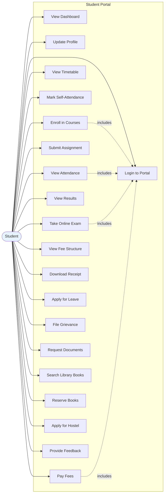
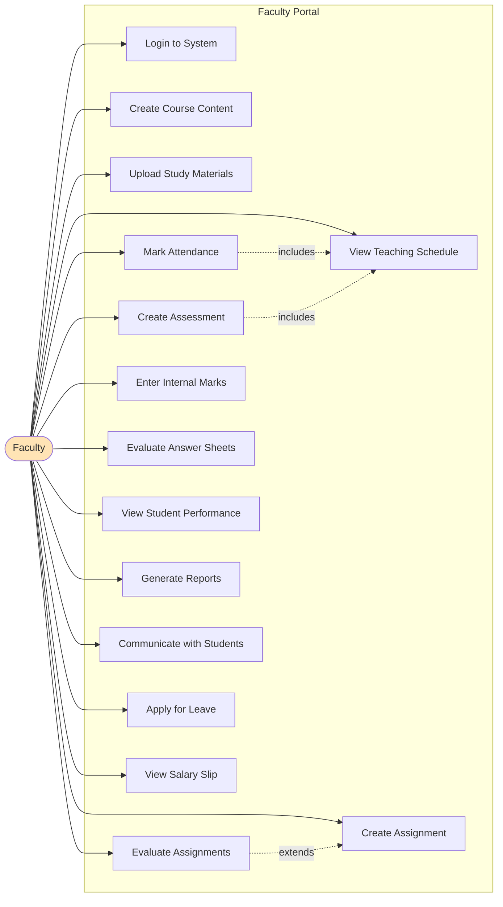
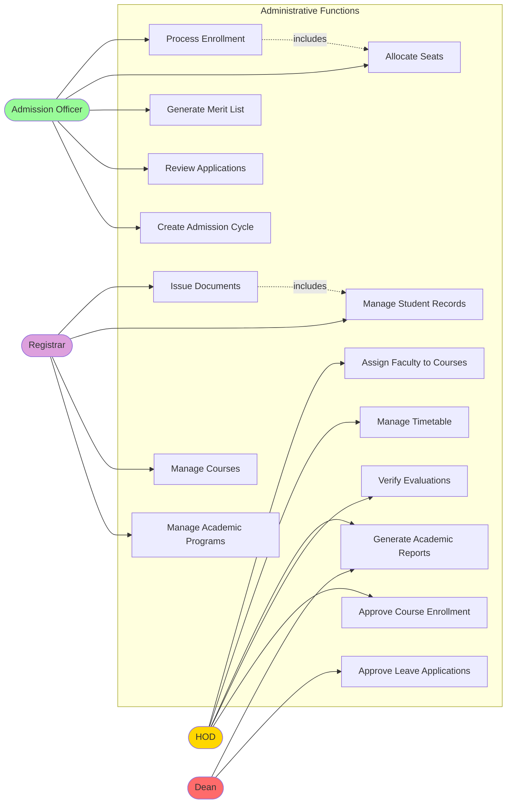
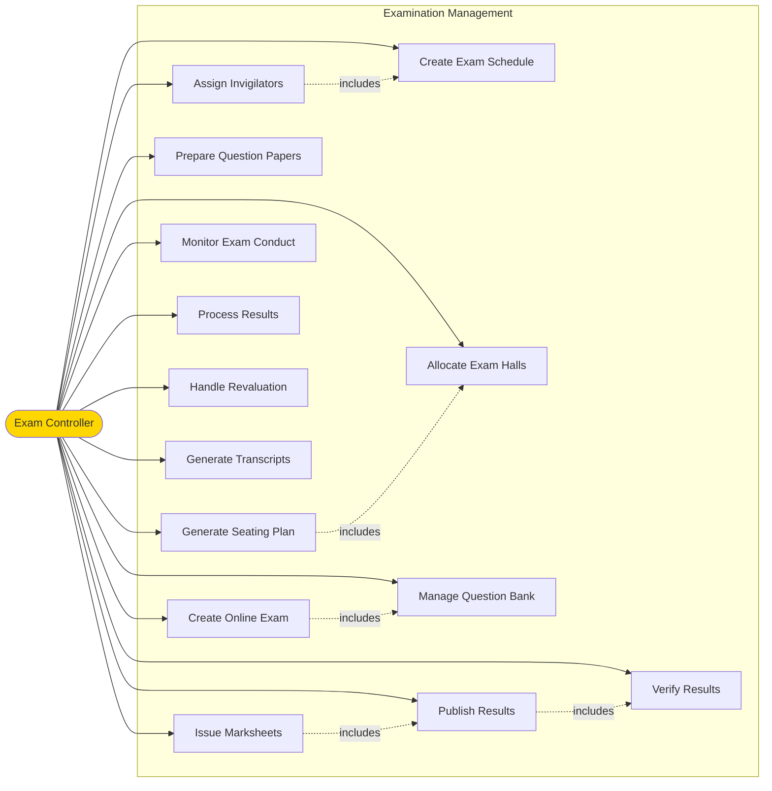
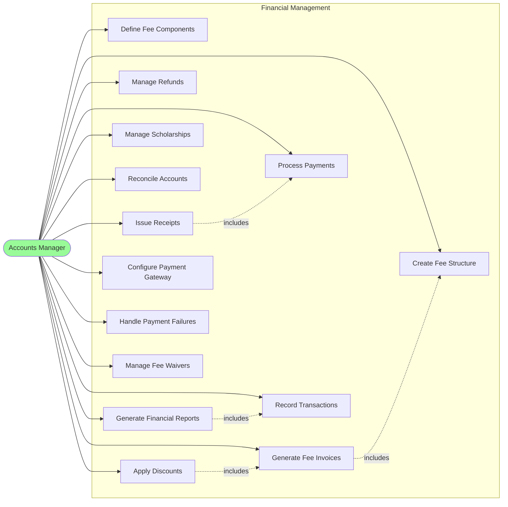
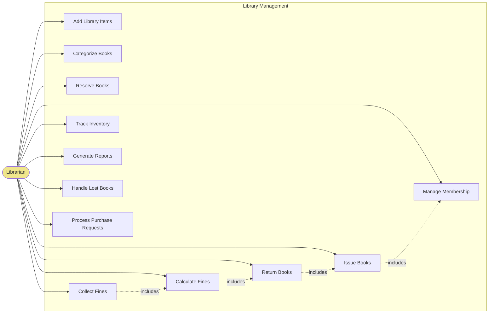
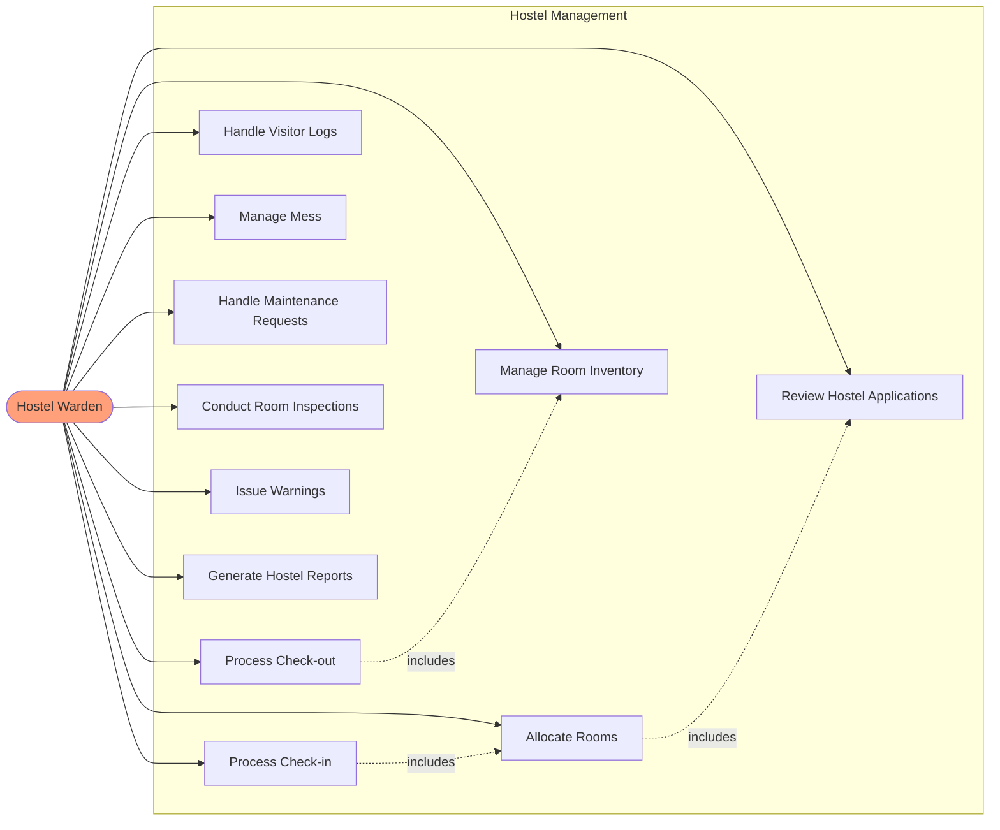
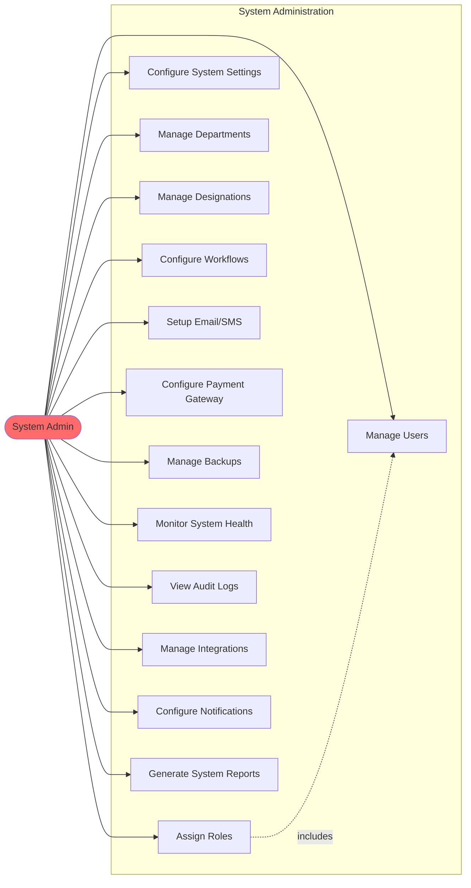
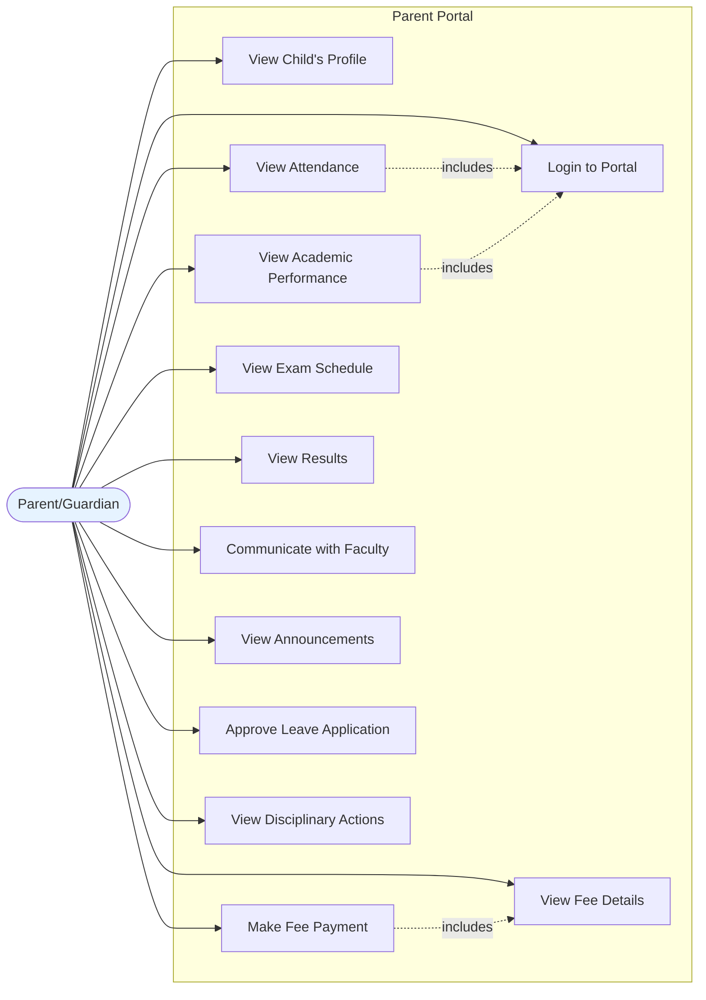

# University ERP - Use Case Diagrams

## Table of Contents
1. [System Overview](#1-system-overview)
2. [Student Use Cases](#2-student-use-cases)
3. [Faculty Use Cases](#3-faculty-use-cases)
4. [Administrative Use Cases](#4-administrative-use-cases)
5. [Examination Controller Use Cases](#5-examination-controller-use-cases)
6. [Accounts Manager Use Cases](#6-accounts-manager-use-cases)
7. [Librarian Use Cases](#7-librarian-use-cases)
8. [Hostel Warden Use Cases](#8-hostel-warden-use-cases)
9. [System Admin Use Cases](#9-system-admin-use-cases)
10. [Parent/Guardian Use Cases](#10-parentguardian-use-cases)

---

## 1. System Overview

### Complete System Use Case Diagram

```mermaid
graph TB
    subgraph "University ERP System"
        direction TB

        subgraph "Academic Management"
            UC_COURSE[Manage Courses]
            UC_ENROLL[Course Enrollment]
            UC_ATTEND[Attendance Management]
            UC_ASSESS[Assessment Management]
        end

        subgraph "Examination Management"
            UC_EXAM[Conduct Examinations]
            UC_EVAL[Evaluate Answer Sheets]
            UC_RESULT[Declare Results]
        end

        subgraph "Financial Management"
            UC_FEE[Fee Management]
            UC_PAYMENT[Payment Processing]
            UC_ACCOUNTS[Accounting]
        end

        subgraph "Support Services"
            UC_LIBRARY[Library Management]
            UC_HOSTEL[Hostel Management]
            UC_TRANSPORT[Transport Management]
            UC_GRIEVANCE[Grievance Management]
        end

        subgraph "Administrative"
            UC_ADMISSION[Admission Management]
            UC_STUDENT[Student Management]
            UC_HR[HR Management]
            UC_REPORTS[Reports & Analytics]
        end
    end

    STUDENT([Student]) --> UC_ENROLL
    STUDENT --> UC_ATTEND
    STUDENT --> UC_PAYMENT
    STUDENT --> UC_EXAM
    STUDENT --> UC_LIBRARY
    STUDENT --> UC_HOSTEL
    STUDENT --> UC_GRIEVANCE

    FACULTY([Faculty]) --> UC_COURSE
    FACULTY --> UC_ATTEND
    FACULTY --> UC_ASSESS
    FACULTY --> UC_EVAL

    EXAMCTRL([Exam Controller]) --> UC_EXAM
    EXAMCTRL --> UC_RESULT

    ACCOUNTS([Accounts Manager]) --> UC_FEE
    ACCOUNTS --> UC_ACCOUNTS

    REGISTRAR([Registrar]) --> UC_ADMISSION
    REGISTRAR --> UC_STUDENT

    LIBRARIAN([Librarian]) --> UC_LIBRARY

    WARDEN([Hostel Warden]) --> UC_HOSTEL

    ADMIN([System Admin]) --> UC_HR
    ADMIN --> UC_REPORTS

    style STUDENT fill:#E6F3FF
    style FACULTY fill:#FFE4B5
    style EXAMCTRL fill:#FFD700
    style ACCOUNTS fill:#98FB98
    style REGISTRAR fill:#DDA0DD
    style LIBRARIAN fill:#F0E68C
    style WARDEN fill:#FFA07A
    style ADMIN fill:#FF6B6B
```

---

## 2. Student Use Cases

### Use Case Diagram

### Detailed Use Case Descriptions

#### UC1: Login to Portal
- **Actor**: Student
- **Precondition**: Student has valid credentials
- **Main Flow**:
  1. Student enters email and password
  2. System validates credentials
  3. System generates JWT token
  4. System redirects to dashboard
- **Postcondition**: Student is authenticated and can access portal features
- **Extensions**:
  - Invalid credentials: Show error message
  - Account locked: Show unlock instructions
  - First login: Force password change

#### UC4: Enroll in Courses
- **Actor**: Student
- **Precondition**: Registration period is open, student is logged in
- **Main Flow**:
  1. Student views available courses
  2. Student selects courses
  3. System validates prerequisites
  4. System checks credit limits (12-24)
  5. System checks seat availability
  6. Student submits enrollment request
  7. System sends to advisor for approval
  8. Advisor approves enrollment
  9. System reserves seats
  10. System generates fee invoice
  11. Student pays fee
  12. System confirms enrollment
- **Postcondition**: Student is enrolled in selected courses
- **Extensions**:
  - Prerequisites not met: Show error, suggest prerequisite courses
  - Credit limit exceeded: Show error message
  - Seats full: Add to waitlist
  - Advisor rejects: Notify student with reason
  - Payment not made: Cancel enrollment after 7 days

#### UC9: Take Online Exam
- **Actor**: Student
- **Precondition**: Exam is scheduled and active
- **Main Flow**:
  1. Student clicks "Start Exam"
  2. System validates exam timing
  3. System enables full-screen mode
  4. System starts proctoring (webcam, screen recording)
  5. System displays questions
  6. Student answers questions
  7. System auto-saves answers every 2 minutes
  8. Student submits exam or time expires
  9. System calculates marks (objective questions)
  10. System records exam attempt
- **Postcondition**: Exam is submitted and recorded
- **Extensions**:
  - Tab switching detected: Show warning, log violation
  - Multiple violations (>3): Auto-submit exam
  - Face not detected: Show alert
  - Internet connection lost: Resume from last saved state

#### UC11: Pay Fees
- **Actor**: Student
- **Precondition**: Fee invoice is generated
- **Main Flow**:
  1. Student views fee invoice
  2. Student clicks "Pay Now"
  3. System creates payment order with gateway
  4. System redirects to payment gateway
  5. Student enters payment details
  6. Gateway processes payment
  7. Gateway sends callback to system
  8. System verifies payment signature
  9. System updates invoice status
  10. System generates and emails receipt
- **Postcondition**: Fee is paid and receipt is generated
- **Extensions**:
  - Payment fails: Show error, offer retry
  - Signature verification fails: Log fraud attempt
  - Partial payment: Update remaining amount

---

## 3. Faculty Use Cases

### Use Case Diagram

### Detailed Use Case Descriptions

#### FC5: Mark Attendance
- **Actor**: Faculty
- **Precondition**: Faculty is logged in, class schedule exists
- **Main Flow**:
  1. Faculty selects course schedule
  2. System loads enrolled students list
  3. Faculty marks attendance for each student (Present/Absent/Late/Leave)
  4. Faculty submits attendance
  5. System calculates attendance percentage
  6. System checks if any student is below 75%
  7. System sends alerts for low attendance
- **Postcondition**: Attendance is recorded and students are notified
- **Extensions**:
  - Biometric integration: Auto-sync attendance from biometric device
  - QR code: Generate dynamic QR for students to scan
  - Mobile app: Students self-mark with location verification

#### FC7: Create Assignment
- **Actor**: Faculty
- **Precondition**: Faculty is assigned to course
- **Main Flow**:
  1. Faculty creates assignment with title and description
  2. Faculty sets submission deadline
  3. Faculty sets maximum marks
  4. Faculty attaches reference materials (optional)
  5. Faculty publishes assignment
  6. System notifies all enrolled students
- **Postcondition**: Assignment is published and students are notified
- **Extensions**:
  - Late submission: Configure penalty percentage
  - Group assignment: Allow group submissions

#### FC8: Evaluate Assignments
- **Actor**: Faculty
- **Precondition**: Student has submitted assignment
- **Main Flow**:
  1. Faculty views pending assignments
  2. Faculty opens submission
  3. System shows plagiarism report
  4. Faculty reviews submission
  5. Faculty awards marks
  6. Faculty provides feedback
  7. Faculty submits evaluation
  8. System notifies student
- **Postcondition**: Assignment is evaluated and student is notified
- **Extensions**:
  - Plagiarism detected: Faculty can report misconduct
  - Re-evaluation request: HOD assigns different faculty

#### FC10: Evaluate Answer Sheets
- **Actor**: Faculty
- **Precondition**: Exam is completed
- **Main Flow**:
  1. Faculty views assigned answer sheets
  2. Faculty opens answer sheet (blind evaluation)
  3. Faculty reviews answers
  4. Faculty awards marks for each question
  5. System calculates total marks
  6. Faculty submits evaluation
  7. System forwards to HOD for verification
- **Postcondition**: Answer sheet is evaluated
- **Extensions**:
  - Online exam: Objective questions auto-evaluated
  - Double evaluation: If marks differ >10%, send to third evaluator

---

## 4. Administrative Use Cases

### Use Case Diagram

### Detailed Use Case Descriptions

#### AD4: Review Applications
- **Actor**: Admission Officer
- **Precondition**: Applications are submitted
- **Main Flow**:
  1. Officer views pending applications
  2. Officer opens application
  3. Officer verifies documents
  4. Officer checks eligibility criteria
  5. Officer approves/rejects application
  6. System notifies applicant
- **Postcondition**: Application is reviewed
- **Extensions**:
  - Documents missing: Request resubmission
  - Entrance exam required: Schedule exam

#### AD5: Generate Merit List
- **Actor**: Admission Officer
- **Precondition**: All applications reviewed, entrance exams conducted
- **Main Flow**:
  1. Officer selects admission cycle
  2. Officer defines selection criteria
  3. System calculates merit scores
  4. System ranks applicants
  5. System generates merit list
  6. Officer reviews and approves list
  7. System publishes merit list
  8. System notifies all applicants
- **Postcondition**: Merit list is published
- **Extensions**:
  - Multiple quotas: Generate separate lists for each quota
  - Entrance exam: Weight exam marks in merit calculation

#### AD9: Approve Course Enrollment
- **Actor**: HOD / Academic Advisor
- **Precondition**: Student has submitted enrollment request
- **Main Flow**:
  1. Advisor views pending enrollments
  2. Advisor opens enrollment request
  3. System shows course selection
  4. Advisor verifies prerequisites
  5. Advisor checks student academic performance
  6. Advisor approves/rejects enrollment
  7. System notifies student
- **Postcondition**: Enrollment request is processed
- **Extensions**:
  - Overload request: If credits > 24, require special approval
  - Course withdrawal: Process drop requests

---

## 5. Examination Controller Use Cases

### Use Case Diagram

### Detailed Use Case Descriptions

#### EX1: Create Exam Schedule
- **Actor**: Exam Controller
- **Precondition**: Academic term is active
- **Main Flow**:
  1. Controller creates exam schedule
  2. Controller selects courses
  3. Controller sets exam dates and timings
  4. Controller selects exam mode (online/offline)
  5. System validates no clashes
  6. Controller publishes schedule
  7. System notifies students and faculty
- **Postcondition**: Exam schedule is published
- **Extensions**:
  - Date clash: System suggests alternative dates
  - Holiday on exam date: Show warning

#### EX6: Manage Question Bank
- **Actor**: Exam Controller / Faculty
- **Precondition**: Course exists
- **Main Flow**:
  1. User creates question
  2. User sets question type (MCQ, descriptive, numerical)
  3. User sets difficulty level
  4. User sets marks
  5. User maps to course outcome
  6. User maps to Bloom's taxonomy level
  7. User saves question
  8. System adds to question bank
- **Postcondition**: Question is added to bank
- **Extensions**:
  - MCQ: Add options and mark correct answer
  - With image: Upload question image

#### EX11: Publish Results
- **Actor**: Exam Controller
- **Precondition**: All evaluations are verified
- **Main Flow**:
  1. Controller reviews result summary
  2. Controller checks pass/fail statistics
  3. Controller verifies no pending evaluations
  4. Controller publishes results
  5. System generates grade cards
  6. System generates transcripts
  7. System notifies all students
- **Postcondition**: Results are published
- **Extensions**:
  - Errors found: Unpublish and correct
  - Re-evaluation window: Open for X days

---

## 6. Accounts Manager Use Cases

### Use Case Diagram

### Detailed Use Case Descriptions

#### AC1: Create Fee Structure
- **Actor**: Accounts Manager
- **Precondition**: Academic program exists
- **Main Flow**:
  1. Manager creates fee structure
  2. Manager selects program and academic year
  3. Manager adds fee components
  4. Manager sets amounts for each component
  5. Manager sets due dates
  6. Manager applies category-wise variations
  7. Manager publishes fee structure
- **Postcondition**: Fee structure is created and published
- **Extensions**:
  - Installment payment: Define multiple due dates
  - Late fee: Configure penalty rules

#### AC4: Process Payments
- **Actor**: Accounts Manager
- **Precondition**: Payment is made
- **Main Flow**:
  1. Manager views payment transactions
  2. Manager verifies payment details
  3. Manager reconciles with bank statement
  4. Manager creates payment entry
  5. Manager updates invoice status
  6. Manager creates journal entry
  7. System generates receipt
  8. System emails receipt to student
- **Postcondition**: Payment is recorded
- **Extensions**:
  - Payment mismatch: Contact student
  - Duplicate payment: Process refund

#### AC11: Generate Financial Reports
- **Actor**: Accounts Manager
- **Precondition**: Transactions are recorded
- **Main Flow**:
  1. Manager selects report type
  2. Manager sets date range
  3. Manager applies filters
  4. System aggregates data
  5. System generates report
  6. Manager reviews report
  7. Manager exports/prints report
- **Postcondition**: Financial report is generated
- **Extensions**:
  - Custom report: Define custom columns
  - Scheduled report: Configure auto-generation

---

## 7. Librarian Use Cases

### Use Case Diagram

### Detailed Use Case Descriptions

#### LB3: Issue Books
- **Actor**: Librarian
- **Precondition**: Student is a library member, book is available
- **Main Flow**:
  1. Student presents ID card
  2. Librarian verifies identity
  3. Librarian checks student quota
  4. Librarian checks pending dues
  5. Librarian scans book barcode
  6. System creates library transaction
  7. System calculates due date
  8. System updates book status
  9. Librarian prints issue slip
  10. Librarian hands book to student
  11. System sends confirmation
- **Postcondition**: Book is issued to student
- **Extensions**:
  - Quota exceeded: Cannot issue
  - Pending dues: Collect dues first
  - Book reserved: Check if student is next in queue

#### LB4: Return Books
- **Actor**: Librarian
- **Precondition**: Book was issued
- **Main Flow**:
  1. Student returns book
  2. Librarian scans book barcode
  3. System retrieves transaction
  4. Librarian inspects book condition
  5. System checks return date
  6. System calculates fine (if late)
  7. Librarian collects fine (if applicable)
  8. System updates transaction status
  9. System marks book as available
  10. System notifies next in reservation queue
- **Postcondition**: Book is returned and available
- **Extensions**:
  - Book damaged: Assess damage fine
  - Book lost: Mark as lost, charge replacement cost

---

## 8. Hostel Warden Use Cases

### Use Case Diagram

### Detailed Use Case Descriptions

#### HS1: Review Hostel Applications
- **Actor**: Hostel Warden
- **Precondition**: Student has submitted application
- **Main Flow**:
  1. Warden views pending applications
  2. Warden opens application
  3. Warden verifies documents
  4. Warden checks eligibility
  5. Warden approves/rejects application
  6. System notifies student
- **Postcondition**: Application is reviewed
- **Extensions**:
  - Documents incomplete: Request resubmission
  - Not eligible: Reject with reason

#### HS3: Process Check-in
- **Actor**: Hostel Warden
- **Precondition**: Room is allocated, student has paid fee
- **Main Flow**:
  1. Student arrives on check-in date
  2. Warden verifies allotment letter
  3. Warden verifies ID and documents
  4. Warden inspects room with student
  5. Warden creates inventory checklist
  6. Student signs checklist
  7. System creates occupancy record
  8. Warden hands room keys
  9. System sends welcome message
- **Postcondition**: Student is checked in
- **Extensions**:
  - Room not ready: Provide temporary accommodation

---

## 9. System Admin Use Cases

### Use Case Diagram

### Detailed Use Case Descriptions

#### SA1: Manage Users
- **Actor**: System Admin
- **Precondition**: Admin is logged in
- **Main Flow**:
  1. Admin creates new user
  2. Admin enters user details
  3. Admin assigns role
  4. Admin sets permissions
  5. System generates credentials
  6. System sends welcome email
- **Postcondition**: User is created
- **Extensions**:
  - Bulk import: Upload CSV file
  - Reset password: Generate reset link

#### SA9: Manage Backups
- **Actor**: System Admin
- **Precondition**: Admin has access to backup system
- **Main Flow**:
  1. Admin schedules backup
  2. Admin configures backup settings
  3. System creates database dump
  4. System compresses backup
  5. System uploads to cloud storage
  6. System verifies backup integrity
  7. System notifies admin
- **Postcondition**: Backup is created and stored
- **Extensions**:
  - Manual backup: Trigger immediate backup
  - Restore: Restore from backup file

---

## 10. Parent/Guardian Use Cases

### Use Case Diagram

### Detailed Use Case Descriptions

#### PR3: View Attendance
- **Actor**: Parent/Guardian
- **Precondition**: Parent is linked to student, logged in
- **Main Flow**:
  1. Parent logs in to portal
  2. Parent navigates to attendance section
  3. System displays attendance summary
  4. System shows course-wise attendance
  5. System displays attendance percentage
  6. System highlights low attendance
- **Postcondition**: Parent views attendance
- **Extensions**:
  - Download report: Export attendance report
  - Alerts: View attendance alerts

#### PR11: Approve Leave Application
- **Actor**: Parent/Guardian
- **Precondition**: Student has applied for leave
- **Main Flow**:
  1. System notifies parent of leave request
  2. Parent logs in to portal
  3. Parent views leave application
  4. Parent reviews reason and dates
  5. Parent approves/rejects leave
  6. System notifies student and college
- **Postcondition**: Leave application is processed
- **Extensions**:
  - Emergency leave: Auto-approve for emergencies

---

## Use Case Priority Matrix

### High Priority (Must Have)

| Use Case | Actor | Complexity | Business Value |
|----------|-------|------------|----------------|
| Login to Portal | Student | Low | Critical |
| Enroll in Courses | Student | High | Critical |
| Pay Fees | Student | High | Critical |
| Take Online Exam | Student | Very High | Critical |
| Mark Attendance | Faculty | Medium | High |
| Evaluate Answer Sheets | Faculty | High | Critical |
| Review Applications | Admission Officer | Medium | Critical |
| Generate Merit List | Admission Officer | High | Critical |
| Create Exam Schedule | Exam Controller | Medium | Critical |
| Publish Results | Exam Controller | High | Critical |

### Medium Priority (Should Have)

| Use Case | Actor | Complexity | Business Value |
|----------|-------|------------|----------------|
| File Grievance | Student | Medium | High |
| Apply for Hostel | Student | Medium | High |
| Request Documents | Student | Low | Medium |
| Create Assignment | Faculty | Medium | High |
| Issue Books | Librarian | Low | Medium |
| Process Check-in | Hostel Warden | Medium | Medium |
| Manage Backups | System Admin | High | Critical |

### Low Priority (Nice to Have)

| Use Case | Actor | Complexity | Business Value |
|----------|-------|------------|----------------|
| Provide Feedback | Student | Low | Low |
| View Performance | Parent | Low | Medium |
| Generate Reports | Various | Medium | Medium |

---

## Summary

This document provides comprehensive use case diagrams for:

1. **System Overview** - All actors and their interactions
2. **Student Use Cases** - 20+ student portal features
3. **Faculty Use Cases** - Teaching and evaluation functions
4. **Administrative Use Cases** - Admission, enrollment, documents
5. **Examination Controller** - Exam management lifecycle
6. **Accounts Manager** - Financial management
7. **Librarian** - Library operations
8. **Hostel Warden** - Hostel management
9. **System Admin** - System configuration and maintenance
10. **Parent/Guardian** - Parent portal features

Each use case includes:
- Actor identification
- Preconditions and postconditions
- Main flow (happy path)
- Alternative flows (extensions)
- Business value and priority

All diagrams use Mermaid syntax for easy rendering and maintenance.
