# University ERP - Cloud Infrastructure Requirements

## Overview

This document outlines the cloud infrastructure required to host the University ERP system with the specified modules for a **small to medium university** with:

- **Students**: ~2,000
- **Faculty**: ~70
- **Staff**: ~50 (estimated)
- **Parents**: ~2,000 (potential)

### Modules to Deploy

| Module | Priority | Load Pattern |
|--------|----------|--------------|
| Academic Management | High | Steady |
| Admission & Enrollment | High | Seasonal spikes (June-July) |
| Attendance Management | High | Morning/Evening peaks |
| Fee & Finance | High | Monthly spikes |
| Student Portal | High | Daily peaks (9 AM - 6 PM) |
| LMS Module | High | Class hours peaks |
| HR & Payroll | Medium | Month-end spikes |
| Library Management | Medium | Steady |
| Hostel Management | Medium | Semester start spikes |
| Transport Management | Low | Steady |
| Communication Hub | High | Burst traffic |
| Placement & Alumni | Medium | Placement season spikes |

---

## User Base & Traffic Analysis

### User Distribution

| User Type | Count | Concurrent Users (Peak) | Daily Active |
|-----------|-------|------------------------|--------------|
| Students | 2,000 | 400-600 | 1,500 |
| Faculty | 70 | 40-50 | 60 |
| Staff | 50 | 30-40 | 45 |
| Parents | 2,000 | 50-100 | 200 |
| **Total** | **4,120** | **520-790** | **1,805** |

### Traffic Estimation

| Operation | Daily Requests | Peak RPS | Notes |
|-----------|---------------|----------|-------|
| Portal Login | 2,000-3,000 | 10-20 | Morning spike |
| Attendance Marking | 2,000-4,000 | 50-100 (burst) | 10 min window |
| LMS Access | 5,000-10,000 | 30-50 | During class hours |
| Fee Payment | 50-200 | 5-10 | Monthly peak |
| API Calls (total) | 30,000-50,000 | 50-100 | General operations |
| File Downloads | 2,000-5,000 | 20-30 | LMS content |

### Peak Load Scenarios

```mermaid
gantt
    title Daily Load Pattern
    dateFormat HH:mm
    axisFormat %H:%M

    section Morning Peak
    Attendance Burst     :crit, 08:30, 30m
    Login Spike          :crit, 08:45, 45m

    section Class Hours
    LMS Active          :active, 09:00, 6h
    Portal Usage        :active, 09:00, 8h

    section Evening
    Assignment Uploads  :10:00, 2h
    Result Checking     :16:00, 2h

    section Night
    Low Activity        :22:00, 8h
```

---

## Recommended Architecture

### Architecture Diagram

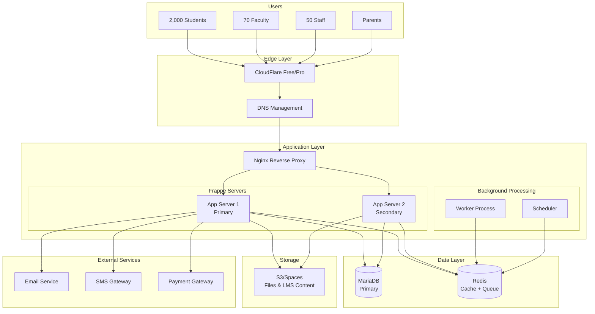

---

## Infrastructure Options

### Option 1: AWS (Production Ready) - Recommended

**Monthly Cost: ₹25,000 - ₹35,000 ($300 - $420)**

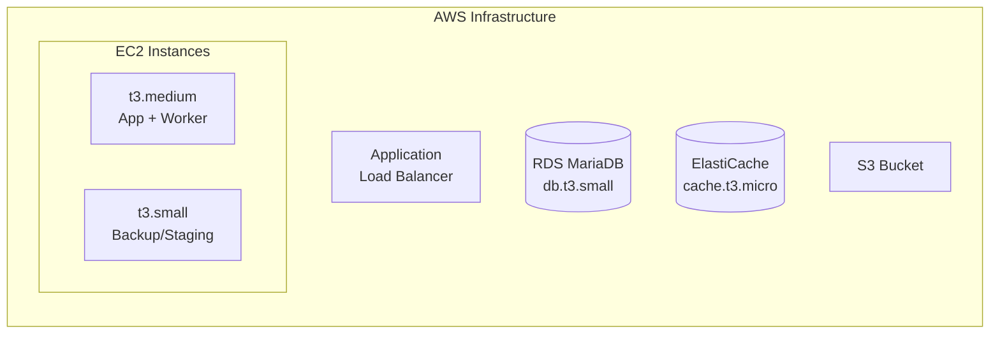

#### Detailed AWS Specifications

| Component | Specification | Monthly Cost (USD) |
|-----------|--------------|-------------------|
| **Compute** | | |
| EC2 Primary | t3.medium (2 vCPU, 4GB RAM) | $30 |
| EC2 Staging | t3.small (2 vCPU, 2GB RAM) | $15 |
| **Database** | | |
| RDS MariaDB | db.t3.small (2 vCPU, 2GB RAM) | $25 |
| Storage | 50GB GP3 SSD | $5 |
| **Cache** | | |
| ElastiCache | cache.t3.micro (1 node) | $12 |
| **Storage** | | |
| S3 Standard | 100GB | $2.50 |
| S3 Data Transfer | 100GB/month | $9 |
| **Networking** | | |
| Application Load Balancer | | $16 + $0.008/LCU |
| Elastic IP | 1 | $3.60 |
| Data Transfer | 100GB | $9 |
| **Other** | | |
| Route 53 | | $0.50 |
| CloudWatch | Basic | Free |
| SES | 10,000 emails | $1 |
| **Subtotal** | | **~$130** |
| **With Reserved Instance (1yr)** | | **~$95** |

#### AWS Configuration

```yaml
# EC2 Instance (t3.medium)
Instance Type: t3.medium
vCPU: 2
Memory: 4 GB
Storage: 30 GB EBS (GP3)
OS: Ubuntu 22.04 LTS

# Services Running:
- Nginx (reverse proxy)
- Frappe/ERPNext (gunicorn - 4 workers)
- Redis (cache + queue)
- Frappe Worker (1 default, 1 short)
- Frappe Scheduler

# RDS MariaDB (db.t3.small)
Instance Type: db.t3.small
vCPU: 2
Memory: 2 GB
Storage: 50 GB GP3
Multi-AZ: No (cost saving)
Automated Backup: 7 days
```

---

### Option 2: DigitalOcean (Cost Effective)

**Monthly Cost: ₹12,000 - ₹18,000 ($150 - $220)**

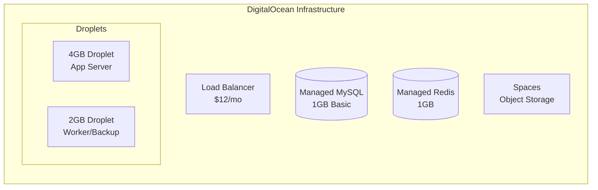

#### Detailed DigitalOcean Specifications

| Component | Specification | Monthly Cost (USD) |
|-----------|--------------|-------------------|
| **Droplets** | | |
| Primary Server | 4GB RAM, 2 vCPU, 80GB SSD | $24 |
| Worker/Backup | 2GB RAM, 1 vCPU, 50GB SSD | $12 |
| **Managed Database** | | |
| MySQL | 1GB RAM, 1 vCPU, 10GB | $15 |
| **Managed Redis** | | |
| Redis | 1GB RAM | $15 |
| **Storage** | | |
| Spaces | 250GB + 1TB transfer | $5 |
| Spaces CDN | Included | - |
| **Networking** | | |
| Load Balancer | | $12 |
| Reserved IP | | Free |
| Bandwidth | 4TB included | Free |
| **Total** | | **~$83** |

#### DigitalOcean Setup

```bash
# Primary Droplet Configuration
doctl compute droplet create university-erp-app \
  --image ubuntu-22-04-x64 \
  --size s-2vcpu-4gb \
  --region blr1 \
  --ssh-keys your-key-id \
  --tag-names production,frappe

# Worker Droplet
doctl compute droplet create university-erp-worker \
  --image ubuntu-22-04-x64 \
  --size s-1vcpu-2gb \
  --region blr1 \
  --ssh-keys your-key-id \
  --tag-names production,worker
```

---

### Option 3: E2E Networks (India-Based - Recommended for Indian Universities)

**Monthly Cost: ₹4,000 - ₹8,000 ($50 - $100)**

E2E Networks is an India-based cloud provider offering excellent price-performance ratio with data residency in India.

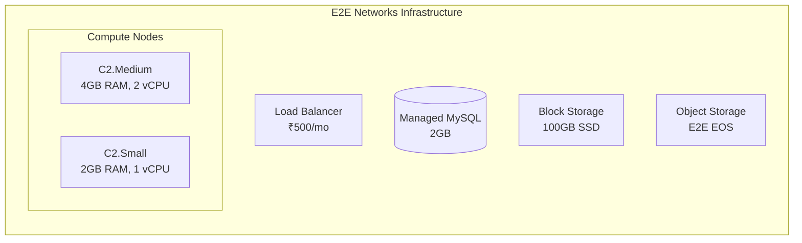

#### E2E Networks Specifications

| Component | Specification | Monthly Cost (₹) |
|-----------|--------------|------------------|
| **Compute** | | |
| Primary Node | C2.Medium (2 vCPU, 4GB RAM, 60GB SSD) | ₹1,500 |
| Worker Node | C2.Small (1 vCPU, 2GB RAM, 40GB SSD) | ₹750 |
| **Database** | | |
| Managed MySQL | 2GB RAM, 50GB Storage | ₹1,200 |
| **Storage** | | |
| Block Storage | 100GB SSD | ₹500 |
| Object Storage (EOS) | 200GB | ₹200 |
| **Networking** | | |
| Load Balancer | Basic | ₹500 |
| Public IP | 2 IPs | ₹200 |
| Bandwidth | 2TB included | Free |
| **Total** | | **₹4,850/month** |

#### E2E Networks Advantages

| Feature | Benefit |
|---------|---------|
| **Data Residency** | Data stays in India (GDPR, IT Act compliance) |
| **Pricing** | 40-60% cheaper than AWS/Azure |
| **Support** | Local support team, IST hours |
| **Billing** | INR billing, no forex fluctuation |
| **Latency** | Low latency for Indian users |
| **GPU Options** | Available for AI/ML workloads |

#### E2E Setup Commands

```bash
# Using E2E CLI (myaccount.e2enetworks.com)

# Create compute node
e2e node create \
  --name university-erp-app \
  --plan C2.Medium \
  --image ubuntu-22.04 \
  --region Delhi-NCR \
  --ssh-key your-key-name

# Create managed database
e2e database create \
  --name university-db \
  --engine mysql-8.0 \
  --plan DBaaS-2GB \
  --region Delhi-NCR

# Create object storage bucket
e2e eos bucket create \
  --name university-erp-files \
  --region Delhi-NCR \
  --acl private
```

#### E2E Network Architecture

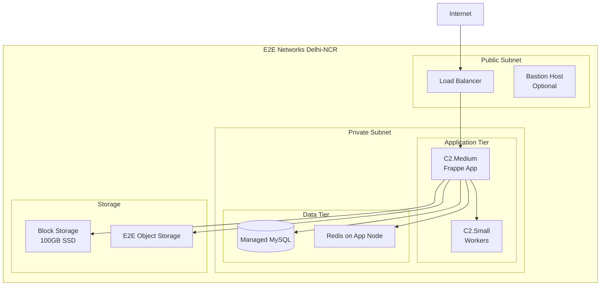

#### E2E vs Other Providers (Cost Comparison)

| Resource | E2E Networks | AWS | DigitalOcean |
|----------|-------------|-----|--------------|
| 4GB Compute | ₹1,500/mo | ₹2,500/mo | ₹2,000/mo |
| 2GB Managed DB | ₹1,200/mo | ₹2,000/mo | ₹1,250/mo |
| 100GB Storage | ₹500/mo | ₹800/mo | ₹1,000/mo |
| Load Balancer | ₹500/mo | ₹1,500/mo | ₹1,000/mo |
| **Total** | **₹3,700** | **₹6,800** | **₹5,250** |

---

### Option 4: Single VPS (Budget/Starter)

**Monthly Cost: ₹1,500 - ₹3,000 ($20 - $40)**

For initial deployment or tight budgets:

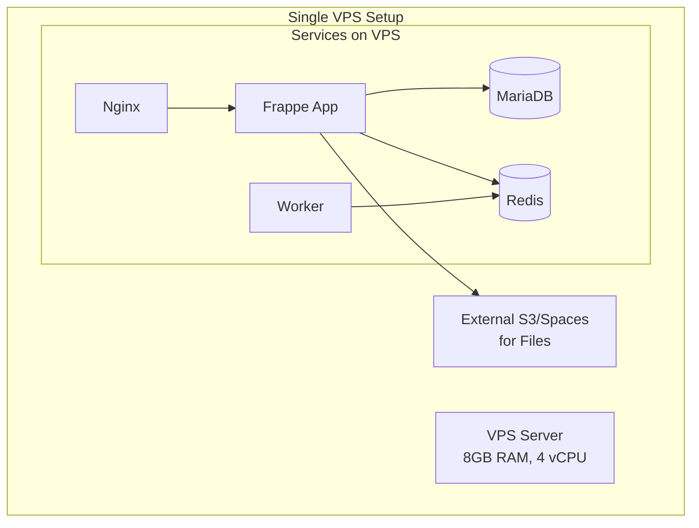

| Provider | Specification | Monthly Cost |
|----------|--------------|--------------|
| **Hetzner** | CPX31 (4 vCPU, 8GB, 160GB) | $15 |
| **Contabo** | VPS M (6 vCPU, 16GB, 400GB) | $12 |
| **DigitalOcean** | Droplet (4GB RAM) | $24 |
| **AWS Lightsail** | 8GB RAM | $40 |
| **Linode** | 8GB RAM | $48 |

**Add external storage:** DigitalOcean Spaces ($5) or Cloudflare R2 (free tier)

---

## Recommended Configuration (2,000 Students)

### Production Setup (AWS)

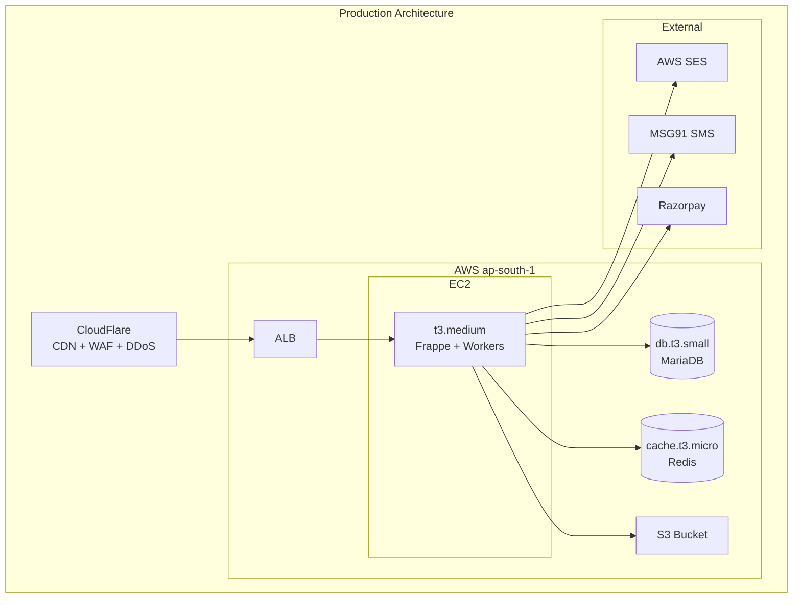

### Server Configuration

```yaml
# Single EC2 t3.medium Configuration

# System Requirements
OS: Ubuntu 22.04 LTS
RAM: 4GB
vCPU: 2
Disk: 30GB EBS GP3

# Software Stack
- Python 3.11
- Node.js 18 LTS
- MariaDB 10.6 (or RDS)
- Redis 7.0
- Nginx 1.24
- Supervisor

# Frappe Configuration
gunicorn_workers: 4
worker_processes: 2 (default + short)
scheduler: enabled

# Process Allocation
# Total RAM: 4GB
- OS & System: 512MB
- Nginx: 128MB
- MariaDB: 1GB (if local) / 0 (if RDS)
- Redis: 256MB
- Gunicorn (4 workers): 1.5GB
- Workers (2): 512MB
- Scheduler: 128MB
- Buffer: 500MB
```

### Nginx Configuration

```nginx
# /etc/nginx/sites-available/university

upstream frappe-bench {
    server 127.0.0.1:8000 fail_timeout=0;
    keepalive 32;
}

server {
    listen 80;
    server_name university.example.com;
    return 301 https://$server_name$request_uri;
}

server {
    listen 443 ssl http2;
    server_name university.example.com;

    # SSL (managed by Certbot or CloudFlare)
    ssl_certificate /etc/letsencrypt/live/university.example.com/fullchain.pem;
    ssl_certificate_key /etc/letsencrypt/live/university.example.com/privkey.pem;

    # Security headers
    add_header X-Frame-Options "SAMEORIGIN" always;
    add_header X-Content-Type-Options "nosniff" always;
    add_header X-XSS-Protection "1; mode=block" always;

    # Gzip
    gzip on;
    gzip_types text/plain application/json application/javascript text/css;
    gzip_min_length 1000;

    # Rate limiting
    limit_req_zone $binary_remote_addr zone=api:10m rate=20r/s;
    limit_req_zone $binary_remote_addr zone=login:10m rate=3r/s;

    # File upload size (for LMS)
    client_max_body_size 50M;

    location /api/method/login {
        limit_req zone=login burst=5 nodelay;
        proxy_pass http://frappe-bench;
        proxy_set_header Host $host;
        proxy_set_header X-Real-IP $remote_addr;
    }

    location /api/ {
        limit_req zone=api burst=30 nodelay;
        proxy_pass http://frappe-bench;
        proxy_set_header Host $host;
        proxy_set_header X-Real-IP $remote_addr;
        proxy_read_timeout 120s;
    }

    location /assets/ {
        expires 1y;
        add_header Cache-Control "public, immutable";
        alias /home/frappe/frappe-bench/sites/university.example.com/public/assets/;
    }

    location /files/ {
        expires 1M;
        alias /home/frappe/frappe-bench/sites/university.example.com/public/files/;
    }

    location /socket.io/ {
        proxy_pass http://frappe-bench;
        proxy_http_version 1.1;
        proxy_set_header Upgrade $http_upgrade;
        proxy_set_header Connection "upgrade";
    }

    location / {
        proxy_pass http://frappe-bench;
        proxy_set_header Host $host;
        proxy_set_header X-Real-IP $remote_addr;
        proxy_set_header X-Forwarded-For $proxy_add_x_forwarded_for;
        proxy_set_header X-Forwarded-Proto $scheme;
    }
}
```

### Database Configuration (RDS or Local)

```sql
-- MariaDB Optimization for 2GB RAM

[mysqld]
# InnoDB Settings
innodb_buffer_pool_size = 768M
innodb_buffer_pool_instances = 1
innodb_log_file_size = 128M
innodb_flush_log_at_trx_commit = 2
innodb_flush_method = O_DIRECT

# Query Cache
query_cache_type = 1
query_cache_size = 64M
query_cache_limit = 2M

# Connection Settings
max_connections = 150
wait_timeout = 600
interactive_timeout = 600

# Thread Settings
thread_cache_size = 16
thread_pool_size = 4

# Temp Tables
tmp_table_size = 64M
max_heap_table_size = 64M

# Slow Query Log
slow_query_log = 1
long_query_time = 2
slow_query_log_file = /var/log/mysql/slow.log
```

### Redis Configuration

```conf
# /etc/redis/redis.conf

# Memory
maxmemory 256mb
maxmemory-policy allkeys-lru

# Persistence (for queue reliability)
appendonly yes
appendfsync everysec

# Performance
tcp-keepalive 300
timeout 0

# Security
bind 127.0.0.1
requirepass your-redis-password
```

---

## Storage Architecture (LMS Focus)

### S3 Bucket Structure

```
university-erp-files/
├── sites/
│   └── university.example.com/
│       ├── private/
│       │   ├── files/          # Private documents
│       │   └── backups/        # Database backups
│       └── public/
│           └── files/          # Public files
├── lms/
│   ├── courses/
│   │   ├── course-001/
│   │   │   ├── lectures/       # Video lectures
│   │   │   ├── materials/      # PDFs, PPTs
│   │   │   └── assignments/    # Assignment files
│   │   └── course-002/
│   └── submissions/            # Student submissions
└── backups/
    ├── daily/
    ├── weekly/
    └── monthly/
```

### Storage Estimation

| Content Type | Size per Unit | Quantity | Total |
|--------------|--------------|----------|-------|
| Course Materials (PDF, PPT) | 50MB | 500 | 25GB |
| Video Lectures (compressed) | 200MB | 200 | 40GB |
| Student Submissions | 5MB | 5,000 | 25GB |
| Profile Photos | 200KB | 2,500 | 500MB |
| Documents (certificates, etc) | 1MB | 5,000 | 5GB |
| Database Backups | 500MB | 30 | 15GB |
| **Total** | | | **~110GB** |

### S3 Lifecycle Policy

```json
{
  "Rules": [
    {
      "ID": "MoveOldFilesToIA",
      "Status": "Enabled",
      "Filter": {
        "Prefix": "lms/submissions/"
      },
      "Transitions": [
        {
          "Days": 90,
          "StorageClass": "STANDARD_IA"
        }
      ]
    },
    {
      "ID": "ArchiveOldBackups",
      "Status": "Enabled",
      "Filter": {
        "Prefix": "backups/"
      },
      "Transitions": [
        {
          "Days": 30,
          "StorageClass": "GLACIER"
        }
      ],
      "Expiration": {
        "Days": 365
      }
    }
  ]
}
```

---

## Communication Services

### Email (AWS SES)

```yaml
# Email Volume Estimation (Monthly)
Transactional Emails:
  - Login OTP: 3,000
  - Fee Reminders: 2,000
  - Assignment Notifications: 5,000
  - Attendance Alerts: 1,000
  - Result Notifications: 2,000
  - General Notifications: 5,000
  Total: ~18,000 emails/month

# AWS SES Pricing
First 62,000 emails: $0.10/1000 = ~$2/month
```

### SMS (MSG91 / Twilio)

```yaml
# SMS Volume Estimation (Monthly)
Critical SMS:
  - OTP: 1,000
  - Fee Due Alerts: 500
  - Exam Reminders: 500
  - Emergency: 100
  Total: ~2,100 SMS/month

# MSG91 Pricing (India)
Transactional SMS: ₹0.15-0.20/SMS
Monthly Cost: ₹315-420 (~$4-5)
```

---

## Backup Strategy

### Backup Schedule

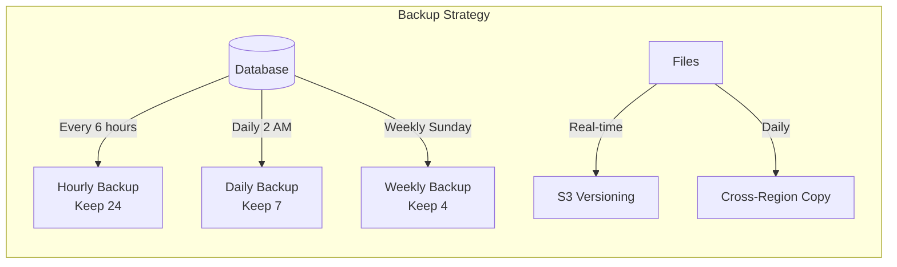

### Backup Script

```bash
#!/bin/bash
# /opt/scripts/backup.sh

SITE_NAME="university.example.com"
BACKUP_DIR="/home/frappe/backups"
S3_BUCKET="university-erp-backups"
DATE=$(date +%Y%m%d_%H%M%S)

# Create backup
cd /home/frappe/frappe-bench
bench --site $SITE_NAME backup --with-files

# Upload to S3
aws s3 cp $BACKUP_DIR/ s3://$S3_BUCKET/daily/ --recursive \
  --exclude "*" \
  --include "*$DATE*"

# Cleanup old local backups (keep 3 days)
find $BACKUP_DIR -type f -mtime +3 -delete

# Notify on failure
if [ $? -ne 0 ]; then
  curl -X POST "https://hooks.slack.com/services/xxx" \
    -d '{"text":"Backup failed for university.example.com"}'
fi
```

### Cron Schedule

```cron
# Database backups
0 */6 * * * /opt/scripts/backup.sh >> /var/log/backup.log 2>&1

# S3 sync for files
0 3 * * * aws s3 sync /home/frappe/frappe-bench/sites/university.example.com/public/files s3://university-erp-files/sites/public/files/
```

---

## Monitoring & Alerting

### CloudWatch / Uptime Monitoring

```yaml
# Key Metrics to Monitor
Application:
  - HTTP Response Time (< 2s)
  - Error Rate (< 1%)
  - Active Connections
  - Request Rate

Server:
  - CPU Utilization (alert > 80%)
  - Memory Usage (alert > 85%)
  - Disk Usage (alert > 80%)
  - Network I/O

Database:
  - Query Time (alert > 1s)
  - Connection Count (alert > 120)
  - Replication Lag (if applicable)

# Free Monitoring Tools
- UptimeRobot (free tier: 50 monitors)
- Healthchecks.io (free tier)
- CloudWatch Basic (free)
```

### Alerting Setup

```yaml
# Alert Channels
Primary: Email (admin@university.example.com)
Secondary: SMS (critical alerts only)
Tertiary: Slack/Teams webhook

# Alert Conditions
Critical (SMS + Email):
  - Server down
  - Database unreachable
  - Disk > 90%
  - Memory > 95%

Warning (Email only):
  - CPU > 80% for 5 min
  - Memory > 85%
  - Response time > 3s
  - Error rate > 1%

Info (Logged only):
  - Backup completed
  - Deployment successful
```

---

## Security Checklist

### Infrastructure Security

```yaml
Network:
  ✅ VPC with private subnets (if using AWS)
  ✅ Security groups (allow only necessary ports)
  ✅ SSH key-based authentication only
  ✅ Fail2ban for SSH protection
  ✅ CloudFlare for DDoS protection

Application:
  ✅ HTTPS only (redirect HTTP)
  ✅ Strong SSL configuration (TLS 1.2+)
  ✅ Rate limiting on login/API
  ✅ CORS properly configured
  ✅ Security headers (CSP, XSS, etc.)

Database:
  ✅ Not publicly accessible
  ✅ Strong passwords
  ✅ Regular backups encrypted
  ✅ Minimal privileges

Access:
  ✅ MFA for admin accounts
  ✅ Regular password rotation
  ✅ Audit logging enabled
  ✅ IP whitelist for admin panel
```

### CloudFlare Configuration

```yaml
# Free Tier Features
SSL: Full (Strict)
Always HTTPS: On
Minimum TLS: 1.2
Auto Minify: JS, CSS, HTML
Brotli: On

# Security Settings
Security Level: Medium
Challenge Passage: 30 minutes
Browser Integrity Check: On

# Firewall Rules (Free: 5 rules)
1. Block countries (if applicable)
2. Challenge suspicious IPs
3. Allow admin IPs to /admin
4. Rate limit /api/method/login
5. Block bad bots
```

---

## Cost Summary

### Recommended Setup: AWS (Production Ready)

| Component | Monthly Cost (₹) | Monthly Cost ($) |
|-----------|-----------------|------------------|
| EC2 t3.medium (Reserved 1yr) | ₹2,000 | $24 |
| RDS db.t3.small (Reserved 1yr) | ₹1,700 | $20 |
| ElastiCache cache.t3.micro | ₹1,000 | $12 |
| S3 (150GB) | ₹300 | $4 |
| ALB | ₹1,500 | $18 |
| Data Transfer (100GB) | ₹750 | $9 |
| CloudFlare Pro (optional) | ₹1,700 | $20 |
| SES + SMS | ₹500 | $6 |
| Domain | ₹100 | $1 |
| **Total** | **₹9,550** | **~$115** |

### Budget Setup: DigitalOcean

| Component | Monthly Cost (₹) | Monthly Cost ($) |
|-----------|-----------------|------------------|
| Droplet 4GB | ₹2,000 | $24 |
| Managed MySQL | ₹1,250 | $15 |
| Managed Redis | ₹1,250 | $15 |
| Spaces (250GB) | ₹420 | $5 |
| Load Balancer | ₹1,000 | $12 |
| CloudFlare (free) | ₹0 | $0 |
| **Total** | **₹5,920** | **~$71** |

### Starter Setup: Single VPS

| Component | Monthly Cost (₹) | Monthly Cost ($) |
|-----------|-----------------|------------------|
| Hetzner CPX31 | ₹1,250 | $15 |
| DigitalOcean Spaces | ₹420 | $5 |
| CloudFlare (free) | ₹0 | $0 |
| **Total** | **₹1,670** | **~$20** |

---

## Scaling Path

### Current → Future Growth

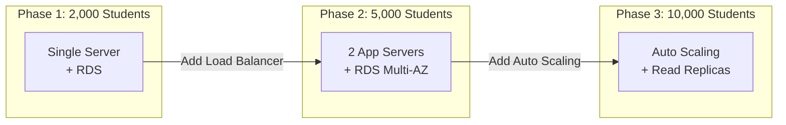

### When to Scale

| Metric | Current Threshold | Action |
|--------|------------------|--------|
| CPU | > 70% sustained | Add server |
| Memory | > 80% sustained | Upgrade instance |
| DB Connections | > 100 | Add read replica |
| Response Time | > 2s | Optimize/scale |
| Storage | > 80% | Increase capacity |

---

## Deployment Checklist

### Pre-Deployment

```yaml
Infrastructure:
  [ ] Domain registered and DNS configured
  [ ] SSL certificate ready (Let's Encrypt/CloudFlare)
  [ ] Server provisioned and secured
  [ ] Database created and configured
  [ ] S3 bucket created with proper permissions
  [ ] CloudFlare configured

Application:
  [ ] Frappe/ERPNext installed
  [ ] Custom app deployed
  [ ] Site created and configured
  [ ] All modules installed
  [ ] Admin user created
  [ ] Email settings configured
  [ ] Payment gateway configured
```

### Post-Deployment

```yaml
Testing:
  [ ] Login working (student, faculty, admin)
  [ ] Email notifications working
  [ ] File uploads working
  [ ] Payment gateway tested
  [ ] All modules accessible

Monitoring:
  [ ] Uptime monitoring configured
  [ ] Backup scripts tested
  [ ] Alert notifications working
  [ ] Log rotation configured

Documentation:
  [ ] Admin credentials secured
  [ ] Runbook documented
  [ ] Recovery procedures tested
```

---

## Quick Start Commands

### AWS CLI Setup

```bash
# Create EC2 instance
aws ec2 run-instances \
  --image-id ami-0c55b159cbfafe1f0 \
  --instance-type t3.medium \
  --key-name university-key \
  --security-group-ids sg-xxx \
  --subnet-id subnet-xxx \
  --tag-specifications 'ResourceType=instance,Tags=[{Key=Name,Value=university-erp}]'

# Create RDS instance
aws rds create-db-instance \
  --db-instance-identifier university-db \
  --db-instance-class db.t3.small \
  --engine mariadb \
  --master-username admin \
  --master-user-password 'StrongPassword123!' \
  --allocated-storage 50
```

### Frappe Installation

```bash
# On fresh Ubuntu 22.04
sudo apt update && sudo apt upgrade -y

# Install dependencies
sudo apt install python3-pip python3-venv redis-server \
  mariadb-server nginx supervisor -y

# Install bench
pip3 install frappe-bench

# Initialize bench
bench init --frappe-branch version-15 frappe-bench
cd frappe-bench

# Create site
bench new-site university.example.com

# Install ERPNext
bench get-app erpnext --branch version-15
bench --site university.example.com install-app erpnext

# Install custom app
bench get-app university_erp https://github.com/your-org/university_erp.git
bench --site university.example.com install-app university_erp

# Setup production
sudo bench setup production frappe
```

---

---

## E2E Networks Complete Deployment Guide

### Step 1: Create E2E Account & Setup

```bash
# 1. Sign up at https://myaccount.e2enetworks.com
# 2. Complete KYC verification
# 3. Add payment method (Credit Card, Net Banking, UPI)
# 4. Generate API credentials from Dashboard → API Access
```

### Step 2: Infrastructure Setup via Dashboard

#### A. Create Virtual Private Cloud (VPC)

```yaml
VPC Configuration:
  Name: university-erp-vpc
  Region: Delhi-NCR (NCR) or Mumbai (BOM)
  CIDR: 10.0.0.0/16

Subnets:
  - Public Subnet: 10.0.1.0/24
  - Private Subnet: 10.0.10.0/24
```

#### B. Create Compute Nodes

```yaml
# Primary Application Server
Node 1:
  Name: university-erp-app
  Plan: C2.Medium (2 vCPU, 4GB RAM)
  Image: Ubuntu 22.04 LTS
  Storage: 60GB SSD (included) + 50GB Block Storage
  Network: Private Subnet
  Security Group: app-sg

# Worker/Backup Node (Optional)
Node 2:
  Name: university-erp-worker
  Plan: C2.Small (1 vCPU, 2GB RAM)
  Image: Ubuntu 22.04 LTS
  Storage: 40GB SSD
  Network: Private Subnet
  Security Group: worker-sg
```

#### C. Create Managed Database

```yaml
Database:
  Name: university-mysql
  Engine: MySQL 8.0
  Plan: DBaaS-2GB (2GB RAM, 1 vCPU)
  Storage: 50GB SSD
  Region: Same as compute
  Backup: Daily (7 days retention)
  Access: Private subnet only
```

#### D. Create Object Storage (EOS)

```yaml
Bucket:
  Name: university-erp-files
  Region: Delhi-NCR
  Access: Private
  Versioning: Enabled

CORS Configuration:
  - AllowedOrigins: ["https://university.example.com"]
  - AllowedMethods: ["GET", "PUT", "POST"]
  - AllowedHeaders: ["*"]
```

### Step 3: Security Groups Configuration

```yaml
# Application Security Group (app-sg)
Inbound Rules:
  - Port 22 (SSH): Your IP only
  - Port 80 (HTTP): Load Balancer SG
  - Port 443 (HTTPS): Load Balancer SG
  - Port 8000 (Frappe): Load Balancer SG

Outbound Rules:
  - All traffic: 0.0.0.0/0

# Database Security Group (db-sg)
Inbound Rules:
  - Port 3306 (MySQL): app-sg only

# Load Balancer Security Group (lb-sg)
Inbound Rules:
  - Port 80 (HTTP): 0.0.0.0/0
  - Port 443 (HTTPS): 0.0.0.0/0
```

### Step 4: Frappe Installation on E2E

```bash
#!/bin/bash
# e2e_frappe_install.sh - Run on E2E compute node

# Update system
sudo apt update && sudo apt upgrade -y

# Install dependencies
sudo apt install -y python3-pip python3-venv python3-dev \
    redis-server nginx supervisor \
    libmysqlclient-dev libffi-dev \
    git curl wget

# Install Node.js 18
curl -fsSL https://deb.nodesource.com/setup_18.x | sudo -E bash -
sudo apt install -y nodejs

# Install wkhtmltopdf
sudo apt install -y wkhtmltopdf

# Create frappe user
sudo useradd -m -s /bin/bash frappe
sudo usermod -aG sudo frappe

# Switch to frappe user
sudo su - frappe

# Install bench
pip3 install frappe-bench

# Initialize bench
bench init --frappe-branch version-15 frappe-bench
cd frappe-bench

# Configure MySQL connection (E2E Managed MySQL)
# Get connection details from E2E Dashboard → Databases

# Create site
bench new-site university.example.com \
    --db-host <e2e-mysql-endpoint> \
    --db-port 3306 \
    --db-name university_erp \
    --admin-password 'StrongAdminPassword'

# Install ERPNext
bench get-app erpnext --branch version-15
bench --site university.example.com install-app erpnext

# Install custom University ERP app
bench get-app university_erp https://github.com/your-org/university_erp.git
bench --site university.example.com install-app university_erp

# Configure site for production
bench --site university.example.com set-config developer_mode 0
bench --site university.example.com clear-cache

# Setup production
sudo bench setup production frappe --yes
```

### Step 5: Configure E2E Object Storage (EOS)

```python
# site_config.json - Add S3-compatible storage config

{
    "db_host": "<e2e-mysql-endpoint>",
    "db_port": 3306,
    "db_name": "university_erp",
    "s3_bucket": "university-erp-files",
    "s3_endpoint_url": "https://objectstore.e2enetworks.net",
    "s3_access_key_id": "<your-eos-access-key>",
    "s3_secret_access_key": "<your-eos-secret-key>",
    "use_s3_for_file_storage": true
}
```

```python
# hooks.py - Configure file storage
# In your university_erp app

def get_s3_settings():
    return {
        'bucket': frappe.conf.s3_bucket,
        'endpoint_url': frappe.conf.s3_endpoint_url,
        'aws_access_key_id': frappe.conf.s3_access_key_id,
        'aws_secret_access_key': frappe.conf.s3_secret_access_key
    }
```

### Step 6: Load Balancer Configuration

```yaml
# E2E Load Balancer Configuration
Load Balancer:
  Name: university-lb
  Type: Application Load Balancer
  Listeners:
    - Port: 80
      Protocol: HTTP
      Action: Redirect to HTTPS

    - Port: 443
      Protocol: HTTPS
      SSL Certificate: Upload your SSL cert
      Target Group: university-targets

Target Group:
  Name: university-targets
  Protocol: HTTP
  Port: 8000
  Health Check:
    Path: /api/method/ping
    Interval: 30s
    Timeout: 10s
    Healthy Threshold: 2
    Unhealthy Threshold: 3

Backend Servers:
  - university-erp-app:8000
```

### Step 7: DNS & SSL Configuration

```yaml
# Option A: Use E2E SSL (if available)
Upload SSL Certificate:
  Certificate: your-cert.pem
  Private Key: your-key.pem
  Certificate Chain: chain.pem

# Option B: Use CloudFlare (Recommended)
CloudFlare Setup:
  1. Add domain to CloudFlare
  2. Update nameservers at registrar
  3. Set SSL mode: Full (Strict)
  4. Create DNS record:
     - Type: A
     - Name: university
     - Value: <E2E Load Balancer IP>
     - Proxy: Yes (orange cloud)
```

### Step 8: Backup Configuration

```bash
#!/bin/bash
# /opt/scripts/e2e_backup.sh

SITE_NAME="university.example.com"
BACKUP_DIR="/home/frappe/backups"
EOS_BUCKET="university-erp-files"
DATE=$(date +%Y%m%d_%H%M%S)

# Create backup
cd /home/frappe/frappe-bench
bench --site $SITE_NAME backup --with-files

# Upload to E2E Object Storage using s3cmd
s3cmd put $BACKUP_DIR/*$DATE* s3://$EOS_BUCKET/backups/daily/ \
    --host=objectstore.e2enetworks.net \
    --host-bucket="%(bucket)s.objectstore.e2enetworks.net"

# Cleanup old backups
find $BACKUP_DIR -type f -mtime +3 -delete

# Notify on completion
echo "Backup completed: $DATE" >> /var/log/backup.log
```

```bash
# s3cmd configuration for E2E EOS
# ~/.s3cfg

[default]
access_key = <your-eos-access-key>
secret_key = <your-eos-secret-key>
host_base = objectstore.e2enetworks.net
host_bucket = %(bucket)s.objectstore.e2enetworks.net
use_https = True
```

### E2E Networks Monitoring

```yaml
# E2E Built-in Monitoring
Dashboard Features:
  - CPU, Memory, Disk metrics
  - Network I/O
  - Database metrics
  - Alerts via Email/SMS

# Additional Monitoring (Recommended)
External Tools:
  - UptimeRobot (free): HTTP monitoring
  - Healthchecks.io (free): Cron job monitoring

# Custom CloudWatch-like Alerts
E2E Alerts:
  - CPU > 80%: Email alert
  - Memory > 85%: Email alert
  - Disk > 80%: Email + SMS
  - Node down: SMS + Call
```

### E2E Networks Support

```yaml
Support Channels:
  - Email: support@e2enetworks.com
  - Phone: 1800-121-5622 (Toll-free)
  - Ticket: myaccount.e2enetworks.com/support
  - Chat: Available in dashboard

Support Hours:
  - 24x7 for Critical issues
  - Business hours for general queries

SLA:
  - 99.95% uptime guarantee
  - Response time: 15 min (Critical), 4 hours (Normal)
```

---

## Summary

For **2,000 students and 70 faculty**, the recommended setup is:

| Setup | Monthly Cost | Best For |
|-------|-------------|----------|
| **E2E Networks (Recommended)** | ₹4,850 (~$60) | Indian universities, data residency, best value |
| **AWS** | ₹9,500 (~$115) | Global reach, enterprise features |
| **DigitalOcean** | ₹6,000 (~$71) | Good balance of cost and features |
| **Single VPS** | ₹1,700 (~$20) | Starting out, testing |

### Recommendation for Indian Universities: **E2E Networks**

| Benefit | Details |
|---------|---------|
| **Cost** | 40-60% cheaper than AWS/DigitalOcean |
| **Data Residency** | Data stays in India (IT Act compliant) |
| **Support** | Local support in IST hours |
| **Billing** | INR billing, no forex charges |
| **Latency** | Best for Indian users (<50ms) |
| **Compliance** | MEITY empaneled, ISO certified |

### Quick Comparison

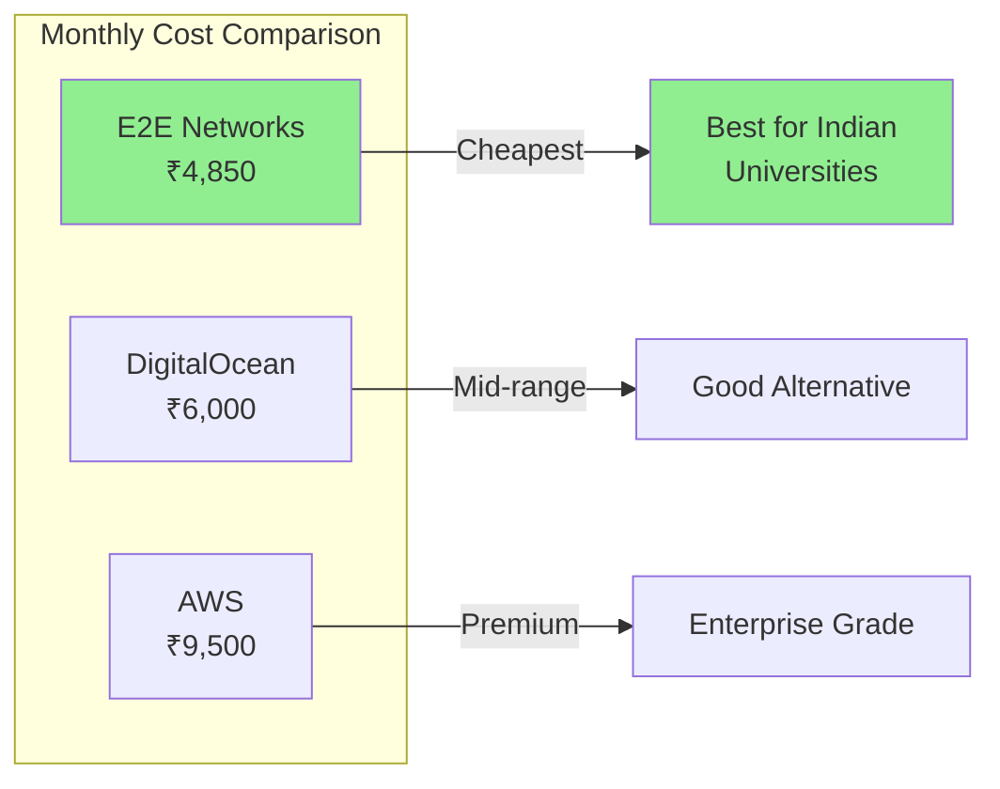

### Key Recommendations

1. **Start with E2E Networks** for Indian universities (best value + compliance)
2. **Use CloudFlare (free)** for CDN and DDoS protection
3. **Enable automated backups** from day one
4. **Set up monitoring** before go-live
5. **Plan for growth** - choose scalable architecture
6. **Use managed database** to reduce operational burden

### Scaling Path with E2E Networks

| Students | Configuration | Monthly Cost |
|----------|--------------|--------------|
| 2,000 | C2.Medium + DBaaS-2GB | ₹4,850 |
| 5,000 | 2x C2.Medium + DBaaS-4GB | ₹9,000 |
| 10,000 | 3x C2.Large + DBaaS-8GB + LB | ₹18,000 |

The infrastructure can easily scale to **5,000-10,000 students** by adding more compute nodes and upgrading the database plan.
