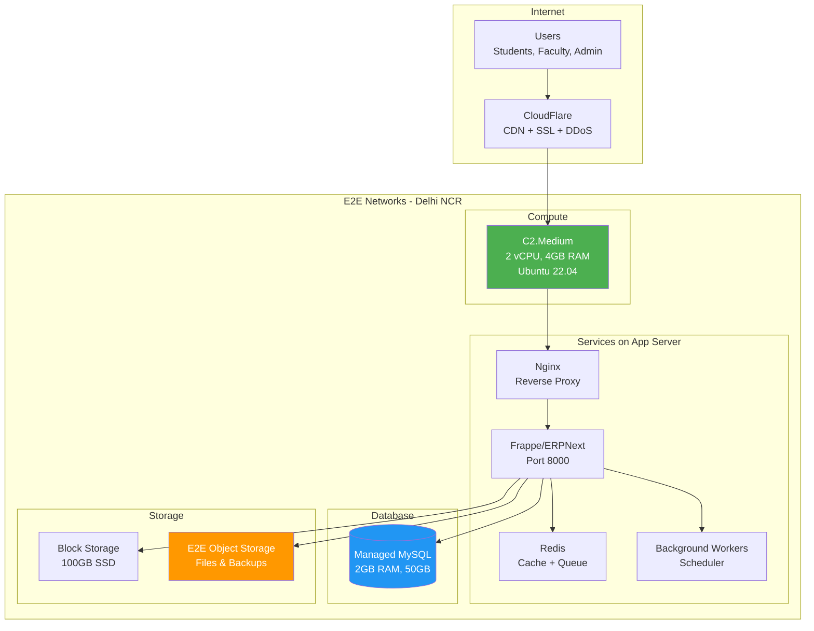
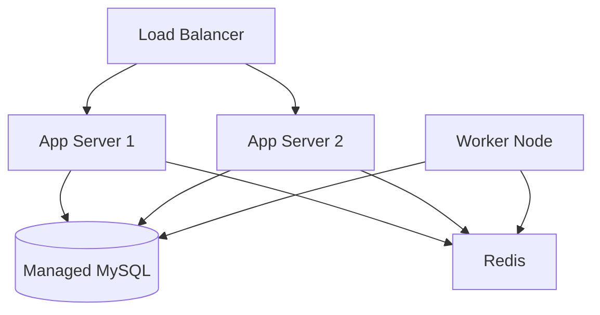

# University ERP - E2E Networks Cloud Infrastructure

## Overview

This document provides a complete guide for deploying the University ERP system on E2E Networks, an India-based cloud provider ideal for Indian universities due to data residency compliance, INR billing, and excellent price-performance ratio.

---

## Infrastructure Summary

| Component | Specification | Monthly Cost (₹) |
|-----------|---------------|------------------|
| **Compute** | C2.Medium (2 vCPU, 4GB RAM) | ₹1,500 |
| **Database** | Managed MySQL 2GB | ₹1,200 |
| **Storage** | 100GB Block Storage | ₹500 |
| **Object Storage** | 200GB EOS | ₹200 |
| **Public IP** | 1 Static IP | ₹100 |
| **Bandwidth** | 2TB (included) | Free |
| **Total** | | **₹3,500/month** |

---

## Architecture Diagram



---

## Why E2E Networks?

| Feature | Benefit |
|---------|---------|
| **Data Residency** | Data stays in India (IT Act, GDPR compliant) |
| **Cost** | 40-60% cheaper than AWS/Azure |
| **Billing** | INR billing, no forex fluctuation |
| **Support** | Local support team, IST business hours |
| **Latency** | <50ms for Indian users |
| **Compliance** | MEITY empaneled, ISO 27001 certified |
| **Uptime SLA** | 99.95% guaranteed |

---

## Step-by-Step Deployment Guide

### Step 1: Create E2E Networks Account

1. Go to https://myaccount.e2enetworks.com
2. Sign up with business email
3. Complete KYC verification (PAN, GST for business)
4. Add payment method (Credit Card / Net Banking / UPI)
5. Verify email and phone number

### Step 2: Generate SSH Key

```bash
# On your local machine
ssh-keygen -t ed25519 -C "university-erp-admin"

# Copy public key
cat ~/.ssh/id_ed25519.pub
```

Add the public key in E2E Dashboard → **SSH Keys** → **Add SSH Key**

### Step 3: Create Compute Node

**Via E2E Dashboard:**

1. Go to **Compute** → **Create Node**
2. Configure:

| Setting | Value |
|---------|-------|
| **Name** | `university-erp-app` |
| **Region** | Delhi-NCR (or Mumbai) |
| **Plan** | C2.Medium |
| **vCPU** | 2 |
| **RAM** | 4 GB |
| **Storage** | 60 GB SSD |
| **OS** | Ubuntu 22.04 LTS |
| **SSH Key** | Select your key |

3. Click **Create**

**Via CLI (if available):**

```bash
e2e node create \
  --name university-erp-app \
  --plan C2.Medium \
  --image ubuntu-22.04 \
  --region ncr \
  --ssh-key your-key-name
```

### Step 4: Create Managed Database

**Via E2E Dashboard:**

1. Go to **Databases** → **Create Database**
2. Configure:

| Setting | Value |
|---------|-------|
| **Name** | `university-mysql` |
| **Engine** | MySQL 8.0 |
| **Plan** | DBaaS-2GB |
| **RAM** | 2 GB |
| **Storage** | 50 GB SSD |
| **Region** | Same as compute |
| **Backup** | Daily (7 days retention) |

3. Click **Create**
4. Note down the connection details:
   - Host: `<your-db-id>.mysql.database.e2enetworks.net`
   - Port: `3306`
   - Username: `admin`
   - Password: (set during creation)

### Step 5: Create Object Storage Bucket

**Via E2E Dashboard:**

1. Go to **Object Storage (EOS)** → **Create Bucket**
2. Configure:

| Setting | Value |
|---------|-------|
| **Bucket Name** | `university-erp-files` |
| **Region** | Delhi-NCR |
| **Access** | Private |
| **Versioning** | Enabled |

3. Click **Create**
4. Go to **Access Keys** → **Generate Key**
5. Save the Access Key and Secret Key securely

### Step 6: Add Block Storage

**Via E2E Dashboard:**

1. Go to **Block Storage** → **Create Volume**
2. Configure:

| Setting | Value |
|---------|-------|
| **Name** | `university-erp-data` |
| **Size** | 100 GB |
| **Type** | SSD |
| **Region** | Same as compute |

3. Click **Create**
4. Attach to your compute node

### Step 7: Configure Security Group

**Via E2E Dashboard:**

1. Go to **Network** → **Security Groups** → **Create**
2. Name: `university-erp-sg`
3. Add Inbound Rules:

| Port | Protocol | Source | Description |
|------|----------|--------|-------------|
| 22 | TCP | Your IP | SSH access |
| 80 | TCP | 0.0.0.0/0 | HTTP |
| 443 | TCP | 0.0.0.0/0 | HTTPS |

4. Apply to your compute node

---

## Server Setup

### Connect to Server

```bash
ssh -i ~/.ssh/id_ed25519 root@<your-server-ip>
```

### Initial Server Configuration

```bash
#!/bin/bash
# server_setup.sh

# Update system
apt update && apt upgrade -y

# Set timezone
timedatectl set-timezone Asia/Kolkata

# Install essential packages
apt install -y \
    curl \
    wget \
    git \
    vim \
    htop \
    unzip \
    software-properties-common \
    apt-transport-https \
    ca-certificates \
    gnupg \
    lsb-release

# Configure firewall
ufw allow OpenSSH
ufw allow 80/tcp
ufw allow 443/tcp
ufw --force enable

# Create swap (if not present)
if [ ! -f /swapfile ]; then
    fallocate -l 2G /swapfile
    chmod 600 /swapfile
    mkswap /swapfile
    swapon /swapfile
    echo '/swapfile none swap sw 0 0' >> /etc/fstab
fi

echo "Server setup complete!"
```

### Mount Block Storage

```bash
# List available disks
lsblk

# Format the block storage (replace /dev/vdb with actual device)
mkfs.ext4 /dev/vdb

# Create mount point
mkdir -p /data

# Mount the volume
mount /dev/vdb /data

# Add to fstab for auto-mount
echo '/dev/vdb /data ext4 defaults 0 2' >> /etc/fstab

# Verify
df -h /data
```

---

## Frappe/ERPNext Installation

### Install Dependencies

```bash
#!/bin/bash
# install_dependencies.sh

# Install Python
apt install -y python3-dev python3-pip python3-venv

# Install MariaDB client (for connecting to managed MySQL)
apt install -y mariadb-client libmysqlclient-dev

# Install Redis
apt install -y redis-server
systemctl enable redis-server
systemctl start redis-server

# Install Node.js 18
curl -fsSL https://deb.nodesource.com/setup_18.x | bash -
apt install -y nodejs

# Install Yarn
npm install -g yarn

# Install wkhtmltopdf (for PDF generation)
apt install -y wkhtmltopdf

# Install Nginx
apt install -y nginx
systemctl enable nginx

# Install Supervisor
apt install -y supervisor
systemctl enable supervisor

echo "Dependencies installed!"
```

### Create Frappe User

```bash
# Create frappe user
useradd -m -s /bin/bash frappe
usermod -aG sudo frappe

# Set password
passwd frappe

# Allow sudo without password (optional, for automation)
echo "frappe ALL=(ALL) NOPASSWD:ALL" >> /etc/sudoers.d/frappe

# Switch to frappe user
su - frappe
```

### Install Bench and Frappe

```bash
# As frappe user
cd ~

# Install bench
pip3 install frappe-bench

# Add to PATH
echo 'export PATH="$HOME/.local/bin:$PATH"' >> ~/.bashrc
source ~/.bashrc

# Initialize bench
bench init --frappe-branch version-15 frappe-bench

cd frappe-bench
```

### Create Site with E2E Managed MySQL

```bash
# Get your E2E MySQL connection details from dashboard
# Host: <db-id>.mysql.database.e2enetworks.net
# Port: 3306
# User: admin
# Password: <your-password>

# Create site
bench new-site university.example.com \
    --db-host <db-id>.mysql.database.e2enetworks.net \
    --db-port 3306 \
    --db-root-username admin \
    --db-root-password '<your-db-password>' \
    --admin-password 'YourSecureAdminPassword123!'

# Set as default site
bench use university.example.com
```

### Install ERPNext and Education Module

```bash
# Get ERPNext
bench get-app erpnext --branch version-15

# Install ERPNext
bench --site university.example.com install-app erpnext

# Get Education module (if using separate app)
bench get-app education --branch version-15
bench --site university.example.com install-app education

# Install your custom University ERP app (if available)
# bench get-app university_erp https://github.com/your-org/university_erp.git
# bench --site university.example.com install-app university_erp
```

### Configure Site for Production

```bash
# Disable developer mode
bench --site university.example.com set-config developer_mode 0

# Set maintenance mode off
bench --site university.example.com set-maintenance-mode off

# Clear cache
bench --site university.example.com clear-cache

# Build assets
bench build
```

---

## Production Configuration

### Setup Production Mode

```bash
# As frappe user
cd ~/frappe-bench

# Setup production (creates nginx and supervisor configs)
sudo bench setup production frappe --yes
```

### Nginx Configuration

The bench setup creates nginx config automatically. Verify at:

```bash
sudo cat /etc/nginx/conf.d/frappe-bench.conf
```

Custom configuration (if needed):

```nginx
# /etc/nginx/conf.d/university-erp.conf

upstream frappe-bench {
    server 127.0.0.1:8000 fail_timeout=0;
}

server {
    listen 80;
    server_name university.example.com;

    root /home/frappe/frappe-bench/sites;

    add_header X-Frame-Options "SAMEORIGIN";
    add_header X-XSS-Protection "1; mode=block";
    add_header X-Content-Type-Options "nosniff";

    location /assets {
        try_files $uri =404;
        add_header Cache-Control "max-age=31536000";
    }

    location ~ ^/protected/(.*) {
        internal;
        try_files /$1 =404;
    }

    location /socket.io {
        proxy_http_version 1.1;
        proxy_set_header Upgrade $http_upgrade;
        proxy_set_header Connection "upgrade";
        proxy_set_header X-Frappe-Site-Name university.example.com;
        proxy_set_header Origin $scheme://$http_host;
        proxy_set_header Host $host;
        proxy_pass http://127.0.0.1:9000;
    }

    location / {
        rewrite ^(.+)/$ $1 permanent;
        rewrite ^(.+)/index\.html$ $1 permanent;
        rewrite ^(.+)\.html$ $1 permanent;

        proxy_set_header X-Forwarded-For $proxy_add_x_forwarded_for;
        proxy_set_header X-Forwarded-Proto $scheme;
        proxy_set_header X-Frappe-Site-Name university.example.com;
        proxy_set_header Host $host;
        proxy_set_header X-Use-X-Accel-Redirect True;
        proxy_read_timeout 120;
        proxy_redirect off;
        proxy_pass http://frappe-bench;
    }

    client_max_body_size 50m;
    client_body_buffer_size 16K;
    client_body_timeout 60;

    keepalive_timeout 15;
}
```

### Supervisor Configuration

Verify supervisor config:

```bash
sudo cat /etc/supervisor/conf.d/frappe-bench.conf
```

### Redis Configuration

Edit `/etc/redis/redis.conf`:

```conf
# Memory management
maxmemory 512mb
maxmemory-policy allkeys-lru

# Persistence
appendonly yes
appendfsync everysec

# Security
bind 127.0.0.1
```

Restart Redis:

```bash
sudo systemctl restart redis-server
```

---

## E2E Object Storage (EOS) Configuration

### Install S3 Tools

```bash
# Install boto3 for Python
pip3 install boto3

# Install s3cmd for backups
apt install -y s3cmd
```

### Configure s3cmd

```bash
# Create s3cmd config
cat > ~/.s3cfg << 'EOF'
[default]
access_key = YOUR_EOS_ACCESS_KEY
secret_key = YOUR_EOS_SECRET_KEY
host_base = objectstore.e2enetworks.net
host_bucket = %(bucket)s.objectstore.e2enetworks.net
use_https = True
signature_v2 = False
EOF

# Test connection
s3cmd ls
```

### Configure Frappe for EOS

Edit `~/frappe-bench/sites/university.example.com/site_config.json`:

```json
{
    "db_host": "<db-id>.mysql.database.e2enetworks.net",
    "db_port": 3306,
    "db_name": "university_example_com",
    "db_password": "your-db-password",
    "redis_cache": "redis://127.0.0.1:6379/0",
    "redis_queue": "redis://127.0.0.1:6379/1",
    "redis_socketio": "redis://127.0.0.1:6379/2",
    "s3_bucket": "university-erp-files",
    "s3_endpoint_url": "https://objectstore.e2enetworks.net",
    "s3_access_key_id": "YOUR_EOS_ACCESS_KEY",
    "s3_secret_access_key": "YOUR_EOS_SECRET_KEY",
    "use_s3_for_file_storage": true
}
```

### CORS Configuration for EOS

Via E2E Dashboard or API, set CORS for your bucket:

```json
{
    "CORSRules": [
        {
            "AllowedOrigins": ["https://university.example.com"],
            "AllowedMethods": ["GET", "PUT", "POST", "DELETE"],
            "AllowedHeaders": ["*"],
            "MaxAgeSeconds": 3000
        }
    ]
}
```

---

## SSL Configuration with CloudFlare

### Step 1: Add Domain to CloudFlare

1. Sign up at https://cloudflare.com (free plan)
2. Add your domain
3. Update nameservers at your registrar

### Step 2: Configure DNS

| Type | Name | Content | Proxy |
|------|------|---------|-------|
| A | @ | <E2E Server IP> | Proxied (orange) |
| A | www | <E2E Server IP> | Proxied (orange) |

### Step 3: SSL Settings

1. Go to **SSL/TLS** → **Overview**
2. Set mode to **Full (Strict)**
3. Enable **Always Use HTTPS**
4. Enable **Automatic HTTPS Rewrites**

### Step 4: CloudFlare Origin Certificate

1. Go to **SSL/TLS** → **Origin Server**
2. Click **Create Certificate**
3. Generate certificate for `*.example.com, example.com`
4. Download certificate and key

Install on server:

```bash
# Create SSL directory
sudo mkdir -p /etc/ssl/cloudflare

# Save certificate
sudo nano /etc/ssl/cloudflare/origin.pem
# Paste certificate content

# Save private key
sudo nano /etc/ssl/cloudflare/origin.key
# Paste key content

# Set permissions
sudo chmod 600 /etc/ssl/cloudflare/origin.key
```

Update Nginx for SSL:

```nginx
server {
    listen 443 ssl http2;
    server_name university.example.com;

    ssl_certificate /etc/ssl/cloudflare/origin.pem;
    ssl_certificate_key /etc/ssl/cloudflare/origin.key;
    ssl_protocols TLSv1.2 TLSv1.3;
    ssl_ciphers ECDHE-ECDSA-AES128-GCM-SHA256:ECDHE-RSA-AES128-GCM-SHA256;
    ssl_prefer_server_ciphers off;

    # ... rest of config
}

server {
    listen 80;
    server_name university.example.com;
    return 301 https://$server_name$request_uri;
}
```

Reload Nginx:

```bash
sudo nginx -t && sudo systemctl reload nginx
```

---

## Backup Configuration

### Automated Backup Script

```bash
#!/bin/bash
# /opt/scripts/backup.sh

# Configuration
SITE_NAME="university.example.com"
BENCH_PATH="/home/frappe/frappe-bench"
BACKUP_DIR="/data/backups"
EOS_BUCKET="university-erp-files"
DATE=$(date +%Y%m%d_%H%M%S)
RETENTION_DAYS=7

# Create backup directory
mkdir -p $BACKUP_DIR

# Run Frappe backup
cd $BENCH_PATH
sudo -u frappe bench --site $SITE_NAME backup --with-files

# Find latest backup files
LATEST_DB=$(ls -t $BENCH_PATH/sites/$SITE_NAME/private/backups/*.sql.gz | head -1)
LATEST_FILES=$(ls -t $BENCH_PATH/sites/$SITE_NAME/private/backups/*-files.tar | head -1)
LATEST_PRIVATE=$(ls -t $BENCH_PATH/sites/$SITE_NAME/private/backups/*-private-files.tar | head -1)

# Copy to backup directory
cp $LATEST_DB $BACKUP_DIR/
cp $LATEST_FILES $BACKUP_DIR/ 2>/dev/null || true
cp $LATEST_PRIVATE $BACKUP_DIR/ 2>/dev/null || true

# Upload to E2E Object Storage
s3cmd put $BACKUP_DIR/*$DATE* s3://$EOS_BUCKET/backups/daily/ \
    --host=objectstore.e2enetworks.net \
    --host-bucket="%(bucket)s.objectstore.e2enetworks.net"

# Cleanup old local backups
find $BACKUP_DIR -type f -mtime +$RETENTION_DAYS -delete
find $BENCH_PATH/sites/$SITE_NAME/private/backups -type f -mtime +3 -delete

# Log completion
echo "$(date): Backup completed successfully" >> /var/log/erp-backup.log
```

### Setup Cron Job

```bash
# Edit crontab
sudo crontab -e

# Add daily backup at 2 AM
0 2 * * * /opt/scripts/backup.sh >> /var/log/erp-backup.log 2>&1

# Add weekly full backup on Sunday at 3 AM
0 3 * * 0 /opt/scripts/backup.sh --full >> /var/log/erp-backup.log 2>&1
```

### Restore from Backup

```bash
#!/bin/bash
# /opt/scripts/restore.sh

SITE_NAME="university.example.com"
BENCH_PATH="/home/frappe/frappe-bench"

# Download from EOS
s3cmd get s3://university-erp-files/backups/daily/latest.sql.gz /tmp/

# Restore
cd $BENCH_PATH
bench --site $SITE_NAME restore /tmp/latest.sql.gz
```

---

## Monitoring & Alerts

### E2E Built-in Monitoring

E2E Networks provides built-in monitoring in the dashboard:
- CPU utilization
- Memory usage
- Disk I/O
- Network traffic
- Database metrics

### Setup UptimeRobot (Free)

1. Sign up at https://uptimerobot.com
2. Add HTTP monitor for `https://university.example.com`
3. Add keyword check for "Login"
4. Set alert contacts (email, SMS)

### Setup Healthchecks.io (Free)

1. Sign up at https://healthchecks.io
2. Create check for backup cron
3. Add to backup script:

```bash
# At end of backup script
curl -fsS -m 10 --retry 5 https://hc-ping.com/YOUR-CHECK-ID
```

### Simple Server Monitoring Script

```bash
#!/bin/bash
# /opt/scripts/health_check.sh

# Thresholds
CPU_THRESHOLD=80
MEM_THRESHOLD=85
DISK_THRESHOLD=80

# Get metrics
CPU_USAGE=$(top -bn1 | grep "Cpu(s)" | awk '{print $2}' | cut -d'%' -f1)
MEM_USAGE=$(free | grep Mem | awk '{print $3/$2 * 100.0}')
DISK_USAGE=$(df -h / | awk 'NR==2 {print $5}' | cut -d'%' -f1)

# Check and alert
ALERT=""

if (( $(echo "$CPU_USAGE > $CPU_THRESHOLD" | bc -l) )); then
    ALERT="$ALERT CPU: ${CPU_USAGE}%"
fi

if (( $(echo "$MEM_USAGE > $MEM_THRESHOLD" | bc -l) )); then
    ALERT="$ALERT MEM: ${MEM_USAGE}%"
fi

if [ "$DISK_USAGE" -gt "$DISK_THRESHOLD" ]; then
    ALERT="$ALERT DISK: ${DISK_USAGE}%"
fi

if [ -n "$ALERT" ]; then
    echo "ALERT: $ALERT" | mail -s "University ERP Server Alert" admin@example.com
fi
```

Add to cron (every 5 minutes):

```bash
*/5 * * * * /opt/scripts/health_check.sh
```

---

## Performance Optimization

### MySQL Tuning

For E2E Managed MySQL, some settings are managed. For custom tuning, request via support or use:

```sql
-- Optimize tables periodically
OPTIMIZE TABLE `tabUser`;
OPTIMIZE TABLE `tabStudent`;
-- Run for frequently updated tables
```

### Redis Optimization

```bash
# /etc/redis/redis.conf
maxmemory 512mb
maxmemory-policy allkeys-lru
tcp-keepalive 300
```

### Nginx Performance

```nginx
# /etc/nginx/nginx.conf

worker_processes auto;
worker_rlimit_nofile 65535;

events {
    worker_connections 4096;
    multi_accept on;
    use epoll;
}

http {
    # Gzip
    gzip on;
    gzip_comp_level 5;
    gzip_types text/plain text/css application/json application/javascript;

    # Caching
    open_file_cache max=1000 inactive=20s;
    open_file_cache_valid 30s;
    open_file_cache_min_uses 2;

    # Buffers
    client_body_buffer_size 16K;
    client_header_buffer_size 1k;
    client_max_body_size 50m;
    large_client_header_buffers 4 16k;
}
```

### Frappe Optimization

```python
# site_config.json additions
{
    "enable_frappe_cache": 1,
    "enable_page_cache": 1,
    "logging": 0,
    "background_workers": 2,
    "gunicorn_workers": 4
}
```

---

## Security Hardening

### Server Security

```bash
# Disable root SSH login
sudo sed -i 's/PermitRootLogin yes/PermitRootLogin no/' /etc/ssh/sshd_config

# Disable password authentication
sudo sed -i 's/#PasswordAuthentication yes/PasswordAuthentication no/' /etc/ssh/sshd_config

# Restart SSH
sudo systemctl restart sshd

# Install fail2ban
sudo apt install -y fail2ban
sudo systemctl enable fail2ban
sudo systemctl start fail2ban
```

### Firewall Rules

```bash
# UFW configuration
sudo ufw default deny incoming
sudo ufw default allow outgoing
sudo ufw allow ssh
sudo ufw allow http
sudo ufw allow https
sudo ufw enable
```

### Database Security

- Use managed database (E2E handles security patches)
- Connect only from app server (private network)
- Use strong passwords
- Enable SSL for connections

---

## Scaling Guide

### Vertical Scaling (Easiest)

| Stage | Plan | vCPU | RAM | Users |
|-------|------|------|-----|-------|
| Start | C2.Medium | 2 | 4 GB | 0-2,000 |
| Growth | C2.Large | 4 | 8 GB | 2,000-5,000 |
| Scale | C2.XLarge | 8 | 16 GB | 5,000-10,000 |

To upgrade via E2E Dashboard:
1. Stop the node
2. Change plan
3. Start the node

### Horizontal Scaling (Advanced)

For 5,000+ users, add worker nodes:



---

## Cost Summary

### Minimal Setup (Testing/Small)

| Component | Cost/Month |
|-----------|------------|
| C2.Small (1 vCPU, 2GB) | ₹750 |
| MySQL on same server | ₹0 |
| 50GB Block Storage | ₹250 |
| **Total** | **₹1,000** |

### Recommended Setup (Production)

| Component | Cost/Month |
|-----------|------------|
| C2.Medium (2 vCPU, 4GB) | ₹1,500 |
| Managed MySQL 2GB | ₹1,200 |
| 100GB Block Storage | ₹500 |
| 200GB Object Storage | ₹200 |
| Static IP | ₹100 |
| **Total** | **₹3,500** |

### Growth Setup (5,000+ Users)

| Component | Cost/Month |
|-----------|------------|
| 2x C2.Large (4 vCPU, 8GB) | ₹6,000 |
| Managed MySQL 4GB | ₹2,400 |
| 200GB Block Storage | ₹1,000 |
| 500GB Object Storage | ₹500 |
| Load Balancer | ₹500 |
| **Total** | **₹10,400** |

---

## Support & Resources

### E2E Networks Support

| Channel | Contact |
|---------|---------|
| Email | support@e2enetworks.com |
| Phone | 1800-121-5622 (Toll-free) |
| Ticket | myaccount.e2enetworks.com/support |
| Chat | Available in dashboard |

**Support Hours:**
- Critical issues: 24x7
- General queries: Business hours (IST)

**SLA:**
- 99.95% uptime guarantee
- Response: 15 min (Critical), 4 hours (Normal)

### Useful Links

- E2E Documentation: https://docs.e2enetworks.com
- E2E Status: https://status.e2enetworks.com
- Frappe Documentation: https://frappeframework.com/docs
- ERPNext Documentation: https://docs.erpnext.com

---

## Troubleshooting

### Common Issues

**1. Cannot connect to database**
```bash
# Test MySQL connection
mysql -h <db-host> -u admin -p

# Check if MySQL is accessible from server
telnet <db-host> 3306
```

**2. Site not loading**
```bash
# Check Nginx status
sudo systemctl status nginx
sudo nginx -t

# Check Frappe logs
tail -f /home/frappe/frappe-bench/logs/frappe.log

# Check supervisor
sudo supervisorctl status
```

**3. Slow performance**
```bash
# Check server resources
htop

# Check disk space
df -h

# Check Redis
redis-cli info memory
```

**4. Background jobs not running**
```bash
# Check workers
sudo supervisorctl status frappe-bench-workers:

# Restart workers
sudo supervisorctl restart frappe-bench-workers:
```

---

## Deployment Checklist

- [ ] E2E account created and verified
- [ ] SSH key generated and added
- [ ] Compute node created (C2.Medium)
- [ ] Managed MySQL created
- [ ] Object Storage bucket created
- [ ] Block storage attached
- [ ] Security groups configured
- [ ] Server dependencies installed
- [ ] Frappe/ERPNext installed
- [ ] Site created and configured
- [ ] Production mode enabled
- [ ] SSL configured (CloudFlare)
- [ ] Backups configured and tested
- [ ] Monitoring setup complete
- [ ] DNS configured
- [ ] Security hardening applied

---

**Document Version:** 1.0
**Last Updated:** January 2026
**Target Users:** 2,000 students, 70 faculty
