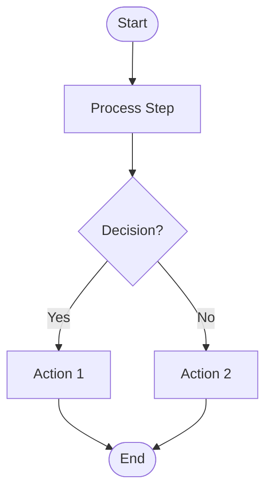
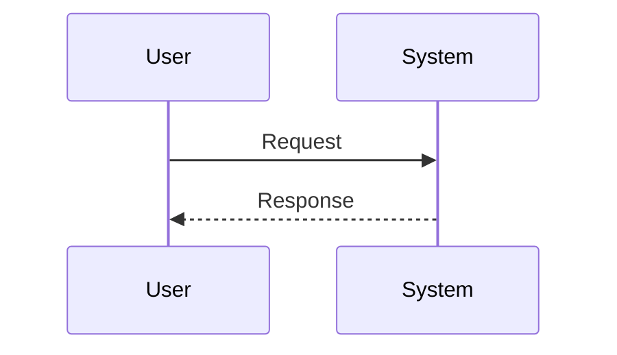
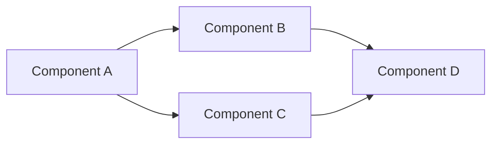
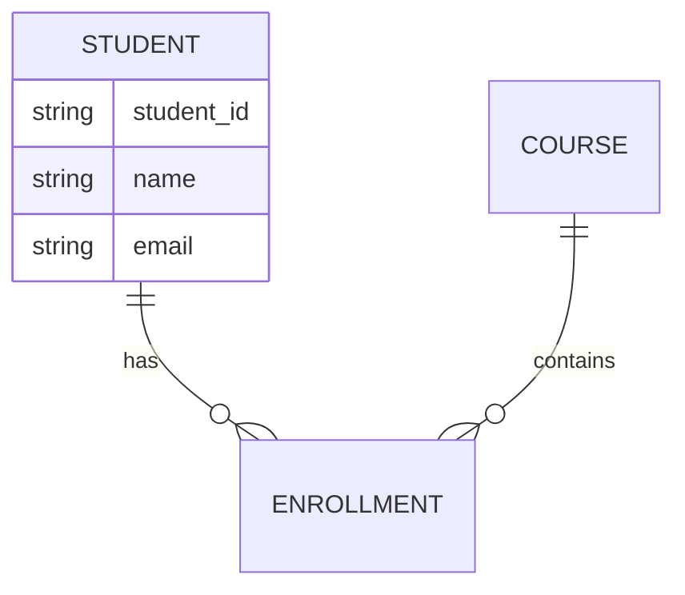
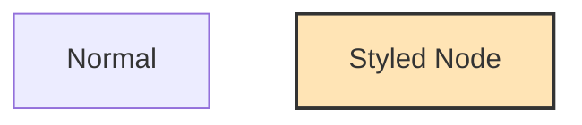
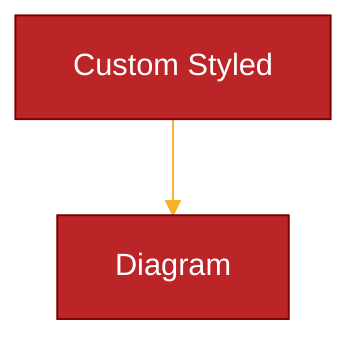

# University ERP - Architecture Documentation

## Quick Start

**To view the diagrams in this documentation:**

1. **Install the Mermaid Chart extension in VS Code**:
   - Open VS Code Extensions (`Ctrl+Shift+X`)
   - Search for **"Mermaid Chart"**
   - Install the extension by **MermaidChart**
   - Or install via command: `code --install-extension MermaidChart.vscode-mermaid-chart`

2. **View the diagrams**:
   - Open any `.md` file from this directory
   - Press `Ctrl+Shift+V` (Windows/Linux) or `Cmd+Shift+V` (Mac) for markdown preview
   - Or right-click on a Mermaid code block and select "Preview Mermaid Diagram"

---

## Overview

This directory contains comprehensive architecture documentation for the University ERP system, including system architecture, workflows, sequence diagrams, activity diagrams, and use case diagrams.

## Contents

1. **[01_SYSTEM_ARCHITECTURE.md](01_SYSTEM_ARCHITECTURE.md)** - Complete system architecture including:
   - System overview and layers
   - Technology stack
   - Module structure and organization
   - DocType catalog (300+ DocTypes)
   - Database schema and ER diagrams
   - Integration architecture
   - Student portal architecture
   - Security architecture
   - Deployment architecture

2. **[02_WORKFLOWS.md](02_WORKFLOWS.md)** - Process workflow diagrams for:
   - Student admission workflow
   - Student registration & enrollment
   - Course enrollment
   - Fee payment processing
   - Examination conduct
   - Result processing
   - Leave application
   - Grievance redressal
   - Library book issue/return
   - Hostel allocation
   - Transport allocation
   - Attendance marking
   - Assignment submission
   - Document request
   - Faculty recruitment

3. **[03_SEQUENCE_DIAGRAMS.md](03_SEQUENCE_DIAGRAMS.md)** - Detailed sequence diagrams showing:
   - Student login & authentication
   - Student admission flow
   - Course enrollment
   - Fee payment processing
   - Online examination
   - Result publication
   - Biometric attendance marking
   - Library book issue
   - Hostel room allocation
   - Assignment submission & evaluation
   - Grievance handling
   - Document request processing
   - Notification system
   - Payment gateway integration
   - Background job processing

4. **[04_ACTIVITY_DIAGRAMS.md](04_ACTIVITY_DIAGRAMS.md)** - Activity diagrams for major processes:
   - Student onboarding process
   - Course registration process
   - Examination process
   - Fee collection process
   - Library management process
   - Hostel management process
   - Attendance management process
   - Result declaration process
   - Grievance resolution process
   - Document issuance process

5. **[05_USE_CASE_DIAGRAMS.md](05_USE_CASE_DIAGRAMS.md)** - Use case diagrams for all actors:
   - System overview
   - Student use cases (20+ features)
   - Faculty use cases
   - Administrative use cases
   - Examination controller use cases
   - Accounts manager use cases
   - Librarian use cases
   - Hostel warden use cases
   - System admin use cases
   - Parent/guardian use cases

6. **[06_CLOUD_INFRASTRUCTURE.md](06_CLOUD_INFRASTRUCTURE.md)** - Cloud deployment options:
   - AWS infrastructure
   - DigitalOcean setup
   - E2E Networks overview
   - Single VPS setup
   - Cost comparisons

7. **[07_E2E_NETWORKS_INFRASTRUCTURE.md](07_E2E_NETWORKS_INFRASTRUCTURE.md)** - Complete E2E Networks deployment guide:
   - Step-by-step setup instructions
   - Compute, database, storage configuration
   - Frappe/ERPNext installation
   - SSL with CloudFlare
   - Backup and monitoring
   - Security hardening
   - Scaling guide
   - Cost breakdown

---

## How to View the Diagrams

All diagrams in these documents are created using **Mermaid** syntax, a markdown-like text format for creating diagrams and flowcharts.

### Option 1: VS Code with Mermaid Chart Extension (Recommended)

#### Step 1: Install Mermaid Chart Extension

Install the **Mermaid Chart** extension in VS Code for the best viewing and editing experience:

**Mermaid Chart** (Recommended)
- Extension ID: `MermaidChart.vscode-mermaid-chart`
- Install: Search for "Mermaid Chart" in VS Code Extensions
- Publisher: Mermaid Chart
- Features:
  - Native Mermaid diagram rendering
  - Interactive diagram editing
  - Export to PNG, SVG, PDF
  - Live preview
  - Syntax highlighting
  - Auto-completion
  - Diagram validation

#### Step 2: View Diagrams

**Method 1: Using Markdown Preview (Built-in)**
1. Open any `.md` file from this directory in VS Code
2. Press `Ctrl+Shift+V` (Windows/Linux) or `Cmd+Shift+V` (Mac) to open Markdown Preview
3. The Mermaid diagrams will render automatically in the preview pane
4. You can view the markdown file and preview side-by-side

**Method 2: Using Mermaid Chart Extension**
1. Open any `.md` file from this directory
2. Right-click on a Mermaid code block
3. Select "Preview Mermaid Diagram" from the context menu
4. Or use the command palette: `Ctrl+Shift+P` and search for "Mermaid Chart"

#### Installation via Command Line

```bash
# Install Mermaid Chart extension
code --install-extension MermaidChart.vscode-mermaid-chart

# Or install from marketplace
# https://marketplace.visualstudio.com/items?itemName=MermaidChart.vscode-mermaid-chart
```

#### Alternative Extensions (If needed)

If you prefer other options:

1. **Markdown Preview Mermaid Support**
   - Extension ID: `bierner.markdown-mermaid`
   - Features: Basic Mermaid rendering in markdown preview

2. **Mermaid Preview**
   - Extension ID: `vstirbu.vscode-mermaid-preview`
   - Features: Dedicated preview pane for Mermaid files

### Option 2: GitHub/GitLab

GitHub and GitLab both support Mermaid diagrams natively. Simply:
1. Push these files to your repository
2. Open any `.md` file in the GitHub/GitLab web interface
3. Diagrams will render automatically

### Option 3: Online Mermaid Editor

For quick viewing or editing:

1. Visit [Mermaid Live Editor](https://mermaid.live/)
2. Copy the Mermaid code from any diagram
3. Paste it into the editor
4. View and export the diagram

### Option 4: Other Markdown Viewers

Many markdown viewers support Mermaid:

- **Obsidian**: Native Mermaid support
- **Typora**: Native Mermaid support
- **MarkText**: Native Mermaid support
- **Notion**: Supports Mermaid code blocks
- **Confluence**: Via Mermaid macro

### Option 5: Generate Static Images

If you need static images (PNG, SVG) of the diagrams:

#### Using Mermaid CLI

```bash
# Install Mermaid CLI
npm install -g @mermaid-js/mermaid-cli

# Generate images from markdown files
mmdc -i 01_SYSTEM_ARCHITECTURE.md -o output/architecture.png

# Generate SVG (better quality)
mmdc -i 01_SYSTEM_ARCHITECTURE.md -o output/architecture.svg -b transparent
```

#### Using Online Tools

1. Visit [Mermaid Live Editor](https://mermaid.live/)
2. Copy diagram code
3. Click "Actions" → "Download PNG" or "Download SVG"

---

## Diagram Types Used

### 1. Flowchart Diagrams
Used for workflows and activity diagrams. Shows process flows with decision points.

**Example:**


### 2. Sequence Diagrams
Used for showing interactions between components over time.

**Example:**


### 3. Graph Diagrams
Used for system architecture and use case diagrams. Shows relationships and hierarchies.

**Example:**


### 4. Entity Relationship Diagrams
Used for database schema documentation.

**Example:**


---

## Quick Reference: Mermaid Syntax

### Flowchart Shapes

```
[Rectangle]          - Standard process box
([Rounded])          - Start/End (Stadium)
{Diamond}            - Decision point
[[Subroutine]]       - Subroutine process
[(Cylindrical)]      - Database
((Circle))           - Connection point
```

### Flowchart Arrows

```
-->     Solid arrow
-.->    Dotted arrow
==>     Thick arrow
--text--> Arrow with text
```

### Sequence Diagram Arrows

```
->>     Solid line with arrow
-->>    Dashed line with arrow
-x      Solid line with cross
--x     Dashed line with cross
```

### Styling



---

## Troubleshooting

### Diagrams Not Rendering in VS Code

1. **Ensure Mermaid Chart Extension is Installed**
   ```bash
   # Check if extension is installed
   code --list-extensions | grep -i mermaid

   # Should show: MermaidChart.vscode-mermaid-chart
   ```

2. **Verify Extension is Active**
   - Open VS Code Extensions panel (`Ctrl+Shift+X`)
   - Search for "Mermaid Chart"
   - Ensure it's installed and enabled

3. **Check Markdown Preview**
   - Press `Ctrl+Shift+V` to open preview
   - Try reloading VS Code window: `Ctrl+R` or `Ctrl+Shift+P` → "Reload Window"

4. **Try Mermaid Chart Preview**
   - Right-click on a Mermaid code block
   - Select "Preview Mermaid Diagram"
   - This provides better rendering than standard markdown preview

5. **Update Extension**
   - Open Extensions panel
   - Search for "Mermaid Chart"
   - Click "Update" if available

6. **Check for Syntax Errors**
   - Ensure Mermaid code blocks start with ` ```mermaid `
   - Ensure code blocks end with ` ``` `
   - Validate syntax at [Mermaid Live Editor](https://mermaid.live/)
   - The Mermaid Chart extension will highlight syntax errors

### Diagrams Too Large

If diagrams are too large to view comfortably:

1. **Use Browser Zoom**
   - In preview: `Ctrl +` to zoom in, `Ctrl -` to zoom out

2. **Export to SVG**
   - SVG files are scalable and can be zoomed without quality loss

3. **Split Large Diagrams**
   - Consider breaking complex diagrams into smaller parts

### Performance Issues

If VS Code is slow with large documents:

1. **Disable Live Preview**
   - Only open preview when needed

2. **Use Dedicated Preview Window**
   - Open preview in separate window

3. **Increase Memory**
   - Adjust VS Code memory settings in `settings.json`:
   ```json
   {
     "files.maxMemoryForLargeFilesMB": 4096
   }
   ```

---

## Mermaid Configuration

You can customize Mermaid rendering with configuration blocks:



### Available Themes

- `default` - Default Mermaid theme
- `forest` - Green/forest theme
- `dark` - Dark theme
- `neutral` - Neutral theme
- `base` - Base theme (customizable)

---

## Exporting Diagrams

### Export to PNG/SVG (High Quality)

```bash
# Install Mermaid CLI
npm install -g @mermaid-js/mermaid-cli

# Export all diagrams from a file
mmdc -i 03_SEQUENCE_DIAGRAMS.md -o exports/

# Export with custom settings
mmdc -i 01_SYSTEM_ARCHITECTURE.md -o output/architecture.svg \
  -t forest -b transparent -w 1920 -H 1080
```

### Export to PDF

```bash
# Convert SVG to PDF using Inkscape
inkscape architecture.svg --export-pdf=architecture.pdf

# Or use Chrome headless
google-chrome --headless --disable-gpu --print-to-pdf=output.pdf architecture.svg
```

### Batch Export Script

Create a script to export all diagrams:

```bash
#!/bin/bash
# export_all_diagrams.sh

mkdir -p exports/png exports/svg

for file in *.md; do
    echo "Processing $file..."
    mmdc -i "$file" -o "exports/svg/${file%.md}.svg" -b transparent
    mmdc -i "$file" -o "exports/png/${file%.md}.png" -b white
done

echo "Export complete!"
```

---

## Additional Resources

### Mermaid Documentation
- Official Docs: https://mermaid.js.org/
- Syntax Reference: https://mermaid.js.org/intro/syntax-reference.html
- Live Editor: https://mermaid.live/
- GitHub Repository: https://github.com/mermaid-js/mermaid

### VS Code Extensions
- **Mermaid Chart** (Recommended): https://marketplace.visualstudio.com/items?itemName=MermaidChart.vscode-mermaid-chart
- Markdown Preview Mermaid: https://marketplace.visualstudio.com/items?itemName=bierner.markdown-mermaid
- Mermaid Preview: https://marketplace.visualstudio.com/items?itemName=vstirbu.vscode-mermaid-preview

### Learning Resources
- Mermaid Cheat Sheet: https://jojozhuang.github.io/tutorial/mermaid-cheat-sheet/
- Video Tutorials: https://www.youtube.com/results?search_query=mermaid+diagram+tutorial
- Interactive Tutorial: https://mermaid.js.org/config/Tutorials.html

---

## Contributing

When adding new diagrams to this documentation:

1. **Follow Existing Format**
   - Use consistent naming conventions
   - Maintain the same structure as existing diagrams

2. **Validate Syntax**
   - Test diagrams in [Mermaid Live Editor](https://mermaid.live/)
   - Ensure proper rendering before committing

3. **Add Descriptions**
   - Include textual description before each diagram
   - Document decision points and flows

4. **Keep It Simple**
   - Break complex diagrams into smaller parts
   - Use subgraphs for better organization

5. **Use Consistent Styling**
   - Follow color scheme used in existing diagrams
   - Use standardized shapes for common elements

---

## Version History

| Version | Date | Changes |
|---------|------|---------|
| 1.0 | 2026-01-09 | Initial architecture documentation |
| | | - System architecture with 300+ DocTypes |
| | | - 15 workflow diagrams |
| | | - 15 sequence diagrams |
| | | - 10 activity diagrams |
| | | - 10 use case diagrams |

---

## Contact

For questions or suggestions regarding this architecture documentation:

- Create an issue in the project repository
- Contact the development team
- Refer to the main project README for additional resources

---

## License

This documentation is part of the University ERP project and follows the same license as the main project.
